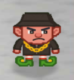
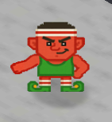
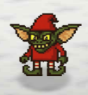
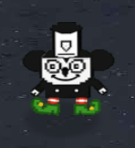

# Meet The Gnomes!

The gnomes of the Neighborhood are a *mysterious* bunch. Each one we encountered had their own unique personality and their own unique... way of not making any sense whatsoever. Here's who we met along our journey:

### Corpo

!!! quote "Corpo"
    ...gnomish nonsense...

### Emcee Gnome

!!! quote "Emcee Gnome"
    ...gnomish nonsense...

### Meathead

!!! quote "Meathead"
    ...gnomish nonsense...

### Hoolignome

!!! quote "Hoolignome"
    ...gnomish nonsense...

### Troll

!!! quote "Troll"
    ...gnomish nonsense...

### Steamy McSteamface

!!! quote "Steamy McSteamface"
    ...gnomish nonsense...

### Termignomer

!!! quote "Termignomer"
    ...gnomish nonsense...

These seven gnomes each played their part in Frosty's plan. Their nonsense may have been confusing, but their role in the story was clear!

