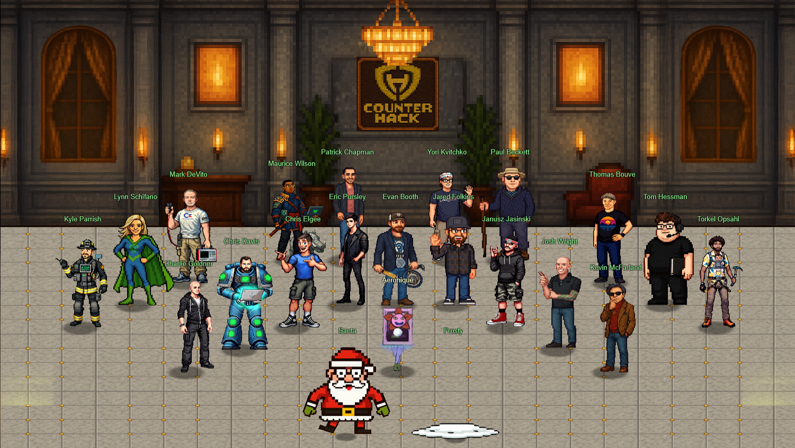

#❄️⛄ Revenge of the Gnomes: The Frosty Return ⛄❄️

## **Introduction**

Hey there! Welcome to my wild *sleigh* ride through the 2025 SANS Holiday Hack Challenge.

I'm currently neck-deep in the SANS Cyber Academy studying for my GCIH, and I decided to tackle this year's Holiday Hack to put my studies into practice and see what I could accomplish. I managed to crack all 26 challenges in the first week, and now I'm here to document the journey with amazingly awful whimsical puns thrown in for good measure.

This is also my first time building a webpage! Do you see the magical snowflakes?! I'm unreasonably proud of those. My son also mentioned the words "fire" and "gas", which apparently means super cool. I'll take it!

This writeup is part documentation and part "hey look, I actually figured this stuff out!" Check out [Hack-a-Gnome](objectives/o20/), [Frosty's Snowglobe](objectives/o23/) (featuring my first edited video with sound and text on my first YouTube channel - things I'm proud of!), or [Snowblind Ambush](objectives/o26/) if you want to know which challenges tested my skills the most!

Oh, and don't miss [Meet the Gnomes](gnomes.md) to see who we're dealing with (spoiler: most of them only speak gibberish), and the [Easter Egg of DOOM](easter_eggs.md) because one lone egg appearing in a winter challenge feels ominous and I'm not okay with it!

Whether you're a fellow cybersecurity newbie like me or a seasoned hacker just here for the fun, grab some hot cocoa, cozy up by the fireplace, and settle in for a different kind of holiday story. (Like Die Hard, but with...well..you'll see...)

## **The Story**

Picture this: The Counter Hack crew is decking the halls, stringing up lights, and generally being festive when *BAM!* The yard gnomes come to life. And not in a cute, sunshine and rainbows way. More like a "we're taking over your fridge and possibly your *soul*" kind of way.

### **The Backstory**

Way back in 2015, the mysterious Atnas Corporation almost ruined the entire holiday season through their nefarious Gnome In Your Home plot. Their villainy centered upon convincing parents to purchase little Gnome dolls that played joyful holiday songs to their children. With Gnome sales topping two million units, a blitz of Atnas Corp advertisements encouraged parents to move their Gnomes around the house daily so that their children could hunt for them in a fun little game. Little did parents know that these Gnomes were snooping IoT devices with a camera and wireless internet access, furtively sending photos to burglars who would rob their houses of their treasures en masse on Christmas Eve, 2015. The incredible efforts of SANS Holiday Hack investigators around the world foiled the foul plot, exposing the criminal mastermind behind Atnas Corp: Cindy Lou Who, age 62.

But those old Gnomes didn't disappear. They lay discarded, gathering dust on shelves, in attics, and among other forgotten places throughout the world. Until now. There must have been some magic in those Gnomes, because, due to some unseen spark, some haunting hocus pocus, the Gnomes have quickened and are now walking among us! We now return with the Counter Hack Crew to the Duke Dosis neighborhood as the Holiday Season 2025 unfolds.

### **Act I: The Invasion**  
Those ceramic lawn ornaments? Yeah, they're alive now. Thanks to some mysterious magical nonsense, the Gnomes in Your Home are scurrying around the Neighborhood causing absolute chaos. Holiday prep has officially gone sideways (honestly though, when does holiday prep *ever* go perfectly as planned??).

### **Act II: The Mystery**  
Things get weirder. The gnomes start stealing refrigerator parts. Not the whole fridge, just specific components. Are they building something? Planning a really elaborate prank? The plot thickens like three-week old leftover gravy. Ew.

### **Act III: The Revelation**  
Plot twist! Frosty the Snowman is behind everything. His master plan? Freeze the entire neighborhood into a permanent winter wasteland. Environmental disaster? *Check*. Evil snowman mastermind? *Double check*. Somebody needs to stop this frosty menace before we all become popsicles.

### **The Final Showdown**  
Just when you think it's over, there's one more challenge. The weather machine is still running, and if we don't shut it down completely, the Neighborhood stays frozen forever. No pressure or anything, just the entire fate of everyone is in your *cold, slightly cramping hands*. (It's not hypothermia...yet...)

Luckily, Santa shows up with the real holiday magic: *compassion*. Frosty's icy heart melts (literally), the Neighborhood is saved, and we all learn that kindness beats evil plots every time.

Throughout this writeup, I'll walk you through how I tackled each challenge, complete with my thought process, occasional panic moments, and eventual victories.

## **Acknowledgments**

Huge shoutout to the [Counter Hack](https://www.counterhack.com/) team and [SANS Institute](https://www.sans.org/) for putting together this amazing challenge. The amount of work that goes into creating these puzzles is insane, and I genuinely had a blast solving every single one. Y'all are awesome! Special thanks to Thomas Bouve for graciously sharing his [report template](https://github.com/crahan/HolidayHackChallengeTemplate), and making it super approchable for a webpage noob like myself to figure out!! And finally, a big thanks to the [SANS Holiday Hack Discord](https://discord.com/invite/Wbmx92rWW3) community (special shout-out to [FluffMe](https://fluff.me)) for their help and encouragement through the toughest of times!

Alright, enough talking. Let's go save a neighborhood from an evil snowman! ❄️⛄

??? tip "Navigation tip"
    Even with less than 75 pages, there's still quite a bit of information to read through. To make things a little easier, you can use ++"P"++ or ++","++ to go to the previous section, ++"N"++ or ++"."++ to navigate to the next section, and ++"S"++, ++"F"++, or ++"/"++ to open up the search dialog.

    **TL;DR** if you keep pressing ++"N"++ or ++"."++ from this point forward, you'll hit all the content in the right order! :smile:

## **Answers**

!!! info "1. Holiday Hack Orientation - :fontawesome-solid-snowflake::fontawesome-regular-snowflake::fontawesome-regular-snowflake::fontawesome-regular-snowflake::fontawesome-regular-snowflake:"
    Don't mess this up! (Oops) Type [answer](./objectives/o1.md) into the *UPPER* terminal.
	
!!! info "2. It's All About Defang - :fontawesome-solid-snowflake::fontawesome-regular-snowflake::fontawesome-regular-snowflake::fontawesome-regular-snowflake::fontawesome-regular-snowflake:"
    Create your custom [regex and SED commands](./objectives/o2.md) here.
	
!!! info "3. Neighborhood Watch Bypass - :fontawesome-solid-snowflake::fontawesome-regular-snowflake::fontawesome-regular-snowflake::fontawesome-regular-snowflake::fontawesome-regular-snowflake:"
    Escalate privileges via [PATH hijacking](./objectives/o3.md) and restore the fire alarm.
	
!!! info "4. Santa's Gift-Tracking Service Port Mystery - :fontawesome-solid-snowflake::fontawesome-regular-snowflake::fontawesome-regular-snowflake::fontawesome-regular-snowflake::fontawesome-regular-snowflake:"
    Find the open port [12321 and re-establish the connection](./objectives/o4.md) to the Santa Tracker.
	
!!! info "5. Visual Networking Thinger - :fontawesome-solid-snowflake::fontawesome-regular-snowflake::fontawesome-regular-snowflake::fontawesome-regular-snowflake::fontawesome-regular-snowflake:"
    Help Santa [deliver packets](./objectives/o5.md) across the internet.

!!! info "6. Visual Firewall Thinger - :fontawesome-solid-snowflake::fontawesome-regular-snowflake::fontawesome-regular-snowflake::fontawesome-regular-snowflake::fontawesome-regular-snowflake:"	    
	Configure [firewall rules](./objectives/o6.md) to keep the naughty packets out while letting the nice ones through.
	
!!! info "7. Intro to Nmap - :fontawesome-solid-snowflake::fontawesome-regular-snowflake::fontawesome-regular-snowflake::fontawesome-regular-snowflake::fontawesome-regular-snowflake:"
    Scan Eric's [wardriving rig](./objectives/o7.md) to find open ports and services lurking in the network shadows.
	
!!! info "8. Blob Storage Challenge in the Neighborhood - :fontawesome-solid-snowflake::fontawesome-regular-snowflake::fontawesome-regular-snowflake::fontawesome-regular-snowflake::fontawesome-regular-snowflake:"
    Audit Azure storage to find publicly accessible [credentials](./objectives/o8.md) someone forgot to lock down.
	
!!! info "9. Spare Key - :fontawesome-solid-snowflake::fontawesome-regular-snowflake::fontawesome-regular-snowflake::fontawesome-regular-snowflake::fontawesome-regular-snowflake:"
    Track down the leaked [SAS token](./objectives/o9.md) hiding in the HOA's terraform files (spoiler: it's good for 75 years!).
	
!!! info "10. The Open Door - :fontawesome-solid-snowflake::fontawesome-regular-snowflake::fontawesome-regular-snowflake::fontawesome-regular-snowflake::fontawesome-regular-snowflake:"
    Find the dangerously misconfigured [NSG rule](./objectives/o10.md) that left RDP wide open to the entire internet.
	
!!! info "11. Owner - :fontawesome-solid-snowflake::fontawesome-regular-snowflake::fontawesome-regular-snowflake::fontawesome-regular-snowflake::fontawesome-regular-snowflake:"
    Discover who has permanent [Owner permissions](./objectives/o11.md) while the HOA insists everyone uses PIM.
	
!!! info "12. Retro Recovery - :fontawesome-solid-snowflake::fontawesome-solid-snowflake::fontawesome-regular-snowflake::fontawesome-regular-snowflake::fontawesome-regular-snowflake:"
    Extract a deleted file from a floppy disk image and decode its [base64 secrets](./objectives/o12.md) with FTK Imager.
	
!!! info "13. Mail Detective - :fontawesome-solid-snowflake::fontawesome-solid-snowflake::fontawesome-regular-snowflake::fontawesome-regular-snowflake::fontawesome-regular-snowflake:"
    Use curl to investigate [IMAP mailboxes](./objectives/o13.md) and uncover malicious JavaScript exfiltrating data to pastebin.
	
!!! info "14. IDORable Bistro - :fontawesome-solid-snowflake::fontawesome-solid-snowflake::fontawesome-regular-snowflake::fontawesome-regular-snowflake::fontawesome-regular-snowflake:"
    Exploit an [IDOR vulnerability](./objectives/o14.md) in the sushi restaurant's receipt system to identify our gnome suspect.
	
!!! info "15. DOSIS Network Down - :fontawesome-solid-snowflake::fontawesome-solid-snowflake::fontawesome-regular-snowflake::fontawesome-regular-snowflake::fontawesome-regular-snowflake:"
    Exploit CVE-2023-1389 in the Archer AX21 router to extract the [admin password](./objectives/o15.md) from the filesystem.
	
!!! info "16. Rogue Gnome Identity Provider - :fontawesome-solid-snowflake::fontawesome-solid-snowflake::fontawesome-regular-snowflake::fontawesome-regular-snowflake::fontawesome-regular-snowflake:"
    Forge malicious JWT tokens using JKU injection to gain [admin access](./objectives/o16.md) and discover the refrigerator botnet.
	
!!! info "17. Quantgnome Leap - :fontawesome-solid-snowflake::fontawesome-solid-snowflake::fontawesome-regular-snowflake::fontawesome-regular-snowflake::fontawesome-regular-snowflake:"
    Progress through post-quantum SSH authentication using [algorithms](./objectives/o17.md) from RSA to hybrid ML-DSA-87.
	
!!! info "18. Going in Reverse - :fontawesome-solid-snowflake::fontawesome-solid-snowflake::fontawesome-regular-snowflake::fontawesome-regular-snowflake::fontawesome-regular-snowflake:"
    Reverse engineer a Commodore 64 BASIC program to decrypt [XOR-encoded passwords](./objectives/o18.md) and uncover Frosty's plan.
	
!!! info "19. Gnome Tea - :fontawesome-solid-snowflake::fontawesome-solid-snowflake::fontawesome-solid-snowflake::fontawesome-regular-snowflake::fontawesome-regular-snowflake:"
    Exploit Firebase misconfigurations to extract [admin credentials](./objectives/o19.md) from Firestore messages and EXIF GPS data.
	
!!! info "20. Hack-a-Gnome - :fontawesome-solid-snowflake::fontawesome-solid-snowflake::fontawesome-solid-snowflake::fontawesome-regular-snowflake::fontawesome-regular-snowflake:"
    Keep your sanity while you chain together NoSQL injection, prototype pollution RCE, and CAN bus manipulation to [navigate](./objectives/o20.md) a warehouse robot.
	
!!! info "21. Snowcat RCE & Priv Esc - :fontawesome-solid-snowflake::fontawesome-solid-snowflake::fontawesome-solid-snowflake::fontawesome-regular-snowflake::fontawesome-regular-snowflake:"
    Exploit Tomcat deserialization for RCE, then abuse SUID binaries to [escalate](./objectives/o21.md) all the way to root.
	
!!! info "22. Schrödinger's Scope - :fontawesome-solid-snowflake::fontawesome-solid-snowflake::fontawesome-solid-snowflake::fontawesome-regular-snowflake::fontawesome-regular-snowflake:"
    Practice responsible [penetration testing](./objectives/o22.md) by finding vulnerabilities while staying in scope and avoiding lockout traps.
	
!!! info "23. Find and Shutdown Frosty's Snowglobe Machine - :fontawesome-solid-snowflake::fontawesome-solid-snowflake::fontawesome-solid-snowflake::fontawesome-regular-snowflake::fontawesome-regular-snowflake:"
    Navigate through the [Data Center maze](./objectives/o23.md) using hints from the Elder Gnome to locate Frosty's lair.
	
!!! info "24. On the Wire - :fontawesome-solid-snowflake::fontawesome-solid-snowflake::fontawesome-solid-snowflake::fontawesome-solid-snowflake::fontawesome-regular-snowflake:"
    Build protocol decoders from scratch for 1-Wire, SPI, and I²C to extract encryption keys and [temperature readings](./objectives/o24.md).
	
!!! info "25. Free Ski - :fontawesome-solid-snowflake::fontawesome-solid-snowflake::fontawesome-solid-snowflake::fontawesome-solid-snowflake::fontawesome-solid-snowflake:"
    Reverse engineer a Python skiing game executable to extract the [flag](./objectives/o25.md) without actually playing the game.
	
!!! info "26. Snowblind Ambush - :fontawesome-solid-snowflake::fontawesome-solid-snowflake::fontawesome-solid-snowflake::fontawesome-solid-snowflake::fontawesome-solid-snowflake:"
    Manipulate an AI (Artificial Idiot) to spill the admin [password](./objectives/o26.md), Jinja2 SSTI your way to [root](./objectives/o26.md), and stop Frosty's [plan](./objectives/o26.md) once and for all!
	
## **Conclusion**

!!! Abstract "Narrative"
    In The Neighborhood where festive cheer once bloomed, 
    The Gnomes came alive, and chaos consumed! 
    With refrigerator parts stolen in the night, 
    We debugged and hacked with all of our might. 
     
    Through three acts we scrambled, from network to code, 
    Some brought us GLORY, others... Ctrl-Alt-Explode. 
    Then Frosty appeared with his freezing machine, 
    The most chilling villain we'd ever seen! 
     
    With Python and Burp, with curl and with grep, 
    We conquered each challenge, step after step. 
    The Final Showdown put our skills to the test, 
    We shut down that weather machine with all of the best! 
     
    Now Santa's compassion has melted the freeze, 
    The Neighborhood's saved, "GLOOOOOOOORY!" we scream with ease. 
    From gnomes to their master, we conquered it all, 
    A whimsical journey, we answered the call! 
	--------------------
	Credit: I originally wrote an incredibly lame version of this. AI helped me rhyme with words that actually exist in the dictionary.

