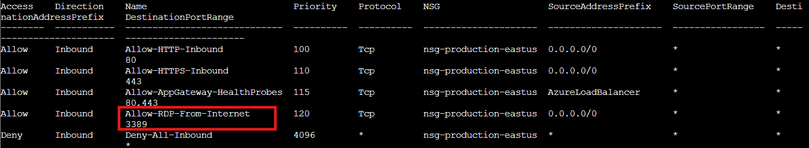
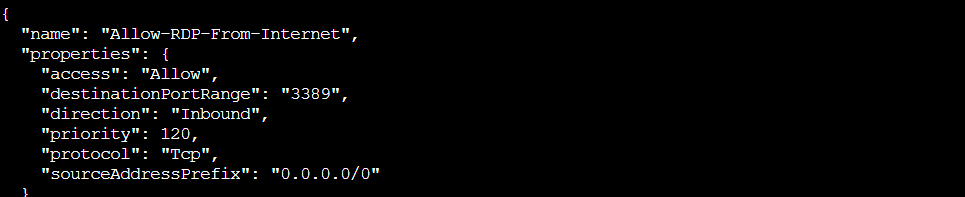

## Overview

Help **Goose Lucas** in the **hotel parking lot** find the dangerously misconfigured Network Security Group rule that's allowing unrestricted internet access to sensitive ports like RDP or SSH.

!!! quote "Lucas"
	(Spanish mode) Hi... welcome to the Dosis Neighborhood! Nice to meet you!

¡Hola Lucas!

!!! quote "Lucas"
	Please make sure the towns Azure network is secured properly.

	The Neighborhood HOA uses Azure for their IT infrastructure.

	Audit their network security configuration to ensure production systems aren't exposed to internet attacks.

	They claim all systems are properly protected, but you need to verify there are no overly permissive NSG rules.

## Hints

??? example "The Open Door"
	This terminal has built-in hints!

## Solution

Back at it again...

### Azure CLI Crash Course

Time to get familiar with the Azure command line interface. The terminal starts us off with a quick tour of output formats!

!!! question "Listing Resource Groups in JSON"
	Welcome back! Let's start by exploring output formats.
	
	First, let's see resource groups in JSON format (the default): `az group list`
	
	JSON format shows detailed structured data.

!!! success "Default JSON Output"
	`az group list`
	
	

The default JSON output shows two resource groups: `theneighborhood-rg1` and `theneighborhood-rg2`, both in `eastus` and `westus` regions. JSON gives us complete structured data with all properties, IDs, and metadata. Great for scripting, *terrible* for actually reading.

### Making JSON Human Readable

Much better! The `-o table` flag transforms that wall of JSON into something our brains can actually parse. JSON is perfect for machines, but humans need tables!

!!! question "Converting to Table Format"
	Great! Now let's see the same data in table format for better readability 👀: `az group list -o table`
	
	Notice how -o table changes the output format completely!

	Both commands show the same data, just formatted differently.

!!! success "Human Readable Table"
	`az group list -o table`

Same information, dramatically better presentation! The table format strips away the JSON structure and gives us just the essential columns: Name, Location, and ProvisioningState. Much easier to scan when you're hunting through Azure resources. It's the difference between reading a raw database dump and reading a spreadsheet.

### Hunting for Firewall Holes

Now for the actual audit! Network Security Groups (NSGs) control what traffic can flow to and from Azure resources. Time to see what the HOA has configured.

!!! question "Finding All NSGs"
	Lets take a look at Network Security Groups (NSGs).
	
	To do this try: `az network nsg list -o table`
	
	This lists all NSGs across resource groups.

!!! success "NSG Discovery"
	`az network nsg list -o table`

Five Network Security Groups spread across the two resource groups: `nsg-web-eastus`, `nsg-db-eastus`, `nsg-dev-eastus`, `nsg-mgmt-eastus`, and `nsg-production-eastus`. Standard naming convention with each NSG labeled by purpose and region. So far the HOA is following best practices with their naming. Let's peek inside and see if the actual rules are as clean!

### Peeking Behind the Web Tier Curtain

The terminal guides us to inspect individual NSGs starting with the web tier.

!!! question "Inspecting Web Security Group"
	Inspect the Network Security Group (web)  🕵️
	
	Here is the NSG and its resource group:`--name nsg-web-eastus --resource-group theneighborhood-rg1`

	Hint: We want to show the NSG details. Use `| less` to page through the output.

!!! success "Full NSG Configuration"
	`az network nsg show --name nsg-web-eastus --resource-group theneighborhood-rg1 | less`

Back to JSON output since we didn't specify `-o table`. The screenshot shows the NSG configuration with its ID, location, and the start of the `securityRules` array. Using `less` lets us scroll through without flooding the terminal. Nothing suspicious yet! The web tier looks locked down properly.

### Management Tier Deep Dive

Moving to the management tier! We use `az network nsg rule list` to focus on rules specifically.

!!! question "Listing Management Rules"
	Inspect the Network Security Group (mgmt)  🕵️
	
	Here is the NSG and its resource group:`--nsg-name nsg-mgmt-eastus --resource-group theneighborhood-rg2` 

	Hint: We want to `list` the NSG rules

!!! success "Management Tier Rules"
	`az network nsg rule list --nsg-name nsg-mgmt-eastus --resource-group theneighborhood-rg2 --output table | less`

Now we're talking! The table format makes scanning rules easy. Looking at `nsg-mgmt-eastus`, we see inbound rules allowing TCP traffic from specific Azure services: `Azure Baston` on port `443`, `Azure Monitor` on port `443`, and `DNS` from `VirtualNetwork` on port `53`. There's also a catch all `"Deny All Inbound"` rule at priority `4096`. The outbound rules allow monitoring, Active Directory, and backup traffic. Everything here looks properly restricted to trusted Azure services! Two down, three to go. Maybe the HOA really did secure everything?

### Finding the Internet-Facing RDP Disaster

Time to examine the production NSG and find the security issue Lucas warned us about!

!!! question "Auditing Production Rules"
	Take a look at the rest of the NSG rules and examine their properties. After enumerating the NSG rules, enter the command string to view the suspect rule and inspect its properties. 
	
	Hint: Review fields such as direction, access, protocol, source, destination and port settings.

!!! success "Production NSG Enumeration"
	`az network nsg rule list --nsg-name nsg-production-eastus --resource-group theneighborhood-rg1 --output table | less`

There it is! Fourth rule down: **Allow RDP From Internet on port 3389 with SourceAddressPrefix 0.0.0.0/0**. Annnd there goes the HOA's claim about proper security!

Port `3389` is Remote Desktop Protocol (RDP). And `0.0.0.0/0` means the entire internet. This rule allows anyone anywhere to attempt RDP connections to whatever's behind this NSG.

The other rules are fine: `HTTP` on port `80`, `HTTPS` on port `443`, health probes from the Azure Load Balancer. But that RDP rule is a *major* security vulnerability. Let's examine it in detail!

!!! success "Detailed Rule Inspection"
	`az network nsg rule show --nsg-name nsg-production-eastus --resource-group theneighborhood-rg1 --name Allow-RDP-From-Internet | less`

The JSON confirms everything:

- **access:** `"Allow"` (bad)
- **destinationPortRange:** `"3389"` (very bad)
- **direction:** `"Inbound"` (extremely bad)
- **priority:** `120` (processes early)
- **protocol:** `"Tcp"` (RDP uses TCP)
- **sourceAddressPrefix:** `"0.0.0.0/0"` (*nuclear explosion*)

This rule accepts RDP connections from anywhere in the world. In production. With a priority of 120, meaning it gets evaluated before most other rules. Attackers can brute force passwords, exploit RDP vulnerabilities, or use stolen credentials to access the network! 

### Challenge Complete!

The HOA claimed "all systems are properly protected" but we found one overly permissive NSG rule exposing the entire production environment to port `3389`.

I have a sneaking suspicion that this HOA security fiasco is not over!

!!! quote "Lucas"
	Ha! 'Properly protected' they said. More like 'properly exposed to the entire internet'! Good catch, amigo.
	

  <a href="/objectives/o9" class="nav-button nav-left">← Spare Key</a>
  <a href="/objectives/o11" class="nav-button nav-right">Next: Owner →</a>

