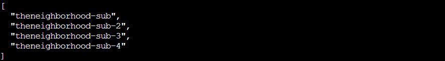
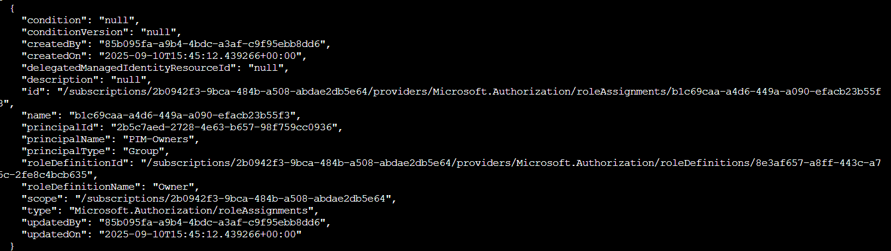
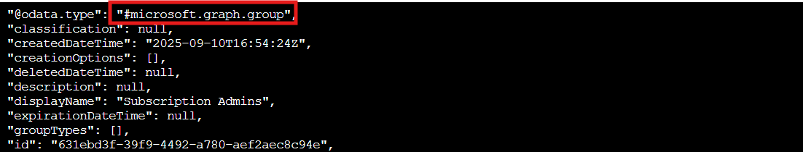

## Overview

Help **Goose James** near the **park** identify which identity has been granted excessive Owner permissions at the subscription level, violating the principle of least privilege.

!!! quote "James"
	CLUCK CLU... I think I might be losing my mind. All the elves are gone and I'm still hearing voices.

Uh oh, James is clucking...this has to be serious!

!!! quote "James"
	The Neighborhood HOA uses Azure for their IT infrastructure.

	The Neighborhood network admins use RBAC for access control.

	Your task is to audit their RBAC configuration to ensure they're following security best practices.

	They claim all elevated access uses PIM, but you need to verify there are no permanently assigned Owner roles.

## Hints
??? example "Owner"
	This terminal has built-in hints!

## Solution

We need to help fix this so James can regain his sanity!! Time to put on our security auditor hats and see if the HOA's Azure setup is as squeaky clean as they claim. Spoiler: *it's not*. ❄️ 

### Task 1: Query Basics

First things first: we need to learn how to query Azure effectively. The terminal wants to teach us JMESPath syntax, which is basically Azure CLI's way of saying "here's how to not drown in JSON output."

!!! question "Learning JMESPath Queries"
	Let's learn some more Azure CLI, the --query parameter with JMESPath syntax! `az account list --query "[].name"`
	
	Here, `[]` loops through each item, `.name` grabs the name field

!!! success "Listing Subscription Names"
	`az account list --query "[].name"`
	

Perfect! We can see all four subscriptions: `theneighborhood-sub`, `theneighborhood-sub-2`, `theneighborhood-sub-3`, and `theneighborhood-sub-4`. The `--query` parameter is our best friend here because it lets us extract just the fields we care about instead of wading through pages of JSON!

### Task 2: Conditional Filtering

Now let's level up with some conditional filtering. We want to see only the enabled subscriptions with their IDs in a nice, clean format.

!!! question "Advanced Queries with Custom Output"
	You can do some more advanced queries using conditional filtering with custom output.
	
	`az account list --query "[?state=='Enabled'].{Name:name, ID:id}"`
	
	Cool! 😎  `[?condition]` filters what you want, `{custom:fields}` makes clean output ✨

!!! success "Filtering Enabled Subscriptions"
	`az account list --query "[?state=='Enabled'].{Name:name, ID:id}"`

That looks way better! Now we can see both the names and IDs of each active subscription. The conditional filter `[?state=='Enabled']` ensures we only look at subscriptions that are actually in use, and the custom output format `{Name:name, ID:id}` gives us exactly what we need.

### Task 3: First Subscription Audit

Time for the actual audit! We'll start by checking who has Owner permissions on the first subscription and see if it matches what the HOA promised.

!!! question "Checking Owner Assignments"
	Let's take a look at the Owners of the first listed subscription 🔍. Pass in the first subscription id.
	
	Try: `az role assignment list --scope "/subscriptions/{ID of first Subscription}" --query [?roleDefinition=='Owner']`

!!! success "Auditing `theneighborhood-sub`"
	`az role assignment list --scope "/subscriptions/2b0942f3-9bca-484b-a508-abdae2db5e64" --query [?roleDefinition=='Owner']`

Good news so far! The first subscription shows a group called `"PIM-Owners"` with the `Owner` role. PIM (Privileged Identity Management) is exactly what we want to see. It means users have to explicitly request and activate their elevated permissions rather than having them permanently. Nothing suspicious yet!

### Task 4: Second Subscription Discovery

The first subscription looked clean, but we can't stop there. The other subscriptions need auditing too!

!!! question "Checking Other Subscriptions"
	Ok 🤔 — there is a group present for the Owners permission; however, we've been assured this is a 🔐 PIM enabled group.
	
	Currently, no PIM activations are present. 🚨
	
	Let's run the previous command against the other subscriptions to see what we come up with.

!!! success "Auditing `theneighborhood-sub-3`"
	`az role assignment list --scope "/subscriptions/065cc24a-077e-40b9-b666-2f4dd9f3a617" --query [?roleDefinition=='Owner']`

Hold on a second... The third subscription has a different group assigned as `Owner: "IT Admins"`! This wasn't mentioned in the briefing. They assured us that only the PIM group would have Owner permissions across all subscriptions. This is starting to look less "winter wonderland" and more "*security blunderland*."

### Task 5: Group Membership Investigation

We found a suspicious `"IT Admins"` group that shouldn't be there. Now we crack it open and see who's actually inside.

!!! question "Investigating the IT Admins Group"
	Looks like you are on to something here! 🕵️  We were assured that only the 🔐 PIM group was present for each subscription.
	
	🔎 Let's figure out the membership of that group.
	
	Hint: use the `az ad member list` command. Pass the group id instead of the name.
	
	Remember: `| less` lets you scroll through long output

!!! success "Checking Group Members"
	`az ad group member list --group 6b982f2f-78a0-44a8-b915-79240b2b4796 | less`

Welp... Instead of containing actual users, the `"IT Admins"` group contains another group (notice the `"@odata.type": "#microsoft.graph.group"`). Group nesting at work, a common way security misconfigurations hide in plain sight. Security through obscurity's evil twin: security through *nested groups*! The ID of this nested group is `631ebd3f-39f9-4492-a780-aef2aec8c94e`. Let's unwrap this present...

### Task 6: Finding the Permanent Assignment

A nested group! *Classic* hiding technique. Let's peel back one more layer and find out who's really got those permanent admin rights.

!!! question "Nested Group Membership"
	Well 😤, that's annoying. Looks like we have a nested group!
	
	Let's run the command one more time against this group.

!!! success "Revealing the User"
	`az ad group member list --group 631ebd3f-39f9-4492-a780-aef2aec8c94e | less`

And there's our culprit! Firewall Frank (`frank.firewall@theneighborhood.onmicrosoft.com`) has permanent Owner access through nested groups: Frank → Subscription Admins → IT Admins → Owner on `theneighborhood-sub-3`. No PIM activation, no time limits, no audit trail. Classic security theater: they *said* everything uses PIM, but Frank's been skating by with permanent admin rights the whole time!

### Challenge Complete!

With Frank's permissions properly audited and James's sanity restored, we've wrapped up our Azure adventure! Four Azure challenges down, from storage accounts to RBAC audits, and we found every misconfiguration the Neighborhood tried to hide. On to the next challenge! ❄️

!!! quote "James"
	You found the permanent assignments! CLUCK! See, I'm not crazy - the security really WAS misconfigured. Now maybe I can finally get some peace and quiet...
	

  <a href="/objectives/o10" class="nav-button nav-left">← The Open Door</a>
  <a href="/objectives/o12" class="nav-button nav-right">Next: Retro Recovery →</a>

