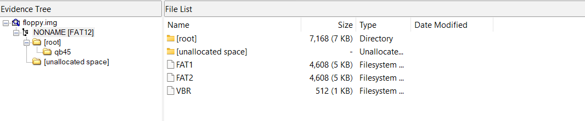
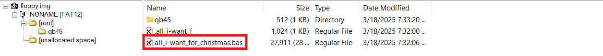

## Overview


Join **Mark** in the **retro shop**. Analyze his disk image for a blast from the retro past and recover some classic treasures.


!!! quote "Mark"
	I am an avid collector of things of the past. I love old technology. I love how it connects us to the past. Some remind me of my dad, who was an engineer on the Apollo 11 mission and helped develop the rendezvous and altimeter radar on the space craft.

	If you ever get into collecting things like vintage computers, here is a tip. Never forget to remove the RIFA capacitors from vintage computer power supplies when restoring a system. If not they can pop and fill the room with nasty smoke.

	I love vintage computing, it’s the very core of where and when it all began. I still enjoy writing programs in BASIC and have started re-learning Apple II assembly language. I started writing code in 1982 on a Commodore CBM.

	Sometimes it is the people no one can imagine anything of who do the things no one can imagine. - Alan Turing

	You never forget your first 8-bit system.
<div style="clear: both;"></div>

You're right, Mark! I still have my original NES that I got for Christmas in 1988, which was only *15 years ago* if I use Millennial math...*sigh*...

!!! quote "Mark"
	This FAT12 floppy disk image must have been under an arcade machine here in the Retro Store.

	When I was a kid we shared warez by hiding things as deleted files.

	I remember writing programs in BASIC. So much fun! My favorite was Star Trek.

	The beauty of file systems is that 'deleted' doesn't always mean gone forever.

	Ready to dive into some digital archaeology and see what secrets this old disk is hiding?

	Download the floppy disk image, and see what you can find!


## Hints
??? example "Retro Recovery (1)"
	I miss old school games. I wonder if there is anything on this disk? I remember, when kids would accidentlly delete things.......... it wasn't to hard to recover files. I wonder if you can still mount these disks?

??? example "Retro Recovery (2)"
	Wow! A disk from the 1980s! I remember delivering those computer disks to the good boys and girls. Games were their favorite, but they weren't like they are now. 

??? example "Retro Recovery (3)"
	I know there are still tools available that can help you find deleted files. Maybe that might help. Ya know, one of my favorite games was a Quick Basic game called Star Trek.

## Solution

### Examining the Floppy

We're given `floppy.img`, a FAT12 floppy disk image from the 1980s!

Let's fire up FTK Imager and take a look at what's on this disk. After opening the image, we can browse the filesystem just like any other drive.



There's a QB45 directory with QuickBASIC 4.5 development tools. Nothing unusual there, but one of the hints mentioned that when kids would accidentally delete things, it wasn't too hard to recover files. FTK Imager shows deleted files alongside active ones, so let's keep looking.



There it is! A deleted file called `all_i-want_for_christmas.bas`. Mark's favorite game was Star Trek in QuickBASIC, so this deleted BASIC file is definitely worth investigating.

### The Hidden Message

Double clicking the deleted file opens it in FTK's text viewer. It's the *classic* Super Star Trek game! Scrolling through the code, something catches our eye in the REM statements around line 211:

```BASIC
211 REM bWVycnkgY2hyaXN0bWFzIHRvIGFsbCBhbmQgdG8gYWxsIGEgZ29vZCBuaWdodAo=
```


That looks like Base64 encoding! Let's decode it:

```bash
echo "bWVycnkgY2hyaXN0bWFzIHRvIGFsbCBhbmQgdG8gYWxsIGEgZ29vZCBuaWdodAo=" | base64 -d
```


!!! success "The Flag!"
	`merry christmas to all and to all a good night`
	
There it is! A *classic* line from "'Twas the Night Before Christmas" hidden in a *classic* Star Trek game on a *classic* floppy disk.	

And that wraps up our digital archaeology expedition!

<div class="nav-buttons">
  <a href="/objectives/o11" class="nav-button nav-left">← Owner</a>
  <a href="/objectives/o13" class="nav-button nav-right">Next: Mail Detective →</a>
</div>