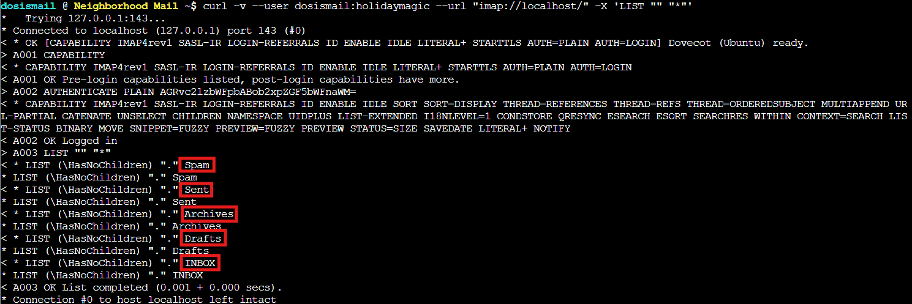
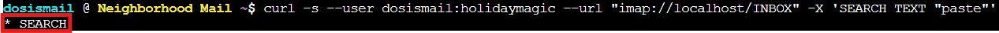
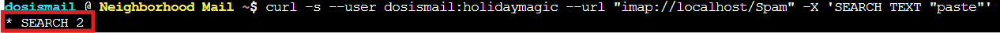
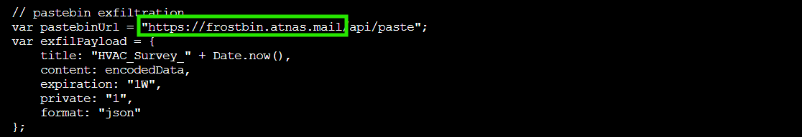

## Overview


Help **Mo** in **City Hall** solve a curly email caper and crack the IMAP case. What is the URL of the pastebin service the gnomes are using?


!!! quote "Mo"
	Hey there! I'm Mo, on loan from the Air Force, and let me tell you - Counter Hack is the best job I have ever had!
<div style="clear: both;"></div>

Heeey, Air Force! I've spent the majority of my Army career telling myself that I should have joined the Air Force...😂. 

!!! quote "Mo"
	So here's our situation: those gnomes have been sending JavaScript-enabled emails to everyone in the neighborhood, and it's causing chaos.

	We had to shut down all the email clients because they weren't blocking the malicious scripts - kind of like how we'd ground aircraft until we clear a security threat.

	The only safe way to access the email server now is through curl - yes, the HTTP tool!

	Think you can help me use curl to connect to the IMAP server and hunt down one of these gnome emails?

## Hints

??? example "Did You Say Curl?"
	If I heard this correctly...our sneaky security gurus found a way to interact with the IMAP server using Curl! Yes...the CLI HTTP tool! Here are some [helpful docs](https://everything.curl.dev/usingcurl/reademail.html) I found.
## Solution

### curl Meets IMAP

Time to investigate! Mo mentioned using `curl` to access an IMAP server, which sounds absolutely wild. `curl` is an HTTP tool, right? But nope, turns out `curl` is the Swiss Army knife of protocols and IMAP support is totally legit. Who knew?

!!! question "Mail Detective Terminal"
    🎄 Mail Detective: Curly IMAP Investigation 🎄
    
    ⚠️  ALERT! Those gnomes have been sending JavaScript-enabled emails
    to everyone in the neighborhood, and it's causing absolute chaos!
    
    🕵️  YOUR MISSION: Use curl to safely connect to the IMAP server
    and hunt down one of these gnome emails. Find the malicious email
    that wants to exfiltrate data to a pastebin service and submit the URL
    of that pastebin service in your badge.
    
    📡 Server Info:
       The IMAP server is running locally on TCP port 143
       Backdoor credentials: dosismail:holidaymagic
	   

**Our mission:** dig through email using command line tools and find Frost's pastebin service. This is basically detective work, but with more typing and less dramatic music.

---

### What Mailboxes Are Available?

Let's start by listing what mailboxes are available using the [LIST command](https://datatracker.ietf.org/doc/html/rfc3501#section-6.3.8). `curl` uses [IMAP URLs](https://curl.se/docs/url-syntax.html) in the format `imap://server/folder` and we authenticate with `--user username:password`:

```bash
curl -v --user dosismail:holidaymagic --url "imap://localhost/" -X 'LIST "" "*"'
```



Perfect! We've got five mailboxes: Spam, Sent, Archives, Drafts, and INBOX. The challenge mentions finding an email that exfiltrates to a pastebin service, so we need to search for messages mentioning "paste" or "pastebin". Time to go phishing for phishing emails! 🎣

---

### Hunting for Pastebin References

Let's search the INBOX first. Maybe the gnomes are bold enough to bypass spam filters:

```bash
curl -s --user dosismail:holidaymagic --url "imap://localhost/INBOX" -X 'SEARCH TEXT "paste"'
```



The output shows `* SEARCH` with no results. Nothing in INBOX. Guess the spam filter is doing its job!

Since the gnome emails are malicious JavaScript, they've probably been caught and quarantined. Let's check the Spam folder using IMAP's [SEARCH command](https://datatracker.ietf.org/doc/html/rfc3501#section-6.4.4):

```bash
curl -s --user dosismail:holidaymagic --url "imap://localhost/Spam" -X 'SEARCH TEXT "paste"'
```



Bingo! `* SEARCH 2`: message number 2 in the Spam folder contains our search term. Found you, you little gnome email!

---

### Grabbing the Gnome's Malicious Message

Now we need to fetch message 2 from the Spam folder. The `curl` IMAP syntax for fetching a specific message uses `imap://server/folder;MAILINDEX=number`, and we use the [FETCH command](https://datatracker.ietf.org/doc/html/rfc3501#section-6.4.5) to retrieve the message body:

```bash
curl -v --user dosismail:holidaymagic --url "imap://localhost/Spam;MAILINDEX=2" -X 'FETCH 2 BODY[1]'
```

The `BODY[1]` parameter tells IMAP to return the first body part of the message (the HTML content). Using verbose mode (`-v`) lets us see the full IMAP conversation happening behind the scenes:


The output tells us there are 3 messages in Spam, and message 2 has a body of 2,956 bytes. That's a *chonky* email for something that's supposed to be stealthy!


And there's our malicious JavaScript! This email is a Triple Threat of Terrible (TTT):

- **initCryptoMiner()** - mines "FrostCoin" for a perpetual winter fund (because apparently Frost needs cryptocurrency?)

- **exfiltrateData()** - collects HVAC system data and sends it to a pastebin service (this is what we're hunting for!)

- **establishPersistence()** - tries to install a persistent service worker (because gnomes are thorough, I'll give them that)

Someone's been busy writing malware instead of wrapping presents.

---

### Finding Frost's Pastebin

The exfiltration function is what we're after. Let's see where this stolen HVAC data is going...

Reading through the JavaScript code that was in the email body, we spot the pastebin configuration buried in the `exfiltrateData()` function:



There it is! The malicious JavaScript exfiltrates stolen HVAC data to `https://frostbin.atnas.mail` - Frost's custom pastebin for collecting neighborhood cooling system intel. Because when you're planning perpetual winter, you need to know where all the heaters are!

The email even includes helpful console logging ("Sending stolen data to FrostBin pastebin service...") which is very considerate of our malicious gnome programmers. It's almost like they *wanted* to get caught. Then again, maybe they're just really into DevOps best practices. Even evil needs good logging, apparently.

!!! success "Answer"
    https://frostbin.atnas.mail

Victory! We've tracked down Frost's pastebin service using nothing but `curl` and some good old fashioned email snooping. Mo can report back to Counter Hack that the investigation is complete, and we've successfully demonstrated that yes, you absolutely can use `curl` as an email client. Is it weird? Yes. Does it work? Also yes!

The gnomes might want to reconsider their operational security though, but let's not deliver their audit report *just* yet...

<div class="nav-buttons">
  <a href="/objectives/o12" class="nav-button nav-left">← Retro Recovery</a>
  <a href="/objectives/o14" class="nav-button nav-right">Next: IDORable Bistro →</a>
</div>
