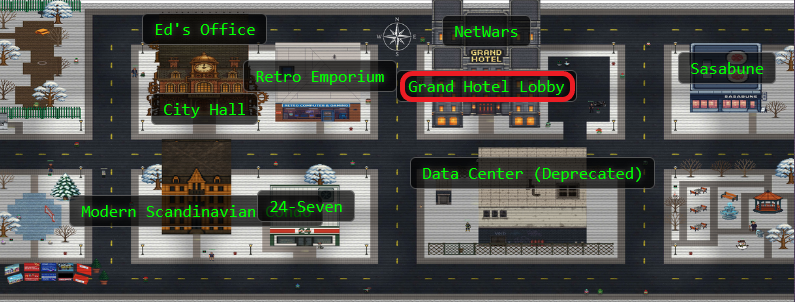
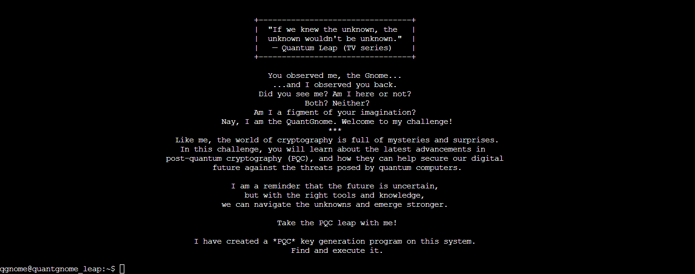
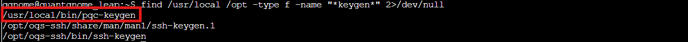
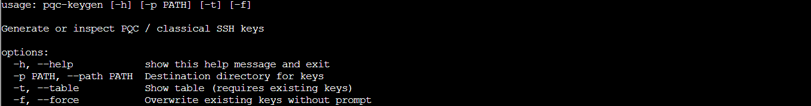
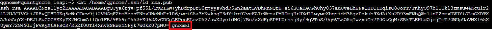
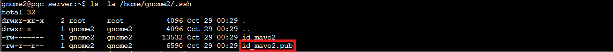
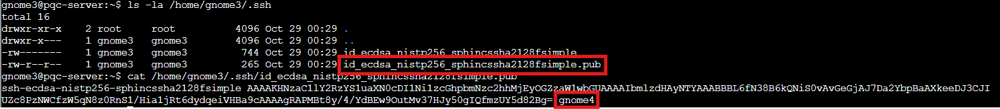
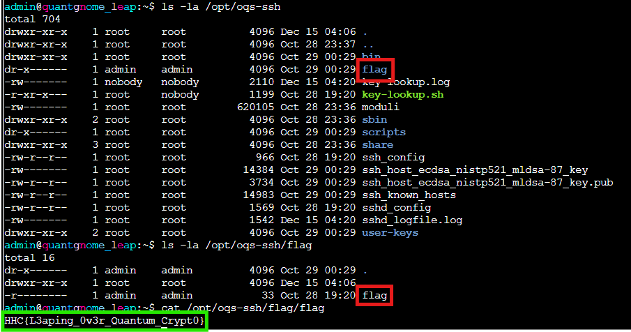

## Overview


**Charlie** in the **hotel** has quantum gnome mysteries waiting to be solved. What is the flag that you find?


!!! quote "Charlie"
	Hello! I'm not JJ. I like music.

	I accept AI tokens.

	I like quantum pancakes.

	I enjoy social engineeering.
<div style="clear: both;"></div>

!!! quote "Charlie"
	I just spotted a mysterious gnome - he winked and vanished, or maybe he's still here?

	Things are getting strange, and I think we've wandered into a quantum conundrum!

	If you help me unravel these riddles, we might just outsmart future quantum computers.

	Cryptic puzzles, quirky gnomes, and post-quantum secrets—will you leap with me?
	
## Hints
??? example "Quantgnome Leap (1)"
	When you give a present, you often put a label on it to let someone know that the present is for them. Sometimes you even say who the present is from. The label is always put on the outside of the present so the public knows the present is for a specific person. SSH keys have something similar called a comment. SSH keys sometimes have a comment that can help determine who and where the key can be used.

??? example "Quantgnome Leap (2)"
	User keys are like presents. The keys are kept in a hidden location until they need to be used. Hidden files in Linux always start with a dot. Since everything in Linux is a file, directories that start with a dot are also...hidden!

??? example "Quantgnome Leap (3)"
	Process information is very useful to determine where an application configuration file is located. I bet there is a secret located in that application directory, you just need the right user to read it!

??? example "Quantgnome Leap (4)"
	If you want to create SSH keys, you would use the ssh-keygen tool. We have a special tool that generates post-quantum cryptographic keys. The suffix is the same as ssh-keygen. It is only the first three letters that change.

## Solution

### Charlie's Post Quantum Playground

Charlie wasn't kidding about quantum mysteries. The challenge drops us into an SSH server running `OQS-SSH`, which supports fancy new post quantum algorithms alongside the classics. We're starting as the `qgnome` user, and somewhere up this cryptographic ladder is an admin account with our flag.



The environment is a playground of quantum safe crypto, each user representing a step up in security. Every rung on this ladder is a different cryptographic algorithm, from "quantum computers will break this eventually" all the way to "good luck cracking this even with a quantum supercomputer!"

We need to generate some quantum safe SSH keys. The hint mentioned a tool similar to `ssh-keygen` but with the *first three letters changed*. So we're looking for something like `*-keygen`. Time to search for it:

```bash
find /usr/local /opt -type f -name "*keygen*" 2>/dev/null
```



Bingo! `/usr/local/bin/pqc-keygen` looks promising. Before we run it blindly, what options does it support?

```bash
/usr/local/bin/pqc-keygen --help
```



The `help` shows we can specify a destination directory with `-p` PATH. Perfect! We'll generate keys in a temp directory and use `-t` afterward to see what we got:

!!! success "Generating Post Quantum Keys"
```bash
	mkdir -p /tmp/quantgnome_keys
	/usr/local/bin/pqc-keygen -p /tmp/quantgnome_keys
	/usr/local/bin/pqc-keygen -p /tmp/quantgnome_keys -t
```
	
??? info "All Keys"
	

Success! The tool generated a whole collection of key pairs in `/tmp/quantgnome_keys/`. Charlie's quantum playground just handed us a full cryptographic toolkit. The table shows we've got quite the lineup here:

Classical keys that work great today but quantum computers will eventually break:

- **`id_rsa`** - *Classic* RSA, been keeping secrets since the '70s

- **`id_ed25519`** - Elliptic curve crypto, faster and smaller than RSA (the sleek sports car of classical crypto)

Pure post quantum algorithms that use completely different math to resist quantum attacks:

- **`id_ssh-mayo2`** - MAYO (Multivariate quAsigroup Yates-Ollerenshaw), uses oil and vinegar polynomials. Yes, really... (I didn't believe it at first either)

Hybrid keys that combine both worlds for extra protection, like wearing both a winter coat AND a sweater:

- **`id_ecdsa_nistp256_sphincssha2128fsimple`** - ECDSA paired with SPHINCS+, a hash based signature scheme

- **`id_ecdsa_nistp521_mldsa87`** - ECDSA with ML-DSA-87, NIST's highest security level for lattice based signatures

The hybrid approach is clever: even if quantum computers crack the classical part, the post quantum portion keeps you safe. And if there's some undiscovered flaw in the new PQC algorithms, the classical crypto still works. Defense in depth, quantum edition.

Now we'll try connecting as `qgnome` using one of our shiny new quantum safe keys:

```bash
ssh -vv -p 2222 -o IdentitiesOnly=yes -o IdentityAgent=none -o PubkeyAcceptedAlgorithms=+ssh-mayo2,ssh-ecdsa-nistp256-sphincssha2128fsimple,ssh-ecdsa-nistp521-mldsa-87 -i /tmp/quantgnome_keys/id_ssh-mayo2 qgnome@pqc-server.com
```


Permission denied! But the first hint mentioned something about SSH key comments being gift labels that tell you who the present is for. We should check what our generated public keys actually say.

The public key files (`.pub` files) are missing from our generated keys, but we can extract the public key from each private key and check for comments. Here's a bash script that loops through all the generated keys and extracts any comments:

!!! success "Bash Script to Extract SSH Key Comments"
```bash
    for k in /tmp/quantgnome_keys/id_*; do
      ssh-keygen -y -f "$k" 2>/dev/null | awk -v K="$k" '{sub(/^[^ ]+ [^ ]+ /,""); print K": "$0}'
    done
```
	
This iterates through each private key file, uses `ssh-keygen -y` to generate the public key from it, then uses `awk` to extract just the comment field (the third field after the key type and key data). No comments on our generated keys. But there must be existing keys somewhere. The second hint mentioned hidden files starting with dots, and the standard SSH key location is `.ssh` in the home directory.

---

### When Public Keys Whisper Secrets

Checking what qgnome already has tucked away:

```bash
cat /home/qgnome/.ssh/id_rsa.pub
```



Found it! The comment says `gnome1`, which is our next username. The SSH key comments show us the path forward. Just what we'd expect from a gnome who likes *social engineering*.

Time to use that RSA key to log in as gnome1:
```bash
ssh -vv -p 2222 -o IdentitiesOnly=yes -o IdentityAgent=none -i /home/qgnome/.ssh/id_rsa gnome1@pqc-server.com
```


Success! We're in as `gnome1`. Now we know the pattern! Each gnome user has an SSH key whose comment reveals the next username in the chain. It's a quantum leap from user to user, each step bringing us closer to that `admin` account.

---

### Climbing the Cryptographic Ladder

From here, it's a systematic climb through progressively stronger cryptography. Each gnome's .ssh directory contains the key to the next level, both literally and figuratively!

**gnome1 → gnome2 (Ed25519):**

```bash
cat /home/gnome1/.ssh/id_ed25519.pub
```


There's our next stop: `gnome2`. The [elliptic curve](https://ed25519.cr.yp.to/) approach is faster than RSA, though still vulnerable to Shor's algorithm once quantum computers get powerful enough.

```bash
ssh -p 2222 -i /home/gnome1/.ssh/id_ed25519 gnome2@pqc-server.com
```

**gnome2 → gnome3 (MAYO post quantum):**

```bash
cat /home/gnome2/.ssh/id_mayo2.pub
```


(*`id_mayo2.pub` was a loooong key, `gnome3` was there! Trust!*)

Next up: `gnome3`. Now we're entering proper post quantum territory with MAYO! The algorithm gets its name from [Multivariate quAsigroup Yates-Ollerenshaw](https://pqmayo.org/about/) (someone *really* wanted that acronym to work), and it's based on those oil and vinegar polynomials we mentioned earlier. Oil and vinegar is actually a real cryptographic scheme where you have two types of variables in polynomial equations: "vinegar" variables you can choose freely, and "oil" variables computed from them. The security comes from the difficulty of solving systems of multivariate polynomial equations. Quantum computers can crack RSA and elliptic curves, but multivariate polynomial systems? Still a hard problem even for quantum algorithms.

```bash
ssh -p 2222 -i /home/gnome2/.ssh/id_mayo2 gnome3@pqc-server.com
```

**gnome3 → gnome4 (Hybrid ECDSA + SPHINCS+):**

```bash
cat /home/gnome3/.ssh/id_ecdsa_nistp256_sphincssha2128fsimple.pub
```



Our next target: `gnome4`. The hybrid approach gets interesting here. We've got classical [ECDSA](https://cryptobook.nakov.com/digital-signatures/ecdsa-sign-verify-messages) (quantum vulnerable) combined with [SPHINCS+](https://sphincs.org/), a post quantum signature scheme built entirely on hash functions. Hash functions are believed to be quantum resistant, so SPHINCS+ doesn't rely on any fancy math that might have unknown weaknesses. It's the belt-and-suspenders approach to cryptography.

SSH doesn't recognize this hybrid algorithm by default, so we need to explicitly tell it this is acceptable:

```bash
ssh -p 2222 -o PubkeyAcceptedAlgorithms=+ssh-ecdsa-nistp256-sphincssha2128fsimple -i /home/gnome3/.ssh/id_ecdsa_nistp256_sphincssha2128fsimple gnome4@pqc-server.com
```

**gnome4 → admin (Hybrid ECDSA + ML-DSA-87, Level 5 PQC):**

```bash
cat /home/gnome4/.ssh/id_ecdsa_nistp521_mldsa87.pub
```


The final key points to `admin`. We've reached the top tier of post quantum security! [ML-DSA-87](https://nvlpubs.nist.gov/nistpubs/fips/nist.fips.204.pdf ) (Module Lattice Based Digital Signature Algorithm) is NIST's standardized version of what used to be called CRYSTALS-Dilithium. The `"87"` refers to security level 5, the absolute highest tier. This uses lattice based cryptography, where the security comes from the hardness of finding short vectors in high dimensional lattices. Even quantum computers hit a wall with that problem. One more quantum leap:

```bash
ssh -p 2222 -o PubkeyAcceptedAlgorithms=+ssh-ecdsa-nistp521-mldsa-87 -i /home/gnome4/.ssh/id_ecdsa_nistp521_mldsa87 admin@pqc-server.com
```

We're in! Five users, five quantum leaps up the cryptographic ladder.

---

### The OQS Administrator's Secret

Now as `admin`, we need to find that flag. The third hint mentioned checking process information to find where the application lives. Let's see what's running:

```bash
ps -ef | grep sshd
```


The SSH daemon is running from 	/opt/oqs-ssh/	. Perfect! Administrators always leave interesting things in their application directories...like credentials, or flags!

```bash
ls -la /opt/oqs-ssh
ls -la /opt/oqs-ssh/flag
cat /opt/oqs-ssh/flag/flag
```



We've successfully navigated the entire cryptographic evolution from classical RSA through cutting edge post quantum hybrid schemes, all by following the trail of SSH key comments.

!!! success "Flag"
	HHC{L3aping_0v3r_Quantum_Crypt0}

Gloooory! We've quantum leaped our way from classical RSA all the way through to cutting edge hybrid post quantum cryptography. Five SSH keys, five gnomes, five quantum leaps through the winter wonderland of post quantum crypto. Charlie's mysterious gnome left us quite the cryptographic trail to follow!

<div class="nav-buttons">
  <a href="/objectives/o16" class="nav-button nav-left">← Rogue Gnome Identity Provider</a>
  <a href="/objectives/o18" class="nav-button nav-right">Next: Going in Reverse →</a>
</div>