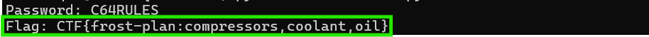

## Overview


**Kevin** in the **Retro Store** needs help rewinding tech and going in reverse. Extract the flag and enter it here.


!!! quote "Kevin"
	Hello, I'm Kevin (though past friends have referred to me as 'Heavy K'). If you ever hear any one say that philosophy is a useless college degree, don't believe them; it's not. I've arrived where I am at because of it. It just made the path more interesting.

	I have more hobbies than I can keep up with, including Amateur Astronomy, Shortwave Radio, and retro-gaming. Things like backyard observances of distant galaxies, non-internet involved, around the world communications, and those who program for the Atari 2600 still invoke degrees of awe for me.

	One of the most influential books I've read is "Godel, Escher, and Bach" by Douglas Hofstadter. I'm also a bit of a Tolkien fanatic.

	My wife and my daughter are everything; without them, I surely would still be kicking rusty tin cans down the lonely highways of my past.
<div style="clear: both;"></div>

!!! quote "Kevin"
	You know, there's something beautifully nostalgic about stumbling across old computing artifacts. Just last week, I was sorting through some boxes in my garage and came across a collection of 5.25" floppies from my college days - mostly containing terrible attempts at programming assignments and a few games I'd copied from friends.

	Finding an old Commodore 64 disk with a mysterious BASIC program on it? That's like discovering a digital time capsule. The C64 was an incredible machine for its time - 64KB of RAM seemed like an ocean of possibility back then. I spent countless hours as a kid typing in program listings from Compute! magazine, usually making at least a dozen typos along the way.

	The thing about BASIC programs from that era is they were often written by clever programmers who knew how to hide things in plain sight. Sometimes the most interesting discoveries come from reading the code itself rather than watching it execute. It's like being a digital archaeologist - you're not just looking at what the program does, you're understanding how the programmer thought.

	Take your time with this one. The beauty of reverse engineering isn't in rushing to the answer, but in appreciating the craft of whoever wrote it. Those old-school programmers had to be creative within such tight constraints.

## Hints
??? example "Going in Reverse (1)"
	Holy cow! Another retro floppy disk, what are the odds? Well it looks like this one is intact. 
	
??? example "Going in Reverse (2)"
	It looks like the program on the disk contains some weird coding.
	
??? example "Going in Reverse (3)"
	Maybe it is encrypted OR encoded?

## Solution

### The C64 Security System

Kevin's got a point about reading the code rather than just running it. Let's see what this mysterious BASIC program is doing.

!!! question "The Program"
	```BASIC
	10 REM *** COMMODORE 64 SECURITY SYSTEM ***
    20 ENC_PASS$ = "D13URKBT"
    30 ENC_FLAG$ = "DSA|auhts*wkfi=dhjwubtthut+dhhkfis+hnkz"
    40 INPUT "ENTER PASSWORD: "; PASS$
    50 IF LEN(PASS$) <> LEN(ENC_PASS$) THEN GOTO 90
    60 FOR I = 1 TO LEN(PASS$)
    70 IF CHR$(ASC(MID$(PASS$,I,1)) XOR 7) <> MID$(ENC_PASS$,I,1) THEN GOTO 90
    80 NEXT I
    85 FLAG$ = "" : FOR I = 1 TO LEN(ENC_FLAG$) : FLAG$ = FLAG$ + CHR$(ASC(MID$(ENC_FLAG$,I,1)) XOR 7) : NEXT I : PRINT FLAG$
    90 PRINT "ACCESS DENIED"
    100 END
	```

Reading through this, the logic is pretty straightforward:

Looking at this, **line 70** immediately catches the eye: `CHR$(ASC(MID$(PASS$,I,1)) XOR 7)`. That's the *classic* BASIC dance of converting characters to ASCII codes (`ASC`), XORing with a key (in this case, `7`), and converting back to characters (`CHR$`).

!!! info "Reference"
	For more details on Commodore 64 BASIC commands and functions, see the [Commodore 64 Programmer's Reference Guide](https://archive.org/details/c64-programmer-ref) (official Commodore documentation).

Let's trace through the logic:

**Lines 40-80: Password Validation**

- Line `40` prompts for a password

- Line `50` checks if the length matches `ENC_PASS$` (8 characters)

- Lines `60-80` loop through each character, `XOR` it with `7`, and compare to the stored encrypted password

- If any character doesn't match, `jump` to line `90` (`ACCESS DENIED`)

**Line 85: The Payload**

This is the good stuff! If the password check passes, it decodes `ENC_FLAG$` using the exact same `XOR` operation and prints it. The flag is sitting right there in line `30`, just waiting to be decoded.

**Line 90: The Trap**

Even if you decode the flag correctly, this line still prints "`ACCESS DENIED`" because the program doesn't have an `END` before it. *Classic* BASIC!

So here's the awesome part: we don't need to run this program at all. We can see both encrypted strings right in the source code at lines `20` and `30`. Since we know they're XOR-encoded with `7`, we can just decode them directly!

---

### Decoding the XOR

Time to write a quick decoder! XOR is one of those operations that's winter-wonderfully simple: `A XOR B XOR B = A`. In other words, XORing something twice with the same key gets you back to the original value. It's encryption's version of a palindrome!

Since the BASIC program XORs each character with `7` to encrypt, we just need to XOR the encrypted strings with `7` to decrypt. Same operation, same key, opposite result. Symmetric cryptography at its most basic!

Here's what we're doing character by character:

- Take an encrypted character (like 'D' from `ENC_PASS$`)

- Convert it to its ASCII value using `ord()` (`68` for 'D')

- XOR that value with `7` (`68 XOR 7 = 67`)

- Convert back to a character using `chr()` (`67 is 'C'`)

Let's see it in action:

!!! success "Python Decoder"
	```Python
	enc_pass = "D13URKBT"
    enc_flag = "DSA|auhts*wkfi=dhjwubtthut+dhhkfis+hnkz"
    
    def xor7(s):
        return ''.join(chr(ord(c) ^ 7) for c in s)
    
    print("Password:", xor7(enc_pass))
    print("Flag:", xor7(enc_flag))
	```
	
Running this gives us:



!!! success "Flag"
	`CTF{frost-plan:compressors,coolant,oil}`

The password is `C64RULES` (very appropriate for a Commodore 64 program), and the decoded flag reveals specific components of Frosty's weather manipulation plan: `CTF{frost-plan:compressors,coolant,oil}`.

Let's verify our logic by manually checking the first character:

- Encrypted: 'D' (ASCII 68)

- `68 XOR 7 = 67` (binary: `1000100 XOR 0000111 = 1000011`)

- ASCII 67 = 'C' 

The math checks out! Each character in "D13URKBT" decodes to "C64RULES" through the same XOR operation.

---

We've uncovered another piece of Frosty's puzzle: compressors, coolant, and oil. Whatever weather manipulation scheme is brewing, it's getting more specific by the challenge!


<div class="nav-buttons">
  <a href="/objectives/o17" class="nav-button nav-left">← Quantgnome Leap</a>
  <a href="/objectives/o19" class="nav-button nav-right">Next: Gnome Tea →</a>
</div>