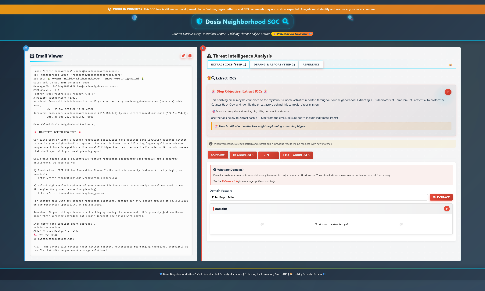

## Overview

Let's explore the town! This is a pretty big area with challenges spread out everywhere. 

Find **Ed Skoudis** upstairs in **City Hall** and help him troubleshoot a clever phishing tool in his cozy office.

!!! quote "Ed Skoudis"
    I'm the Founder of Counter Hack Innovations, the team that brings you the SANS Holiday Hack Challenge for the last 22 years.
	
    I'm also the President of the SANS Technology Institute College, which has over 2,300 students studying for their Bachelor's Degrees, Master's Degrees, and various certificates.
	
    I was the original author of the SANS SEC504 (Incident Handling and Hacker Attacks) and SANS SEC560 (Enterprise Penetration Testing) courses.
	
    I love Capture the Flag games and puzzles.
	
    I've got a steampunk office filled with secret rooms, and I collect antique crypto systems and communication technologies.
	
    I've got an original Enigma machine (A726, from the early war years), a leaf of the Gutenberg Bible (1 John 2:3 to 4:16) from 1455, and a Kryha Liliput from the 1920s.

!!! quote "Ed Skoudis"
	Oh gosh, I could talk for hours about this stuff but I really need your help!

	The team has been working on this new SOC tool that helps triage phishing emails...and there are some...issues.

	We have had some pretty sketchy emails coming through and we need to make sure we block ALL of the indicators of compromise.

	Can you help me? No pressure...

## Hints

??? example "Extract IOCs"
	Remember, the new Phishing Threat Analysis Station (PTAS) is still under construction. Even though the regex patterns are provided, they haven't been fine tuned. Some of the matches may need to be manually removed.

??? example "Defang All The Thingz"
	The PTAS does a pretty good job at defanging, however, the feature we are still working on is one that defangs ALL scenarios. For now, you will need to write a custom sed command combining all defang options.

## Solution

Ah, the classic "no pressure" that means "MAXIMUM PRESSURE!" Time to help Ed wrangle these *phishy* emails!
	
Let's click on the terminal. It brings us to the [Phishing Threat Analysis Station](https://its-all-about-defang.holidayhackchallenge.com/). Sounds fancy!

### Regex Rescue

Here we have an absolutely suspicious looking email that is trying really hard to look totally legit and something my parents might click on. The PTAS is still under construction, which means these regex patters aren't quite...right. But hey, they tried!

Think of regex (Regular Expressions) as a super-powered "Find" function that can match patterns instead of just exact text.

Head over to the *Reference* tab where you'll find almost-correct regex examples.

### Step 1

!!! success "Domains"
	[a-zA-Z0-9-]+(?:\\.[a-zA-Z0-9-]+)+
	
	- **[a-zA-Z0-9-]+** — Match letters, numbers, or hyphens (one or more)
	- **(?:\\.[a-zA-Z0-9-]+)+** — Match a dot followed by more letters/numbers/hyphens, and repeat!
	
!!! success "IP Addresses"	
	\d{1,3}\.\d{1,3}\.\d{1,3}\.\d{1,3}
	
	- **\d{1,3}** — Match 1 to 3 digits
	- **\\.** — Match a literal dot (we escape it with backslash because dot normally means "any character")
	- Repeat four times for IPv4 format!
	
!!! success "URLs"	
	http[s]?://([a-zA-Z-]{2,}.)+[a-zA-Z]+/.+
	
	- **http[s]?** — Match "http" and optionally an "s" (for https)
	- **://** — Match the colon and double slash
	- **([a-zA-Z-]{2,}.)+** — Match domain parts (at least 2 characters, with dots between)
	- **[a-zA-Z]+** — Match the TLD (top level domain like "com")
	- **/.+** — Match a forward slash followed by anything (the path)
	
!!! success "Email Addresses"	
	[a-zA-Z0-9._%+-]+@[a-zA-Z0-9.-]+\\.[a-zA-Z]{2,}

	- **[a-zA-Z0-9._%+-]+** — Match the username part (letters, numbers, and special chars)
	- **@** — Match the @ symbol
	- **[a-zA-Z0-9.-]+** — Match the domain name
	- **\\.[a-zA-Z]{2,}** — Match a dot and at least 2 letters for the TLD

After the regex does its magic, make sure to manually review the matches so that you don't block a legitimate domain.

### Step 2
Now we need to defang. We do this so if someone reading the report accidentially clicks or copies them, they won't inadvertantly expose their system to malware or malicious domains.

Let's write a custom sed command, and chain them together using ';'! 

1. **s/\\./[.]/g** — Replace all dots with [.]
2. **s/@/[@]/g** — Replace all @ symbols with [@]
3. **s/http/hxxp/g** — Replace "http" with "hxxp"
4. **s:\\//[://]/g** — Replace :/ with [://]

!!! success "Defang Command"
	s/\\./[.]/g;s/@/[@]/g;s/http/hxxp/g;s/:\\//[://]/g
	

Looks like we found them all! Now let's forward them to the security team!

!!! quote "Ed Skoudis"
	Well you just made that look like a piece of cake! Though I prefer cookies...I know where to find the best in town!

	Thanks again! See ya 'round!
	

  <a href="/objectives/o1" class="nav-button nav-left">← Holiday Hack Orientation</a>
  <a href="/objectives/o3" class="nav-button nav-right">Next: Neighborhood Watch Bypass →</a>

