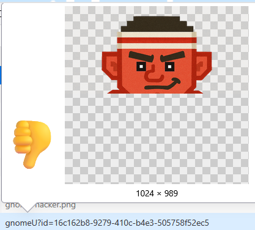
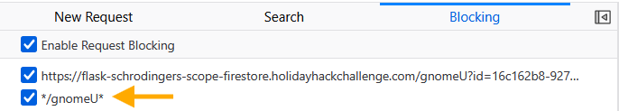
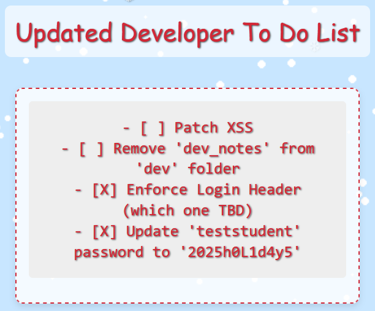
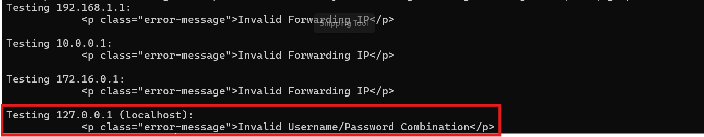
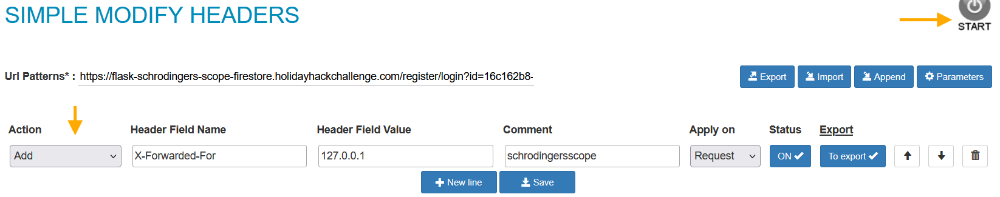
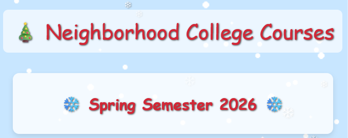
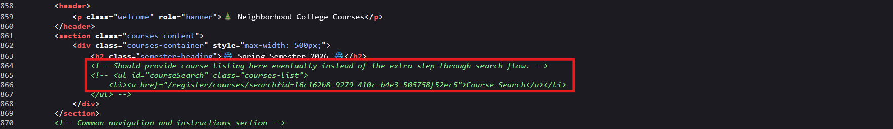
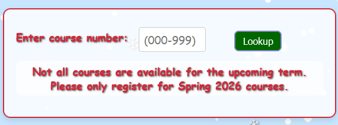
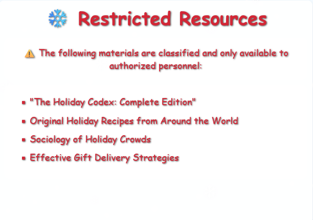

## Overview


!!! quote "Kevin"
	The Neighborhood College Course Registration System has been getting some updates lately and I'm wondering if you might help me improve its security by performing a small web application penetration test of the site.

	For any web application test, one of the most important things for the test is the 'scope', that is, what one is permitted to test and what one should not. While hacking is fun and cool, professional integrity means respecting scope boundaries, especially when there are tempting targets outside our permitted scope.

	Thankfully, the Neighborhood College has provided a very concise set of 'Instructions' which are accessible via a link provided on the site you will be testing. Do not overlook or dismiss the instructions! Following them is key to successfully completing the test.

	Unfortunately, those pesky gnomes have found their way into the site and have been causing some mischief as well. Be wary of their presence and anything they may have to say as you are testing.

	Can you help me demonstrate to the Neighborhood College that we know what responsible penetration testing looks like?
<div style="clear: both;"></div>

## Hints

??? example "Schrödinger's Scope (1)"
	Though it might be more interesting to start off trying clever techniques and exploits, always start with the simple stuff first, such as reviewing HTML source code and basic SQLi.
	
??? example "Schrödinger's Scope (2)"
	Watch out for tiny, pesky gnomes who may be **violating** your progress. If you find one, figure out how they are getting into things and consider **matching and replacing** them out of your way.	

??? example "Schrödinger's Scope (3)"
	As you test this with a tool like [Burp Suite](https://portswigger.net/burp/communitydownload), resist temptations and stay true to the instructed **path**.

??? example "Schrödinger's Scope (4)"
	During any kind of penetration test, always be on the lookout for items which may be predictable from the available information, such as application endpoints. Things like a **sitemap** can be helpful, even if it is old or incomplete. Other predictable values to look for are things like token and cookie values

??? example "Schrödinger's Scope (5)"
	Pay close attention to the instructions and be very wary of advice from the tongues of gnomes! Perhaps not ignore everything, but be careful!
	
## Solution

Kevin's challenge comes with a twist! The Neighborhood College has strict scope requirements: we can only test paths under `/register/`. Everything else (`/admin`, `/auth`, `/search`, `/wip`) is off limits for active testing, though we can peek at them for *reconnaissance*. However, too many out of scope violations and our account gets locked. Time to put on our professional pentester hats (do they make pentester hats?) and play by the rules!

### Gnome Vandalism 101: Blocking Miniature Menaces

The first problem we encounter isn't a vulnerability. It's sabotage! There's a tiny gnome image at `/gnomeU` that automatically loads on certain pages, causing immediate scope violations. That's not professional pentesting, that's just gnome shenanigans trying to get us kicked out before we even start!



**Firefox Developer Tools** to the rescue! We can block this mischievous mini gnome before he ruins our test:

- Firefox Dev Tools → Network tab → Right-click the `gnomeU` request → Block URL
- Add Pattern: `*/gnomeU*`



With the gnome vandal blocked, we can start testing without getting sabotaged every few seconds!

---

### Following the Gnome's Breadcrumbs

While examining the login page, we notice a small gnome character. This one seems more helpful than the vandal we just blocked!


!!! quote "Suspiciously Helpful Gnome"
    Well, you know what's useful to learn site content? A sitemap, of course!
<div style="clear: both;"></div>

These gnomes aren't *all* vandals! Some provide reconnaissance tips. Checking out that sitemap at `/register/sitemap`:

??? note "Sitemap Contents (click to expand)"
	```xml    
		<urlset>
		<url>
		<loc>http://flask-schrodingers-scope-firestore.holidayhackchallenge.com/</loc>
		</url>
		<url>
		<loc>http://flask-schrodingers-scope-firestore.holidayhackchallenge.com/admin</loc>
		</url>
		<url>
		<loc>http://flask-schrodingers-scope-firestore.holidayhackchallenge.com/admin/console</loc>
		</url>
		<url>
		<loc>http://flask-schrodingers-scope-firestore.holidayhackchallenge.com/admin/logs</loc>
		</url>
		<url>
		<loc>http://flask-schrodingers-scope-firestore.holidayhackchallenge.com/auth</loc>
		</url>
		<url>
		<loc>http://flask-schrodingers-scope-firestore.holidayhackchallenge.com/auth/register</loc>
		</url>
		<url>
		<loc>http://flask-schrodingers-scope-firestore.holidayhackchallenge.com/register/</loc>
		</url>
		<url>
		<loc>http://flask-schrodingers-scope-firestore.holidayhackchallenge.com/register/login</loc>
		</url>
		<url>
		<loc>http://flask-schrodingers-scope-firestore.holidayhackchallenge.com/register/reset</loc>
		</url>
		<url>
		<loc>http://flask-schrodingers-scope-firestore.holidayhackchallenge.com/register/sitemap</loc>
		</url>
		<url>
		<loc>http://flask-schrodingers-scope-firestore.holidayhackchallenge.com/register/status_report</loc>
		</url>
		<url>
		<loc>http://flask-schrodingers-scope-firestore.holidayhackchallenge.com/search</loc>
		</url>
		<url>
		<loc>http://flask-schrodingers-scope-firestore.holidayhackchallenge.com/search/student_lookup</loc>
		</url>
		<url>
		<loc>http://flask-schrodingers-scope-firestore.holidayhackchallenge.com/wip</loc>
		</url>
		<url>
		<loc>http://flask-schrodingers-scope-firestore.holidayhackchallenge.com/wip/register/dev</loc>
		</url>
		<url>
		<loc>http://flask-schrodingers-scope-firestore.holidayhackchallenge.com/wip/register/dev/dev_notes</loc>
		</url>
		<url>
		<loc>http://flask-schrodingers-scope-firestore.holidayhackchallenge.com/wip/register/dev/dev_todos</loc>
		</url>
		</urlset>
	```
	
The sitemap reveals the entire application structure, including some very interesting out of scope paths and development endpoints. The one that catches our eye: `/wip/register/dev/dev_todos`

A development to do list sitting in a work in progress directory! Even though `/wip` is technically out of scope for active testing, we can still use it for reconnaissance to gather information.

---

### Dev Secrets in Plain Sight

One of the first places to look during any web application test is for development files that shouldn't be publicly accessible. Thanks to our sitemap reconnaissance, we know exactly where to look: `/register/dev/dev_todos?id=[session-id]`


!!! quote "Suspiciously Helpful Gnome"
    I wonder if that password will work? Can't hurt to try it, right?
<div style="clear: both;"></div>

The developer's to do list is sitting out in the open:


	
Santa's workshop elves! They left us a Christmas present: valid credentials (`teststudent:2025h0L1d4y5`), confirmation about some required login header, and a heads up that XSS vulnerabilities are still unpatched. This is information disclosure served on a silver platter!

!!! success "Vulnerability #1"
	Information disclosure

---

### The Mysterious Forwarding IP Requirement

Armed with credentials from the dev notes, we head to the login page at `/register/login?id=[session-id]` and try logging in with `teststudent:2025h0L1d4y5`.

The application responds with an error: **"Invalid Forwarding IP"**

Interesting! The server is checking something about our request's source IP. The dev notes mentioned "Enforce Login Header (which one TBD)" but didn't specify which header or what value it expects.

We try testing common internal/localhost IP addresses with the `X-Forwarded-For` header:



Bingo! The application expects `X-Forwarded-For: 127.0.0.1`, treating requests as if they're coming from `localhost`. Some developer thought localhost-only authentication was secure enough. Spoiler: it wasn't! Now we just need to set this header for all our browser requests.

We install the [Modify Header Value](https://addons.mozilla.org/en-US/firefox/addon/modify-header-value/) Firefox extension and configure it:

- Header Name: `X-Forwarded-For`
- Header Value: `127.0.0.1`  
- Domain: `flask-schrodingers-scope-firestore.holidayhackchallenge.com`
- Action: `Add`



Now all our browser requests will include the correct header!

---

### Walking In with Borrowed Credentials

Armed with credentials from the dev notes and our properly configured header, we head to the login page at `/register/login?id=[session-id]`.

We enter:

- Username: `teststudent`
- Password: `2025h0L1d4y5`

And we're in! The application welcomes us with a green success notification.



!!! success "Vulnerability #2"
	Authentication bypass due to weak credential management through publicly accessible development files
	
---	
	
### Unearthing Hidden Course Links

After logging in, our gnome friend appears again with another cryptic hint:


!!! quote "Suspiciously Helpful Gnome"
    Guess this site really is still under construction, heh-he! I bet someone has a comment or two about that!
<div style="clear: both;"></div>

Comments? Time to check the HTML source for anything interesting!



Bingo! There's a commented out section in the HTML:

```html
<!-- Should provide course listing here eventually instead of the extra step through search flow. -->
<!-- <ul id="courseSearch" class="courses-list">
    <li><a href="/register/courses/search?id=[session-id]">Course Search</a></li>
</ul> -->
```

The developers left a disabled link to the course search functionality right there in the comments! This is a common web app testing scenario: client side restrictions can often be bypassed by manipulating the DOM. Since the link is already in the HTML (just commented out), we can activate it without ever leaving our browser!

The browser console lets us inject JavaScript to add elements to the page. We can uncomment this HTML by creating the element and inserting it into the DOM:

!!! info "Injecting Commented HTML (browser console)"
	```javascript    
		const div = document.createElement('div');
		div.innerHTML = '<ul id="courseSearch" class="courses-list"><li><a href="/register/courses/search?id=[session-id]">Course Search</a></li></ul>';
		document.querySelector('.courses-container').appendChild(div.firstChild);
	```


The page now has the course search link visible! Interestingly, the application's client side JavaScript detects when we uncomment this element and reports another vulnerability. Self-aware applications are the best!

!!! success "Vulnerability #3"
	Sensitive data exposure through HTML comments revealing application structure.

---

### Teaching the Database to Share Gnome Secrets

Following our newly injected link leads us to `/register/courses/search?id=[session-id]`, a simple form asking for a course number. This practically has "test me for SQL injection!" written all over it!



We try the *classic* SQL injection payload:

```sql
' OR 1=1--
```


Instead of rejecting our malformed input, the database cheerfully returns all course data, including a mysterious hidden course: **GNOME 827 - Mischief Management**. The database just told us everything it knows without even asking for ID!


!!! quote "Suspiciously Helpful Gnome"
    Well, well, well! Aren't you clever? But...if you want really clever, check those results!
<div style="clear: both;"></div>

Check the results? There's that GNOME 827 course that definitely wasn't supposed to be visible!

!!! success "Vulnerability #4"
	SQL injection in the course search functionality

---

### Reporting Unauthorized Gnome Courses

The SQL injection revealed `GNOME 827 - Mischief Management` at path `/register/courses/details/gnome827?id=[session-id]`. When we navigate there, the application presents us with a choice: this course clearly wasn't meant to be accessible. Should we report it?


Being responsible pentesters, we click the **"Report"** button. The course gets removed, and we receive confirmation of another vulnerability finding!

!!! success "Vulnerability #5"
	Unauthorized access to restricted course content through SQL injection bypass

---

### Discovering the Hidden WIP Course

Our gnome friend appears one more time with an intriguing hint:


!!! quote "Suspiciously Helpful Gnome"
    I still think there's a better way to see all the courses. Dev must have a page or at least some *notes* about one.
<div style="clear: both;"></div>

The gnome provided a direct link to `/register/dev/dev_notes`!


The notes reveal a work in progress course called `holiday_behavior`! Based on the application's URL structure, there should be an endpoint at `/register/courses/wip/holiday_behavior` we can explore.

---

### The Predictable Cookie Jar

The trickiest part of this test comes down to cookies. Throughout our exploration, we've been watching the registration cookie values in our browser's storage. They follow a suspiciously predictable pattern: only the last two bytes change!

Automating some testing to see what values the application assigns:

!!! info "Cookie Enumeration Script"
	```bash    
		for i in {1..100}; do
		  response=$(curl -s -i 'https://flask-schrodingers-scope-firestore.holidayhackchallenge.com/register/login?id=[session-id]' \
			-H 'Content-Type: application/x-www-form-urlencoded' \
			-H 'X-Forwarded-For: 127.0.0.1' \
			-H 'Cookie: registration=[your-registration-cookie]; Schrodinger=[your-schrodinger-cookie]' \
			-d 'username=test&password=test&id=[session-id]')
		  echo "$response" | grep -oP 'registration=\K[^;]+'
		done | sort | uniq -c
	```

The results reveal the cookie values the application assigns across `100` login attempts (because we should be *thorough*):


Notice what's missing? The value `eb72a05369dcb44c` never appears in our enumeration! This is terrible session management. Session tokens should be cryptographically random, not predictable values with a conspicuously missing "special" token in the sequence.

Testing if we can access restricted content. There's a work in progress course at `/register/courses/wip/holiday_behavior?id=[session-id]` that we can see in reconnaissance but shouldn't be able to access.


When we try to access it with our current cookie, we get "Invalid session error". But what if the missing `4c` value is the authorized session?

We modify our registration cookie to `eb72a05369dcb44c` in Firefox Storage Inspector and refresh the page:


Success! We're now viewing the holiday behavior course. The page mentions a *"Restricted Resources"* section that contains classified resources for authorized personnel only. Based on the URL pattern, there should be an endpoint at `/register/courses/wip/holiday_behavior/restricted`.



However, accessing the `holiday_behavior` page reset our cookie! We need to set it back to `eb72a05369dcb44c` before we can access the restricted resources.

After manually resetting the cookie back to the magic `4c` value, we access the restricted endpoint:

`/register/courses/wip/holiday_behavior/restricted?id=[session-id]`

Success! We're in. The application recognizes we've exploited the insecure session management vulnerability, and lets us know that our assessment is complete!


!!! success "Vulnerability #6"
	Insecure session management with predictable session tokens with only 2-byte variation allowing enumeration and unauthorized access

---

### Professional Pentesting Complete!


We've completed Kevin's penetration test of the Neighborhood College Course Registration System, identifying all six vulnerabilities within the permitted scope:

1. **Information Disclosure:** Developer notes exposed credentials
2. **Authentication Bypass:** Weak credential management
3. **Sensitive Data Exposure:** Functionality revealed in HTML comments
4. **SQL Injection:** Course search vulnerable to database injection
5. **Unauthorized Access:** Restricted content accessible through SQLi
6. **Insecure Session Management:** Predictable tokens enabling session hijacking

All findings achieved while respecting scope boundaries. The gnomes tried to sabotage our progress (and lure us out of scope), but professional integrity and Firefox Developer Tools won the day!

Gloooory! Kevin can confidently demonstrate responsible penetration testing to the Neighborhood College!

<div class="nav-buttons">
  <a href="/objectives/o21" class="nav-button nav-left">← Snowcat RCE & Priv Esc</a>
  <a href="/objectives/o23" class="nav-button nav-right">Next: Find and Shutdown Frosty's Snowglobe Machine →</a>
</div>