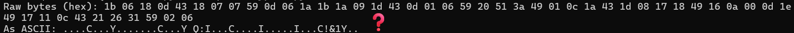
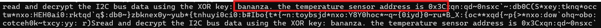
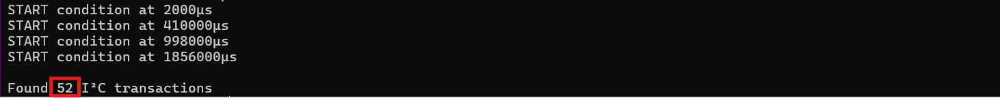

## Overview


Help **Evan** next to **city hall** hack this gnome and retrieve the temperature value reported by the I²C device at address 0x3C. The temperature data is XOR-encrypted, so you’ll need to work through each communication stage to uncover the necessary keys. Start with the unencrypted data being transmitted over the 1-wire protocol.


!!! quote "Evan"
	Hey, I'm Evan!

	I like to build things.

	All sorts of things.

	If you aren't failing on some front, consider adjusting your difficulty settings.

<div style="clear: both;"></div>

!!! quote "Evan"
	So here's the deal - there are some seriously bizarre signals floating around this area.

	Not your typical radio chatter or WiFi noise, but something... different.

	I've been trying to make sense of the patterns, but it's like trying to build a robot hand out of a coffee maker - you need the right approach.

	Think you can help me decode whatever weirdness is being transmitted out there?

## Hints
??? example "Protocols"
	**Key concept - Clock vs. Data signals:**

    - Some protocols have separate clock and data lines (like SPI and I2C)
    - For clocked protocols, you need to sample the data line at specific moments defined by the clock
    - The clock signal tells you when to read the data signal

	**For 1-Wire (no separate clock):**

    - Information is encoded in pulse widths (how long the signal stays low or high)
    - Different pulse widths represent different bit values
    - Look for patterns in the timing between transitions

	**For SPI and I2C:**

    - Identify which line is the clock (SCL for I2C, SCK for SPI)
    - Data is typically valid/stable when the clock is in a specific state (high or low)
    - You need to detect clock edges (transitions) and sample data at those moments

	**Technical approach:**

    - Sort frames by timestamp
    - Detect rising edges (0→1) and falling edges (1→0) on the clock line
    - Sample the data line's value at each clock edge

??? example "Structure"
	**What you're dealing with:**

    - You have access to WebSocket endpoints that stream digital signal data
    - Each endpoint represents a physical wire in a hardware communication system
    - The data comes as JSON frames with three properties: line (wire name), t (timestamp), and v (value: 0 or 1)
    - The server continuously broadcasts signal data in a loop - you can connect at any time
    - This is a multi-stage challenge where solving one stage reveals information needed for the next

	**Where to start:**

    - Connect to a WebSocket endpoint and observe the data format
    - The server automatically sends data every few seconds - just wait and collect
    - Look for documentation on the protocol types mentioned (1-Wire, SPI, I2C)
    - Consider that hardware protocols encode information in the timing and sequence of signal transitions, not just the values themselves
    - Consider capturing the WebSocket frames to a file so you can work offline

??? example "On Rails"
	**Stage-by-stage approach**

	Stage 1
	
    1. Connect to the captured wire files or endpoints for the relevant wires.
    2. Collect all frames for the transmission (buffer until inactivity or loop boundary).
    3. Identify protocol from wire names (e.g., `dq` → 1-Wire; `mosi/sck` → SPI; `sda/scl` → I²C).
    4. Decode the raw signal:
        - Pulse-width protocols: locate falling→rising transitions and measure low-pulse width.
        - Clocked protocols: detect clock edges and sample the data line at the specified sampling phase. 
    5. Assemble bits into bytes taking the correct bit order (LSB vs MSB)
    6. Convert bytes to text (printable ASCII or hex as appropriate).
    7. Extract information from the decoded output — it contains the XOR key or other hints for the next stage.

	Stage 2
	
    1. Repeat Stage 1 decoding to recover raw bytes (they will appear random).
    2. Apply XOR decryption using the key obtained from the previous stage.
    3. Inspect decrypted output for next-stage keys or target device information.

	I²C-Specific Notes
	
    - Multiple 7-bit device addresses share the same SDA/SCL lines.
    - START condition: SDA falls while SCL is high. STOP: SDA rises while SCL is high.
    - First byte of a transaction = (7-bit address << 1) | R/W. Extract address with `address = first_byte >> 1`	
    - Identify and decode every device’s transactions; decrypt only the target device’s payload
    - Print bytes in hex and as ASCII (if printable) — hex patterns reveal structure.
    - Check printable ASCII range (0x20–0x7E) to spot valid text.
    - Verify endianness: swapping LSB/MSB will quickly break readable text	
    - For XOR keys, test short candidate keys and look for common English words	
    - If you connect mid-broadcast, wait for the next loop or detect a reset/loop marker before decoding
    - Buffering heuristic: treat the stream complete after a short inactivity window (e.g., 500 ms) or after a full broadcast loop.
    - Sort frames by timestamp per wire and collapse consecutive identical levels before decoding to align with the physical waveform.

??? example "Garbage?"
	**If your decoded data looks like gibberish:**

    - The data may be encrypted with XOR cipher
    - XOR is a simple encryption: `encrypted_byte XOR key_byte = plaintext_byte`
    - The same operation both encrypts and decrypts: `plaintext XOR key = encrypted, encrypted XOR key = plaintext`

	**How XOR cipher works:**

	```bash
	function xorDecrypt(encrypted, key) {
	  let result = "";
	  for (let i = 0; i < encrypted.length; i++) {
		const encryptedChar = encrypted.charCodeAt(i);
		const keyChar = key.charCodeAt(i % key.length);  // Key repeats
		result += String.fromCharCode(encryptedChar ^ keyChar);
	  }
	  return result;
	}
	```
	
	**Key characteristics:**

    - The key is typically short and repeats for the length of the message
    - You need the correct key to decrypt (look for keys in previous stage messages)
    - If you see readable words mixed with garbage, you might have the wrong key or bit order

	**Testing your decryption:**

    - Encrypted data will have random-looking byte values
    - Decrypted data should be readable ASCII text
    - Try different keys from messages you've already decoded
	
??? example "Bits and Bytes"
	**Critical detail - Bit ordering varies by protocol:**

	**MSB-first (Most Significant Bit first):**

    - SPI and I2C typically send the highest bit (bit 7) first
    - When assembling bytes: `byte = (byte << 1) | bit_value`
    - Start with an empty byte, shift left, add the new bit

	**LSB-first (Least Significant Bit first):**

    - 1-Wire and UART send the lowest bit (bit 0) first
    - When assembling bytes: `byte |= bit_value << bit_position`
    - Build the byte from bit 0 to bit 7

	**I2C specific considerations:**

    - Every 9th bit is an ACK (acknowledgment) bit - ignore these when decoding data
    - The first byte in each transaction is the device address (7 bits) plus a R/W bit
    - You may need to filter for specific device addresses

	**Converting bytes to text:**

	`String.fromCharCode(byte_value)  // Converts byte to ASCII character`

## Solution

### Evan's Electric Pulse Puzzle

This challenge is different from most CTF objectives. We're implementing protocol decoders from scratch based on hardware communication specs. Pure protocol analysis! The hints tell us which protocols are in use (1-Wire, SPI, I²C), and our job is to read the specs, understand how they work, and write code that correctly decodes the raw signal data! Easy, right? *Right?*

### Capturing the Signal Data

The challenge [site](https://signals.holidayhackchallenge.com/) provides WebSocket endpoints streaming live signal data. Each wire name corresponds to a protocol signal line: `dq` (1-Wire data), `sck` (SPI clock), `mosi` (SPI master out), `sda` (I²C data), and `scl` (I²C clock).

We used `wscat` (a WebSocket client) to connect and capture data. For reference, WebSocket is defined in [RFC 6455](https://www.rfc-editor.org/rfc/rfc6455).

Working with captured files is much easier for debugging than live streams. The data loops every ~2 seconds, so a 30-second capture provides approximately 15 complete loops. This repetition is helpful for debugging: if our decoder produces different results for the same data in different loops, we know something's wrong with our implementation (ask me how many times my implementation was wrong...):

!!! info "WebSocket Capture Commands"
	```bash    
		sudo npm install -g wscat 
		
		timeout 30 wscat -c wss://signals.holidayhackchallenge.com/wire/dq > dq_capture.json 2>&1
		timeout 30 wscat -c wss://signals.holidayhackchallenge.com/wire/sck > sck_capture.json 2>&1
		timeout 30 wscat -c wss://signals.holidayhackchallenge.com/wire/mosi > mosi_capture.json 2>&1
		timeout 30 wscat -c wss://signals.holidayhackchallenge.com/wire/sda > sda_capture.json 2>&1
		timeout 30 wscat -c wss://signals.holidayhackchallenge.com/wire/scl > scl_capture.json 2>&1
	```

The data format is JSON with three fields per frame: `line` (wire name), `t` (timestamp in microseconds), and `v` (voltage level: 0 or 1). Many frames also include a `marker` field that identifies what each bit represents:

- **1-Wire markers:** `"idle"`, `"reset"`, `"presence"`
- **SPI markers:** `"data-bit"` marks each transmitted bit on MOSI
- **I²C markers:** `"start"`, `"address-bit"`, `"data-bit"`, `"ack-bit"`, `"stop"`

The challenge is helping us decode by marking protocol elements. Real hardware analysis would require determining all these timing conditions ourselves by analyzing the signal edges. The gnomes left us some breadcrumbs...and we're *thankful* for the mess! 🍞


---

### Decoding the DQ Wire

The `dq` wire is 1-Wire protocol. Unlike SPI or I²C with separate clock lines, 1-Wire does everything on a single wire. It's the minimalist's dream! Information gets encoded in pulse widths: `short pulse = 1`, `long pulse = 0`.

The 1-Wire protocol was originally developed by Dallas Semiconductor (now part of Analog Devices). The [protocol specification](https://www.analog.com/en/technical-articles/1wire-communication-through-software.html) from Analog Devices defines the timing: `'1'` bits use `~6μs` pulses, `'0'` bits use `~60μs`. The protocol uses LSB-first bit ordering.

We measured actual pulse widths in our captured data to verify they match the spec:

!!! info "Pulse Width Analyzer (pulse_analyzer.py)"
	```python    
		import json

		signals = []
		with open('dq_capture.json') as f:
			for line in f:
				try:
					frame = json.loads(line.strip())
					if 'line' in frame:
						signals.append(frame)
				except:
					pass
		
		signals.sort(key=lambda x: x['t'])
		
		print("Measuring pulse widths:")
		count = 0
		for i in range(len(signals) - 1):
			if signals[i]['v'] == 0 and signals[i+1]['v'] == 1:
				width = signals[i+1]['t'] - signals[i]['t']
				print(f"Low pulse: {width}μs")
				count += 1
				if count > 20:
					break
	```
	
Running this showed pulse widths clustering around `6μs` and `60μs`, confirming the spec. We picked `20μ`s as the threshold to distinguish between them. This value sits comfortably between the two pulse widths with good margins: `14μs` above the `'1'` bit pulse (`6μs`) and `40μs` below the `'0'` bit pulse (`60μs`). Any value between roughly `10-50μs` would work as a threshold.


The decoder walks through the signal. Anything under `20μs` is a `'1'`, everything else is a `'0'`.

!!! info "1-Wire Pulse Decoder (decode_1wire.py)"
	```python    
		import json

		signals = []
		with open('dq_capture.json') as f:
			for line in f:
				try:
					frame = json.loads(line.strip())
					if 'line' in frame:
						signals.append(frame)
				except:
					pass
		
		signals.sort(key=lambda x: x['t'])
		signals = [s for s in signals if s['t'] > 700]
		
		bits = []
		for i in range(len(signals) - 1):
			if signals[i]['v'] == 0 and signals[i+1]['v'] == 1:
				width = signals[i+1]['t'] - signals[i]['t']
				bits.append('1' if width < 20 else '0')
		
		bytes_data = []
		for i in range(0, len(bits), 8):
			byte_bits = bits[i:i+8]
			if len(byte_bits) == 8:
				byte_val = int(''.join(reversed(byte_bits)), 2)
				bytes_data.append(byte_val)
		
		message = ''.join(chr(b) if 32 <= b < 127 else '.' for b in bytes_data)
		print(message)
	```

1-Wire sends bits LSB first (least significant bit first), which means bytes arrive backwards. The spec tells us this, but it's easy to miss! Our first attempt assembled bytes in arrival order and got garbage. We need to **reverse each group of `8` bits** before converting to bytes.

The 1-Wire protocol also starts each transmission with initialization: a reset pulse (`~480μs low`) followed by a presence pulse (`~150μs low`) from the device. Our decoder skips the first `700μs` to avoid these initialization pulses and only process actual data bits. See section 2.1 of the [Analog Devices specification](https://www.analog.com/en/technical-articles/1wire-communication-through-software.html) for details on the initialization sequence.

Running the decoder revealed a repeating message!

!!! success "XOR Key Message!"
	"read and decrypt the SPI bus data using the XOR key: icy"


The gnomes are using winter-themed encryption keys, and we wouldn't expect any less from them! ❄️

---

### Cracking the Icy SPI Stream

Armed with the key **"icy"**, we moved to the SPI wires: `sck` (clock) and `mosi` (master out, slave in). SPI uses a clock line that tells you when to sample the data line. Much more *civilized* than 1-Wire's timing shenanigans!

SPI (Serial Peripheral Interface) was developed by Motorola. There's no single official standard, but the protocol is well documented. Texas Instruments provides an excellent [SPI overview (SLVA704)](https://www.ti.com/lit/an/slva704/slva704.pdf), and Analog Devices has a detailed [Introduction to SPI Interface](https://www.analog.com/en/analog-dialogue/articles/introduction-to-spi-interface.html). Data transmission is clock-synchronized: you sample the data line on clock edges.

We grabbed MOSI values at each clock sample and assembled them into bytes. SPI can transmit MSB-first (most significant bit first) or LSB-first depending on device configuration. We tried both orderings: MSB-first assembly (where bits are read high-to-low, bit `7` through bit `0`) produced readable text after XOR decryption. LSB-first gave garbage, confirming this device uses MSB-first transmission.

The challenge marks each data bit on the MOSI wire with a `data-bit` marker, making it straightforward to extract the bit stream in transmission order.

Running the SPI decoder without XOR shows the raw encrypted bytes:

!!! info "SPI Decoder (No XOR Yet)"
	```python    
		import json
		
		mosi_bits = []
		with open('mosi_capture.json') as f:
			for line in f:
				try:
					frame = json.loads(line.strip())
					if 'marker' in frame and frame.get('marker') == 'data-bit':
						mosi_bits.append(frame['v'])
				except:
					pass
		
		bytes_data = []
		for i in range(0, len(mosi_bits), 8):
			byte_bits = mosi_bits[i:i+8]
			if len(byte_bits) == 8:
				byte_val = sum(byte_bits[j] * (2 ** (7-j)) for j in range(8))
				bytes_data.append(byte_val)
		
		print("Raw bytes (hex):", ' '.join(f'{b:02x}' for b in bytes_data[:50]))
		print("As ASCII:", ''.join(chr(b) if 32 <= b < 127 else '.' for b in bytes_data[:50]))
	```



The output shows random hex bytes that don't decode to readable ASCII. Exactly what encrypted data should look like!

The *classic* XOR cipher is beautifully simple: repeat a short key across the message with `plaintext[i] = encrypted[i] XOR key[i % keylen]`. Same operation for encryption and decryption. It's symmetric!

Applying the XOR key `"icy"` (from the 1-Wire message) to the encrypted SPI bytes reveals the plaintext:

!!! info "SPI Decoder with XOR"
	```python    
		import json
		
		mosi_bits = []
		with open('mosi_capture.json') as f:
			for line in f:
				try:
					frame = json.loads(line.strip())
					if 'marker' in frame and frame.get('marker') == 'data-bit':
						mosi_bits.append(frame['v'])
				except:
					pass
		
		bytes_data = []
		for i in range(0, len(mosi_bits), 8):
			byte_bits = mosi_bits[i:i+8]
			if len(byte_bits) == 8:
				byte_val = sum(byte_bits[j] * (2 ** (7-j)) for j in range(8))
				bytes_data.append(byte_val)
		
		key = "icy"
		decrypted = [bytes_data[i] ^ ord(key[i % len(key)]) for i in range(len(bytes_data))]
		
		message = ''.join(chr(b) for b in decrypted)
		print(message)
	```



!!! success "Next XOR Key and Target Sensor Address!"
	Next XOR key: "bananza". Target sensor: I²C address 0x3C.

---

### The I²C Party Bus

I²C has multiple devices sharing two wires (`sda` for data, `scl` for clock). Each device has a unique 7-bit address. It's a shared bus where everyone takes turns talking!

The I²C specification is maintained by NXP Semiconductors (who invented the protocol). The official [I²C-bus specification (UM10204)](https://www.nxp.com/docs/en/user-guide/UM10204.pdf) defines the complete protocol. Here's some neat concepts:

1. **START condition:** SDA drops low while SCL is high (begins a transaction)
2. **Address byte:** First byte after START is `(7-bit address << 1) | R/W bit`
3. **ACK bits:** Every 9th bit is acknowledgment (we ignore these for data decoding)
4. **Data bytes:** MSB-first, `8` bits each, followed by ACK
5. **STOP condition:** SDA rises while SCL is high (ends a transaction)

Transactions start with a START condition (SDA drops low while SCL is high). The first byte after START contains the device address (7 bits) plus a read/write bit in the LSB position. To extract the `7`-bit address, we right-shift by one position: `address = first_byte >> 1`. For example, if the first byte is `0x78`, the device address is `0x78 >> 1 = 0x3C`.

The challenge marks I²C protocol elements for us: `'start'` for START conditions, `'address-bit'` for address bits, and `'data-bit'` for data bits. This makes decoding straightforward since we don't need to manually detect timing conditions.

We can detect START conditions by looking for the `'start'` marker:

!!! info "I²C START Detection"
	```python    
		import json

		sda = []
		with open('sda_capture.json') as f:
			for line in f:
				try:
					frame = json.loads(line.strip())
					if 'line' in frame:
						sda.append(frame)
				except:
					pass
		
		start_times = []
		for frame in sda:
			if 'marker' in frame and frame.get('marker') == 'start':
				start_times.append(frame['t'])
				print(f"START condition at {frame['t']}μs")
		
		print(f"\nFound {len(start_times)} I²C transactions")
	```


Building the I²C decoder required detecting START conditions (using the `'start'` marker), splitting transactions by START boundaries, extracting address and data bits (using `'address-bit'` and `'data-bit'` markers), and assembling bytes MSB-first. Since the data loops every `~2` seconds and we captured `30` seconds, each device appears `~15` times in our capture. To keep the output readable, we show only the first transaction per device address.

With START detection working, we can build the full decoder to extract device addresses and data!

!!! info "I²C Device Discovery"
	```python    
		import json
		
		sda = []
		with open('sda_capture.json') as f:
			for line in f:
				try:
					frame = json.loads(line.strip())
					if 'line' in frame:
						sda.append(frame)
				except:
					pass
		
		start_indices = []
		for i, frame in enumerate(sda):
			if 'marker' in frame and frame.get('marker') == 'start':
				start_indices.append(i)
		
		devices = {}
		for i in range(len(start_indices)):
			start_idx = start_indices[i]
			end_idx = start_indices[i+1] if i+1 < len(start_indices) else len(sda)
			
			transaction = sda[start_idx:end_idx]
			
			addr_bits = [f['v'] for f in transaction if f.get('marker') == 'address-bit']
			if len(addr_bits) != 8:
				continue
			
			addr_byte = sum(addr_bits[j] * (2 ** (7-j)) for j in range(8))
			device_addr = addr_byte >> 1
			
			if device_addr in devices:
				continue
			
			data_bits = [f['v'] for f in transaction if f.get('marker') == 'data-bit']
			
			data_bytes = []
			for j in range(0, len(data_bits), 8):
				if j + 8 <= len(data_bits):
					byte_bits = data_bits[j:j+8]
					byte_val = sum(byte_bits[k] * (2 ** (7-k)) for k in range(8))
					data_bytes.append(byte_val)
			
			devices[device_addr] = data_bytes
		
		for addr, data in sorted(devices.items()):
			ascii_data = ''.join(chr(b) if 32 <= b < 127 else '.' for b in data)
			print(f"Device 0x{addr:02X}: {ascii_data}")
	```

The decoder found four active devices chatting away on the shared bus:

- **0x29:** Sensor data (plaintext)
- **0x3C:** Temperature sensor (encrypted with XOR)
- **0x48:** Sensor data (plaintext)
- **0x51:** Sensor data (plaintext)


Only device *0x3C*'s data was encrypted. The others transmitted in plaintext, which was handy for verifying our decoder worked before tackling the XOR challenge!

Each byte in I²C is 8 data bits followed by an ACK (acknowledge) bit. The challenge marks data bits with `'data-bit'` and ACK bits with `'ack-bit'`, so we simply filter for data bits and skip ACKs during decoding. Data bits are transmitted MSB first (most significant bit first), as specified in section 3.1.3 of [NXP's I²C specification (UM10204)](https://www.nxp.com/docs/en/user-guide/UM10204.pdf).

The full decoder handles all the transaction parsing, address extraction, and XOR decryption:

!!! info "I²C Transaction Parser"
	```python    
		import json
		
		sda = []
		with open('sda_capture.json') as f:
			for line in f:
				try:
					frame = json.loads(line.strip())
					if 'line' in frame:
						sda.append(frame)
				except:
					pass
		
		start_indices = []
		for i, frame in enumerate(sda):
			if 'marker' in frame and frame.get('marker') == 'start':
				start_indices.append(i)
		
		devices = {}
		for i in range(len(start_indices)):
			start_idx = start_indices[i]
			end_idx = start_indices[i+1] if i+1 < len(start_indices) else len(sda)
			
			transaction = sda[start_idx:end_idx]
			
			addr_bits = [f['v'] for f in transaction if f.get('marker') == 'address-bit']
			if len(addr_bits) != 8:
				continue
			
			addr_byte = sum(addr_bits[j] * (2 ** (7-j)) for j in range(8))
			device_addr = addr_byte >> 1
			
			if device_addr in devices:
				continue
			
			data_bits = [f['v'] for f in transaction if f.get('marker') == 'data-bit']
			
			data_bytes = []
			for j in range(0, len(data_bits), 8):
				if j + 8 <= len(data_bits):
					byte_bits = data_bits[j:j+8]
					byte_val = sum(byte_bits[k] * (2 ** (7-k)) for k in range(8))
					data_bytes.append(byte_val)
			
			devices[device_addr] = data_bytes
		
		key = "bananza"
		if 0x3C in devices:
			target = devices[0x3C]
			decrypted = [target[i] ^ ord(key[i % len(key)]) for i in range(len(target))]
			devices[0x3C] = decrypted
		
		for addr, data in sorted(devices.items()):
			message = ''.join(chr(b) for b in data)
			print(f"0x{addr:02X}: {message}")
	```

Running the decoder with XOR key `"bananza"` on device `0x3C` gives us the clean output:

`32.84` degrees


That's just above freezing! The gnomes' temperature sensor is reporting cold conditions! ⛄

!!! success "Optimal Temperature!"
    32.84

Three protocols, three decoders built from specs, two XOR keys, and four chatty sensors later, we've decoded the temperature from Evan's signals!

The gnomes built a complete IoT weather station with layered XOR encryption and multiple communication protocols! Leave it to the gnomes to over-engineer...maybe someone should tell them about MQTT...🌡️❄️

<div class="nav-buttons">
  <a href="/objectives/o23" class="nav-button nav-left">← Find and Shutdown Frosty's Snowglobe Machine</a>
  <a href="/objectives/o25" class="nav-button nav-right">Next: Free Ski →</a>
</div>