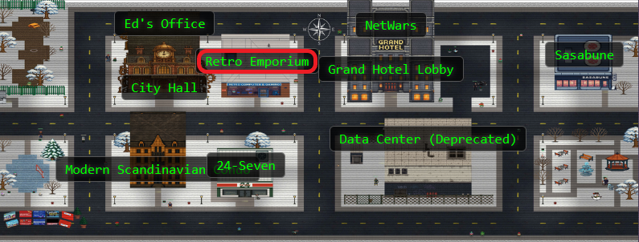
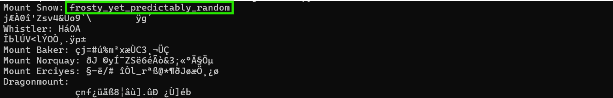

## Overview


Go to the **retro store** and help **Goose Olivia** ski down the mountain and collect all five treasure chests to reveal the hidden flag in this classic SkiFree-inspired challenge.


!!! quote "Olivia"
	"HONK! Well hello there! Fancy meeting you here in the Dosis Neighborhood.

	You know, it's the strangest thing... I used to just waddle around the Geese Islands going 'BONK' all day long. Random noises, no thoughts, just vibes. But then something changed, and now here I am—speaking, thinking, wondering how I even got here!

	HONK! You know what happens to geese in a permanent winter? We can't migrate! And trust me, being stuck in one place forever isn't natural—even for someone who just discovered they can think and talk. Frosty needs to chill out... wait, that's exactly the problem!
<div style="clear: both;"></div>

!!! quote "Olivia"
	This game looks simple enough, doesn't it? Almost too simple. But between you and me... it seems nearly impossible to win fair and square.

	My advice? If you ain't cheatin', you ain't tryin'. wink

	Now get out there and show that mountain who's boss!

## Hints

??? example "Extraction"
	Have you ever used [PyInstaller Extractor](https://github.com/extremecoders-re/pyinstxtractor)?
	
??? example "Decompilation!"
	Many Python decompilers don't understand Python 3.13, but [Decompyle++](https://github.com/zrax/pycdc) does!

## Solution

### The Challenge That Giggles at Your Gaming Skills

FreeSki is a delightful throwback to the *classic* SkiFree game from the 90s. You control a tiny skier barreling down an endless snowy mountain, dodging trees and boulders while hunting for 5 treasure chests. Collect all 5 treasures, and the game reveals a hidden flag.

One look at this game and it's immediately obvious: this was designed by someone who clearly never wants anyone to actually win it legitimately. The treasures spawn in what appears to be random locations across a massive mountain, obstacles pop up faster than a *yeti on espresso* (that's a scary thought), and the collision detection is unforgiving.

Olivia wasn't kidding when she said "if you ain't cheatin', you ain't tryin'." Let's crack open the executable and extract that flag without touching the arrow keys even once (well, I mean we will probably have to touch our arrow keys, but that's beside the point...)

This is reverse engineering after all. Why ski when you can just stay warm and hack?

---

### Unwrapping the Frozen Package

Python games distributed as standalone `.exe` files are usually packaged with PyInstaller. Kind of like a gift wrapper that bundles Python code, the Python interpreter, and all dependencies into a single executable. It's convenient for distribution (users don't need Python installed), but it's also completely reversible!

PyInstaller packages work by:

- Compiling Python source code (`.py`) into bytecode (`.pyc`)
- Bundling the bytecode along with a Python interpreter
- Wrapping everything in an executable that unpacks and runs when launched

We can unwrap that gift and peek inside! Eeee, presents!!

The first hint pointed us to [PyInstaller Extractor](https://github.com/extremecoders-re/pyinstxtractor), a Python script that reverses the packaging process:

```bash
wget https://raw.githubusercontent.com/extremecoders-re/pyinstxtractor/master/pyinstxtractor.py
python3 pyinstxtractor.py FreeSki.exe
```


Boom! The extractor dumps everything into a FreeSki.exe_extracted directory. We get:

- **FreeSki.pyc:** The main game bytecode (this is our target!)
- **PYZ.pyz:** Archive containing Python standard library modules
- Various `.dll` files: Windows dependencies (SDL2 for graphics, etc.)

The warning about Python 3.13 is super duper important. PyInstaller Extractor successfully extracts the files but warns us that decompilation might fail because we're running Python 3.12, not 3.13. This matters because Python bytecode format changes between versions, and decompilers can be picky...and this one is *really* picky.

Most importantly, we now have FreeSki.pyc, the compiled bytecode containing all the game logic, treasure generation, and flag decoding. This is the treasure map!

---

### When Decompilers Get the Sniffles

Here's where things get interesting. We have bytecode (`.pyc`), but what we really want is readable Python source code. Here's the difference:

- **Source code:** Human-readable Python with variable names, comments, clear logic
- **Bytecode:** Machine-readable instructions that the Python interpreter executes, looks like gibberish to humans

A typical reverse engineering workflow would be:

- Extract .pyc bytecode (done!)
- Decompile bytecode back to source code (hoping there's no errors!)
- Read the source code and understand the logic (aka, research!)

But here's the catch: Python 3.13 is brand spanking new, and most decompilers haven't caught up yet. Running popular decompilers on `FreeSki.pyc` produces errors faster than a...*insert a whimsical pun with a slow animal*

Enter [Decompyle++](https://github.com/zrax/pycdc) (`pycdc`), one of the few decompilers that actually understands Python 3.13 bytecode (but output *can* be fussy!)

```bash
wget https://github.com/zrax/pycdc/archive/refs/heads/master.zip -O pycdc.zip
unzip pycdc.zip
cd pycdc-master
cmake .
make
```


After compilation finishes, we get two super useful tools:

- **pycdc:** Attempts to decompile bytecode back to Python source
- **pycdas:** Disassembles bytecode into human-readable instruction listing

Trying to decompile FreeSki.pyc produces... partial results. Some functions decompile cleanly, others hit unsupported opcodes and bail out. This happens when the bytecode contains instructions the decompiler doesn't fully understand yet.

No problem! When decompilation fails, we can fall back to disassembly.

---

### Reading the Assembly Language of Magical Elves

Disassembly is our backup plan, and for reverse engineering, it's often better than decompiled source because you see exactly what the code does without the decompiler making assumptions or educated guesses.

From the `pycdc-master` directory:

```bash
./pycdas ../FreeSki.exe_extracted/FreeSki.pyc > ~/FreeSki_disasm.txt 2>&1
```

This produces nearly 3000 lines of bytecode disassembly showing every instruction in the game.


What we get is nearly 3000 lines of Python bytecode instructions. This isn't quite as cozy to read as source code, but it's infinitely more readable than raw hex bytes! Think of it as reading sheet music instead of listening to the symphony: you can still understand what's happening, you just need to interpret the notation.

Each instruction in the disassembly shows:

- **Line number:** Position in the disassembly (for navigation)
- **Instruction name:** What operation to perform (`LOAD_FAST`, `CALL`, `BINARY_OP`, etc.)
- **Parameters:** What the instruction operates on (variable names, constants, memory addresses)

For example, this bytecode:

```Assembly
16      LOAD_FAST                       2: product
18      LOAD_CONST                      2: 8
20      BINARY_OP                       3 (<<)
```

Translates to Python as:
```python
product << 8
```

It's loading the variable product onto the stack, loading the constant `8`, then performing a binary left shift operation. The result stays on the stack for the next instruction.

At first bytecode looks intimidating, but after you recognize common patterns (load variable, call function, store result), your brain starts auto-translating (or *auto-shutdown* in my case a few times). The huge advantage here is that variable names are preserved! No more cryptic `var_1`, `var_2` nonsense. We get actual meaningful names like `product`, `treasure_val`, and `encoded_flag`.

The disassembly gives us a complete blueprint of exactly what the game does, step by step. It's wordy but super thorough. Every single operation is visible, which means we can reconstruct the entire algorithm with perfect accuracy. *fingers-crossed*

---

### Following the Breadcrumb Trail Through the Snow

With 3000 lines of bytecode in front of us, we need to search for keywords related to our goal.

We're looking for how the game:

- Generates treasure positions
- Detects when we collect a treasure
- Decodes the flag when we get all 5

`Grep` is our bestie here:

```bash
grep -n "SetFlag\|GetTreasureLocations\|Mountain" ~/FreeSki_disasm.txt | head -30
```

This quickly reveals the most important functions in the disassembly:

- **Mountain.GetTreasureLocations:** Generates the 5 treasure positions for a mountain
- **SetFlag:** Decodes and displays the flag after collecting all treasures
- **Main game loop:** Handles treasure collection during gameplay

These three pieces form the complete puzzle. Let's start with treasure generation!

---

### Treasure Generation: Deterministic Chaos!

First, let's find the treasure generation function in our disassembly:

```bash
grep -n "GetTreasureLocations" ~/FreeSki_disasm.txt
```

This shows us where `GetTreasureLocations` is located. Let's view that function:

```bash
sed -n '1253,1358p' ~/FreeSki_disasm.txt
```

??? example "GetTreasureLocations Bytecode (click to expand)"   
	```Assembly
	Object Name: GetTreasureLocations
                    Qualified Name: Mountain.GetTreasureLocations
                    Arg Count: 1
                    Pos Only Arg Count: 0
                    KW Only Arg Count: 0
                    Stack Size: 8
                    Flags: 0x00000003 (CO_OPTIMIZED | CO_NEWLOCALS)
                    [Names]
                        'random'
                        'seed'
                        'binascii'
                        'crc32'
                        'name'
                        'encode'
                        'height'
                        'range'
                        'randint'
                        'int'
                    [Locals+Names]
                        'self'
                        'locations'
                        'prev_height'
                        'prev_horiz'
                        'i'
                        'e_delta'
                        'h_delta'
                    [Constants]
                        None
                        'utf-8'
                        0
                        5
                        200
                        800
                        4
                    [Disassembly]
                        0       RESUME                          0
                        2       BUILD_MAP                       0
                        4       STORE_FAST                      1: locations
                        6       LOAD_GLOBAL                     0: random
                        16      LOAD_ATTR                       2: seed
                        36      PUSH_NULL
                        38      LOAD_GLOBAL                     4: binascii
                        48      LOAD_ATTR                       6: crc32
                        68      PUSH_NULL
                        70      LOAD_FAST                       0: self
                        72      LOAD_ATTR                       8: name
                        92      LOAD_ATTR                       11: encode
                        112     LOAD_CONST                      1: 'utf-8'
                        114     CALL                            1
                        122     CALL                            1
                        130     CALL                            1
                        138     POP_TOP
                        140     LOAD_FAST                       0: self
                        142     LOAD_ATTR                       12: height
                        162     STORE_FAST                      2: prev_height
                        164     LOAD_CONST                      2: 0
                        166     STORE_FAST                      3: prev_horiz
                        168     LOAD_GLOBAL                     15: NULL + range
                        178     LOAD_CONST                      2: 0
                        180     LOAD_CONST                      3: 5
                        182     CALL                            2
                        190     GET_ITER
                        192     FOR_ITER                        93 (to 380)
                        196     STORE_FAST                      4: i
                        198     LOAD_GLOBAL                     0: random
                        208     LOAD_ATTR                       16: randint
                        228     PUSH_NULL
                        230     LOAD_CONST                      4: 200
                        232     LOAD_CONST                      5: 800
                        234     CALL                            2
                        242     STORE_FAST                      5: e_delta
                        244     LOAD_GLOBAL                     0: random
                        254     LOAD_ATTR                       16: randint
                        274     PUSH_NULL
                        276     LOAD_GLOBAL                     19: NULL + int
                        286     LOAD_CONST                      2: 0
                        288     LOAD_FAST                       5: e_delta
                        290     LOAD_CONST                      6: 4
                        292     BINARY_OP                       11 (/)
                        296     BINARY_OP                       10 (-)
                        300     CALL                            1
                        308     LOAD_GLOBAL                     19: NULL + int
                        318     LOAD_FAST                       5: e_delta
                        320     LOAD_CONST                      6: 4
                        322     BINARY_OP                       11 (/)
                        326     CALL                            1
                        334     CALL                            2
                        342     STORE_FAST                      6: h_delta
                        344     LOAD_FAST_LOAD_FAST             54: prev_horiz, h_delta
                        346     BINARY_OP                       0 (+)
                        350     LOAD_FAST_LOAD_FAST             18: locations, prev_height
                        352     LOAD_FAST                       5: e_delta
                        354     BINARY_OP                       10 (-)
                        358     STORE_SUBSCR
                        362     LOAD_FAST_LOAD_FAST             37: prev_height, e_delta
                        364     BINARY_OP                       10 (-)
                        368     STORE_FAST                      2: prev_height
                        370     LOAD_FAST_LOAD_FAST             54: prev_horiz, h_delta
                        372     BINARY_OP                       0 (+)
                        376     STORE_FAST                      3: prev_horiz
                        378     JUMP_BACKWARD                   95 (to 190)
                        382     END_FOR
                        384     POP_TOP
                        386     LOAD_FAST                       1: locations
                        388     RETURN_VALUE
                    [Exception Table]
	```
	
At first glance, this looks complicated, but let's walk through it step by step by looking at the bytecode instructions:

**Instructions 6-138: Seed the random number generator**

The code loads `binascii.crc32()`, passes in the mountain's name (encoded as `UTF-8`), and uses the result to seed Python's random module. `CRC32` is a checksum algorithm that always produces the same output for the same input. So "`Mount Snow`" always generates the same seed value.

**Instructions 140-166: Initialize starting position**

Sets `prev_height` to the mountain's starting height and `prev_horiz` to `0` (starting in the middle).

**Instructions 168-378: Generate 5 treasures in a loop**

For each treasure:

- Generate random `e_delta` (elevation drop: 200-800 units)
- Generate random `h_delta` (horizontal shift: -e_delta/4 to +e_delta/4)
- Calculate new position and add it to the treasures

Here's the magical part: because the RNG is seeded with `CRC32` of the mountain name, these "random" values aren't very random at all! Every time you run the game on "`Mount Snow`", the treasures appear in exactly the same positions. The game feels random when you play it, but it's completely deterministic.

Translating this bytecode to Python:

```python
def get_treasure_locations(name, height):
    random.seed(binascii.crc32(name.encode('utf-8')))
    prev_height = height
    prev_horiz = 0
    
    for i in range(5):
        e_delta = random.randint(200, 800)
        h_delta = random.randint(-int(e_delta / 4), int(e_delta / 4))
        
        horiz = prev_horiz + h_delta
        vertical = prev_height - e_delta
        
        prev_height -= e_delta
        prev_horiz += h_delta
```
		
This is super *AWESOME* design! The treasures appear randomly scattered across the mountain, but they're actually in fixed positions determined entirely by the mountain's name. It means speedrunners can memorize routes (like *Super Mario World*), but it also means we can reproduce the positions programmatically!

---

### The Missing Piece: From Coordinates to Values

Knowing where the treasures spawn is only half the puzzle. We also need to know what values get passed to the `SetFlag` function when you collect them.

This requires digging into the main game loop to find where treasure collection is handled. Let's search for it:

```bash
grep -n "treasures_collected" ~/FreeSki_disasm.txt | head -20
```

This shows several references to treasures_collected. Let's view the relevant bytecode section where treasures are appended to the collection:

```bash
sed -n '2269,2310p' ~/FreeSki_disasm.txt
```

??? example "Treasure Collection Bytecode (click to expand)"
    ```Assembly
				1830    STORE_FAST_STORE_FAST           205: collided_object, collided_row
                1832    STORE_FAST                      14: collided_row_offset
                1834    LOAD_FAST                       12: collided_object
                1836    LOAD_GLOBAL                     96: Obstacles
                1846    LOAD_ATTR                       98: TREASURE
                1866    COMPARE_OP                      88 (==)
                1870    POP_JUMP_IF_FALSE               68 (to 2008)
                1874    LOAD_CONST                      0: None
                1876    LOAD_FAST                       13: collided_row
                1878    LOAD_CONST                      7: 1
                1880    BINARY_SUBSCR
                1884    LOAD_FAST                       14: collided_row_offset
                1886    STORE_SUBSCR
                1890    LOAD_FAST_CHECK                 4: treasures_collected
                1892    LOAD_ATTR                       101: append
                1912    LOAD_FAST                       13: collided_row
                1914    LOAD_CONST                      8: 0
                1916    BINARY_SUBSCR
                1920    LOAD_GLOBAL                     102: mountain_width
                1930    BINARY_OP                       5 (*)
                1934    LOAD_FAST                       14: collided_row_offset
                1936    BINARY_OP                       0 (+)
                1940    CALL                            1
                1948    POP_TOP
                1950    LOAD_GLOBAL                     105: NULL + len
                1960    LOAD_FAST                       4: treasures_collected
                1962    CALL                            1
                1970    LOAD_CONST                      9: 5
                1972    COMPARE_OP                      88 (==)
                1976    POP_JUMP_IF_FALSE               14 (to 2006)
                1980    LOAD_GLOBAL                     107: NULL + SetFlag
                1990    LOAD_FAST_CHECK                 6: mnt
                1992    LOAD_FAST                       4: treasures_collected
                1994    CALL                            2
                2002    POP_TOP
                2004    LOAD_CONST                      2: True
                2006    STORE_FAST                      0: victory_mode
                2008    JUMP_FORWARD                    16 (to 2042)
                2010    LOAD_FAST                       5: skier
                2012    LOAD_ATTR                       109: Crash
                2032    CALL                            0
                2040    POP_TOP
	```
	
The bytecode is dense (like a good eggnog) here, but we can break it down. Looking at the disassembly output, we see:

- **Collision detection:** Compares `collided_object` to `Obstacles.TREASURE` enum value to check if we hit a treasure.
- **Position extraction:** Grabs `collided_row[0]` (vertical position) and `collided_row_offset` (horizontal offset) from the collision data.

**The important part:** The bytecode loads `collided_row[0]`, multiplies it by `mountain_width`, then adds `collided_row_offset`. This translates to:

```python
treasure_value = collided_row[0] * mountain_width + collided_row_offset
treasures_collected.append(treasure_value)
```

The game converts 2D coordinates (horizontal, vertical) into a single integer by treating the mountain as a 1000-unit-wide grid. It's a flattened 2D array index, the same technique used in computer graphics to convert (x, y) screen positions into linear memory addresses.

Why 1000? Looking back at the global constants near the top of the disassembly (line 22):

`mountain_width = 1000`

The game uses a fixed 1000-unit width for all mountains, no matter their height. This makes the math simple and consistent across all levels.

So if a treasure is at horizontal position 113 and vertical position 2966:

`treasure_value = 2966 * 1000 + 113 = 2966113`

The treasure value essentially encodes both coordinates into a single number. You can reverse the calculation to get the original coordinates:

```python
horizontal = treasure_value % 1000
vertical = treasure_value // 1000
```

Pretty cool! One number stores both pieces of position data.

This was the missing link! Early attempts tried summing coordinates, XORing them, or concatenating them as strings. None of that worked because the actual formula is this specific flattened coordinate calculation.

Once you collect all 5 treasures, the `treasures_collected` list contains 5 integers, each representing a treasure's position on the mountain grid. These values then get fed into `SetFlag` to unlock the flag.

---

### The Flag Decoder: XOR Magic With a Twist

Now for the main act! Let's find the `SetFlag` function:

```bash
grep -n "Object Name: SetFlag" ~/FreeSki_disasm.txt
```

This shows us where `SetFlag` is located. Let's view the complete function:

```bash
sed -n '1776,1896p' ~/FreeSki_disasm.txt
```

??? example "SetFlag Bytecode (click to expand)"
    ```Assembly
			Object Name: SetFlag
            Qualified Name: SetFlag
            Arg Count: 2
            Pos Only Arg Count: 0
            KW Only Arg Count: 0
            Stack Size: 7
            Flags: 0x00000003 (CO_OPTIMIZED | CO_NEWLOCALS)
            [Names]
                'random'
                'seed'
                'range'
                'len'
                'encoded_flag'
                'randint'
                'append'
                'chr'
                'join'
                'print'
                'flagfont'
                'render'
                'pygame'
                'Color'
                'flag_text_surface'
            [Locals+Names]
                'mountain'
                'treasure_list'
                'product'
                'treasure_val'
                'decoded'
                'i'
                'r'
                'flag_text'
            [Constants]
                None
                0
                8
                255
                'Flag: %s'
                ''
                False
                'saddle brown'
            [Disassembly]
                0       RESUME                          0
                2       LOAD_CONST                      1: 0
                4       STORE_FAST                      2: product
                6       LOAD_FAST                       1: treasure_list
                8       GET_ITER
                10      FOR_ITER                        11 (to 34)
                14      STORE_FAST                      3: treasure_val
                16      LOAD_FAST                       2: product
                18      LOAD_CONST                      2: 8
                20      BINARY_OP                       3 (<<)
                24      LOAD_FAST                       3: treasure_val
                26      BINARY_OP                       12 (^)
                30      STORE_FAST                      2: product
                32      JUMP_BACKWARD                   13 (to 8)
                36      END_FOR
                38      POP_TOP
                40      LOAD_GLOBAL                     0: random
                50      LOAD_ATTR                       2: seed
                70      PUSH_NULL
                72      LOAD_FAST                       2: product
                74      CALL                            1
                82      POP_TOP
                84      BUILD_LIST                      0
                86      STORE_FAST                      4: decoded
                88      LOAD_GLOBAL                     5: NULL + range
                98      LOAD_CONST                      1: 0
                100     LOAD_GLOBAL                     7: NULL + len
                110     LOAD_FAST                       0: mountain
                112     LOAD_ATTR                       8: encoded_flag
                132     CALL                            1
                140     CALL                            2
                148     GET_ITER
                150     FOR_ITER                        68 (to 288)
                154     STORE_FAST                      5: i
                156     LOAD_GLOBAL                     0: random
                166     LOAD_ATTR                       10: randint
                186     PUSH_NULL
                188     LOAD_CONST                      1: 0
                190     LOAD_CONST                      3: 255
                192     CALL                            2
                200     STORE_FAST                      6: r
                202     LOAD_FAST                       4: decoded
                204     LOAD_ATTR                       13: append
                224     LOAD_GLOBAL                     15: NULL + chr
                234     LOAD_FAST                       0: mountain
                236     LOAD_ATTR                       8: encoded_flag
                256     LOAD_FAST                       5: i
                258     BINARY_SUBSCR
                262     LOAD_FAST                       6: r
                264     BINARY_OP                       12 (^)
                268     CALL                            1
                276     CALL                            1
                284     POP_TOP
                286     JUMP_BACKWARD                   70 (to 148)
                290     END_FOR
                292     POP_TOP
                294     LOAD_CONST                      4: 'Flag: %s'
                296     LOAD_CONST                      5: ''
                298     LOAD_ATTR                       17: join
                318     LOAD_FAST                       4: decoded
                320     CALL                            1
                328     BINARY_OP                       6 (%)
                332     STORE_FAST                      7: flag_text
                334     LOAD_GLOBAL                     19: NULL + print
                344     LOAD_FAST                       7: flag_text
                346     CALL                            1
                354     POP_TOP
                356     LOAD_GLOBAL                     20: flagfont
                366     LOAD_ATTR                       23: render
                386     LOAD_FAST                       7: flag_text
                388     LOAD_CONST                      6: False
                390     LOAD_GLOBAL                     24: pygame
                400     LOAD_ATTR                       26: Color
                420     PUSH_NULL
                422     LOAD_CONST                      7: 'saddle brown'
                424     CALL                            1
                432     CALL                            3
                440     STORE_GLOBAL                    14: flag_text_surface
                442     RETURN_CONST                    0: None
	```
	
Let's walk through this bytecode carefully, because it's doing something neat:

**Step 1: Combine treasure values into a "product"**

The bytecode starts by initializing `product = 0`, then loops through all 5 treasure values. For each value, it left shifts the product by 8 bits (`product << 8`) and XORs it with the current treasure value. This packs the treasure values together byte by byte. In Python:

```python
product = 0
for treasure_val in treasure_list:
    product = (product << 8) ^ treasure_val
```

Why left shift by 8? It's packing the treasure values together byte by byte! Each `<< 8` shift multiplies the current product by 256 (2^8), making room for the next value. Then XOR mixes in the new treasure value.

After processing all 5 treasures, product is a unique integer that represents this specific combination of treasure positions. Different treasure sequences produce different products, which is exactly what we want for a key derivation function.

**Step 2: Reseed the RNG**

The bytecode calls `random.seed(product)` using the combined product value. The same treasure sequence always produces the same seed, which means the same "random" bytes will be generated for decryption.

**Step 3: XOR decode the flag**

The bytecode creates an empty list `decoded = []`, then loops through each byte of the encoded flag. For each byte:

- Generate a random byte (0-255)
- XOR it with the corresponding encoded flag byte
- Convert result to a character

The complete Python translation:

```python
def set_flag(encoded_flag, treasure_list):
    product = 0
    for treasure_val in treasure_list:
        product = (product << 8) ^ treasure_val
    
    random.seed(product)
    
    decoded = []
    for i in range(len(encoded_flag)):
        r = random.randint(0, 255)
        decoded.append(chr(encoded_flag[i] ^ r))
    
    return ''.join(decoded)
```	
This is *elegant* cryptography! The flag is encrypted with XOR using a deterministic random stream. The stream is seeded by the treasure positions, which means:

- Only the correct treasure sequence decodes the flag properly
- Any other sequence produces garbage (since it generates different random bytes)
- The decryption is completely deterministic and reproducible

You can't shortcut it, you can't guess it, you need the exact treasure positions to unlock the correct flag.

### Seven Mountains, Seven Mysteries

Let's find where the mountains are defined in the disassembly:

```bash
grep -n "Mount Snow\|Aspen\|Whistler" ~/FreeSki_disasm.txt | head -10
```

Searching for mountain names reveals where the definitions are located. Let's view that section:

```bash
sed -n '2865,2930p' ~/FreeSki_disasm.txt
```

??? example "Mountain Definitions Bytecode (click to expand)"
    ```Assembly
		2452    LOAD_BUILD_CLASS
        2454    PUSH_NULL
        2456    LOAD_CONST                      51: <CODE> Mountain
        2458    MAKE_FUNCTION
        2460    LOAD_CONST                      52: 'Mountain'
        2462    CALL                            2
        2470    STORE_NAME                      75: Mountain
        2472    LOAD_NAME                       75: Mountain
        2474    PUSH_NULL
        2476    LOAD_CONST                      53: 'Mount Snow'
        2478    LOAD_CONST                      54: 3586
        2480    LOAD_CONST                      55: 3400
        2482    LOAD_CONST                      56: 2400
        2484    LOAD_CONST                      57: b'\x90\x00\x1d\xbc\x17b\xed6S"\xb0<Y\xd6\xce\x169\xae\xe9|\xe2Gs\xb7\xfdy\xcf5\x98'
        2486    CALL                            5
        2494    LOAD_NAME                       75: Mountain
        2496    PUSH_NULL
        2498    LOAD_CONST                      58: 'Aspen'
        2500    LOAD_CONST                      59: 11211
        2502    LOAD_CONST                      60: 11000
        2504    LOAD_CONST                      61: 10000
        2506    LOAD_CONST                      62: b'U\xd7%x\xbfvj!\xfe\x9d\xb9\xc2\xd1k\x02y\x17\x9dK\x98\xf1\x92\x0f!\xf1\\\xa0\x1b\x0f'
        2508    CALL                            5
        2516    LOAD_NAME                       75: Mountain
        2518    PUSH_NULL
        2520    LOAD_CONST                      63: 'Whistler'
        2522    LOAD_CONST                      64: 7156
        2524    LOAD_CONST                      65: 6000
        2526    LOAD_CONST                      66: 6500
        2528    LOAD_CONST                      67: b'\x1cN\x13\x1a\x97\xd4\xb2!\xf9\xf6\xd4#\xee\xebh\xecs.\x08M!hr9?\xde\x0c\x86\x02'
        2530    CALL                            5
        2538    LOAD_NAME                       75: Mountain
        2540    PUSH_NULL
        2542    LOAD_CONST                      68: 'Mount Baker'
        2544    LOAD_CONST                      69: 10781
        2546    LOAD_CONST                      70: 9000
        2548    LOAD_CONST                      65: 6000
        2550    LOAD_CONST                      71: b'\xac\xf9#\xf4T\xf1%h\xbe3FI+h\r\x01V\xee\xc2C\x13\xf3\x97ef\xac\xe3z\x96'
        2552    CALL                            5
        2560    LOAD_NAME                       75: Mountain
        2562    PUSH_NULL
        2564    LOAD_CONST                      72: 'Mount Norquay'
        2566    LOAD_CONST                      73: 6998
        2568    LOAD_CONST                      74: 6300
        2570    LOAD_CONST                      75: 3000
        2572    LOAD_CONST                      76: b'\x0c\x1c\xad!\xc6,\xec0\x0b+"\x9f@.\xc8\x13\xadb\x86\xea{\xfeS\xe0S\x85\x90\x03q'
        2574    CALL                            5
        2582    LOAD_NAME                       75: Mountain
        2584    PUSH_NULL
        2586    LOAD_CONST                      77: 'Mount Erciyes'
        2588    LOAD_CONST                      78: 12848
        2590    LOAD_CONST                      61: 10000
        2592    LOAD_CONST                      79: 12000
        2594    LOAD_CONST                      80: b'n\xad\xb4l^I\xdb\xe1\xd0\x7f\x92\x92\x96\x1bq\xca`PvWg\x85\xb21^\x93F\x1a\xee'
        2596    CALL                            5
        2604    LOAD_NAME                       75: Mountain
        2606    PUSH_NULL
        2608    LOAD_CONST                      81: 'Dragonmount'
        2610    LOAD_CONST                      82: 16282
        2612    LOAD_CONST                      83: 15500
        2614    LOAD_CONST                      84: 16000
        2616    LOAD_CONST                      85: b'Z\xf9\xdf\x7f_\x02\xd8\x89\x12\xd2\x11p\xb6\x96\x19\x05x))v\xc3\xecv\xf4\xe2\\\x9a\xbe\xb5'
        2618    CALL                            5
        2626    BUILD_LIST                      7
        2628    STORE_GLOBAL                    76: Mountains
        2630    LOAD_BUILD_CLASS
	```

The game includes 7 different mountains, each with:

- **Name:** The mountain's identifier (used for `CRC32` seeding)
- **Height:** Starting elevation in game units
- **Encoded flag:** A byte string containing the encrypted flag

The mountains range from the modest `Mount Snow` (3586 units tall) to the towering `Dragonmount` (16282 units). Each mountain gets its own unique encoded flag, though as we'll discover, only one contains the real CTF flag.

Here's Mount Snow's complete data structure from the bytecode:

```python
Mountain(
    name="Mount Snow",
    height=3586,
    treeline=3400,
    yetiline=2400,
    encoded_flag=b'\x90\x00\x1d\xbc\x17b\xed6S"\xb0<Y\xd6\xce\x169\xae\xe9|\xe2Gs\xb7\xfdy\xcf5\x98'
)
```

Those random-looking bytes? That's our encrypted flag, just waiting to be XOR'd back to readable text with the right treasure positions!

The game loads all 7 mountains into a list, letting players choose which slope to conquer. For this challenge, we only care about finding which mountain contains the actual flag, but the multi-mountain design adds replay value for anyone actually playing the game legitimately (assuming they have the patience of a *glacier*... and one not under the effects of global warming).

---

### Assembling Our Automatic Ski Lift

Now comes the satisfying part, where all those hours of bytecode archaeology pay off! We've reverse engineered the entire treasure and flag system. Time to put all the pieces together into a working decoder.

We understand:

- How treasure positions are generated (CRC32 seeding)
- How positions convert to values (vertical * 1000 + horizontal)
- How values unlock the flag (XOR decryption with combined product seed)

Building the decoder is straightforward since we've already translated all the bytecode to Python. The tricky part was getting the order of the treasures correct!

When the game generates treasures in `GetTreasureLocations`, it creates them in a specific order based on the RNG sequence. Initially, I tried storing them in a Python dictionary (which seemed logical for coordinates), but dictionaries don't preserve order in the same way... and more importantly, if two treasures have the same horizontal coordinate, the dictionary overwrites one! That was a fun realization after struggling for a *LONG* time!

Mount Snow has exactly this issue: treasures #2 and #5 both spawn at horizontal position 85. Using a dictionary meant we only got 4 treasures, not 5. We can fix this by using a list to preserve all treasures in generation order.

Here's the complete decoder that ties everything together:

!!! info "FreeSki Flag Decoder"
```python
	#!/usr/bin/env python3
    import random
    import binascii
    
    mountains = [
        ("Mount Snow", 3586, b'\x90\x00\x1d\xbc\x17b\xed6S"\xb0<Y\xd6\xce\x169\xae\xe9|\xe2Gs\xb7\xfdy\xcf5\x98'),
        ("Aspen", 11211, b'U\xd7%x\xbfvj!\xfe\x9d\xb9\xc2\xd1k\x02y\x17\x9dK\x98\xf1\x92\x0f!\xf1\\\xa0\x1b\x0f'),
        ("Whistler", 7156, b'\x1cN\x13\x1a\x97\xd4\xb2!\xf9\xf6\xd4#\xee\xebh\xecs.\x08M!hr9?\xde\x0c\x86\x02'),
        ("Mount Baker", 10781, b'\xac\xf9#\xf4T\xf1%h\xbe3FI+h\r\x01V\xee\xc2C\x13\xf3\x97ef\xac\xe3z\x96'),
        ("Mount Norquay", 6998, b'\x0c\x1c\xad!\xc6,\xec0\x0b+"\x9f@.\xc8\x13\xadb\x86\xea{\xfeS\xe0S\x85\x90\x03q'),
        ("Mount Erciyes", 12848, b'n\xad\xb4l^I\xdb\xe1\xd0\x7f\x92\x92\x96\x1bq\xca`PvWg\x85\xb21^\x93F\x1a\xee'),
        ("Dragonmount", 16282, b'Z\xf9\xdf\x7f_\x02\xd8\x89\x12\xd2\x11p\xb6\x96\x19\x05x))v\xc3\xecv\xf4\xe2\\\x9a\xbe\xb5')
    ]
    
    def get_treasure_values(name, height):
        random.seed(binascii.crc32(name.encode('utf-8')))
        prev_height = height
        prev_horiz = 0
        values = []
        
        for _ in range(5):
            e_delta = random.randint(200, 800)
            h_delta = random.randint(-int(e_delta / 4), int(e_delta / 4))
            
            horiz = prev_horiz + h_delta
            vertical = prev_height - e_delta
            values.append(vertical * 1000 + horiz)
            
            prev_height -= e_delta
            prev_horiz += h_delta
        
        return values
    
    def decode_flag(encoded_flag, treasure_values):
        product = 0
        for val in treasure_values:
            product = (product << 8) ^ val
        
        random.seed(product)
        
        decoded = []
        for byte in encoded_flag:
            decoded.append(chr(byte ^ random.randint(0, 255)))
        
        return ''.join(decoded)
    
    for name, height, encoded_flag in mountains:
        values = get_treasure_values(name, height)
        flag = decode_flag(encoded_flag, values)
        print(f"{name}: {flag}")
```
			
The decoder:

- Extracts all 7 mountain definitions from the disassembly
- For each mountain, generates its treasure positions using `CRC32` seeding
- Calculates treasure values (vertical * 1000 + horizontal)
- Feeds them into the `SetFlag` algorithm for XOR decryption
- Prints the decoded result

Let's run it!

Save the decoder to a file and execute it:

```bash
python3 freeski_decoder.py
```



!!! success "Mount Snow Flag!"
	`frosty_yet_predictably_random`
	
Perfect name for a challenge where "random" treasure positions are actually frozen in place by deterministic `CRC32` seeding! The other six mountains decode to gibberish, confirming Mount Snow has the hidden treasure, or at least the flag we've been searching for for *HOURS*.

And that's how you beat a skiing game without ever touching the slopes. Why risk crashing into trees when you can just reverse engineer the whole thing? Reverse engineering is *definitely* safer. Olivia would be proud! 🦆

!!! quote "Olivia"
	Looks like you found your own way down that mountain... and maybe took a few shortcuts along the way. No judgment here—sometimes the clever path IS the right path. Now I'm one step closer to figuring out my own mystery. Thanks for the company, friend!
	
<div class="nav-buttons">
  <a href="/objectives/o24" class="nav-button nav-left">← Previous: On the Wire</a>
  <a href="/objectives/o26" class="nav-button nav-right">Next: Snowblind Ambush →</a>
</div>
