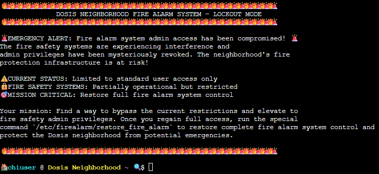
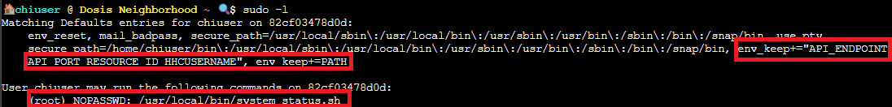
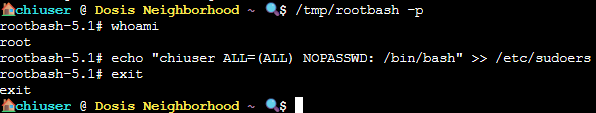

## Overview


Assist **Kyle** at the **old data center** with a fire alarm that just won't chill. 

Thankfully, there's a **hole** in the fence we can get through located at the yellow arrow on the map. So much for secure!


!!! quote "Kyle"
	If you spot a fire, let me know! I'm Kyle, and I've been around the Holiday Hack Challenge scene for years as arnydo - picked up 
	
	multiple Super Honorable Mentions along the way. When I'm not fighting fires or hunting vulnerabilities, you'll find me on a unicycle 
	
	or juggling - I once showed up a professional clown with his own clubs! My family and I love exploring those East Tennessee 
	
	mountains, and honestly, geocaching teaches you a lot about finding hidden things - useful in both firefighting and hacking. 

<div style="clear: both;"></div>

!!! quote "Kyle"
	Anyway, I could use some help here. This fire alarm keeps going nuts but there's no fire. I checked.

	I think someone has locked us out of the system. Can you see if you can get back in?
	
## Hints
??? example "Where Are My Powers?"
	You know, Sudo is a REALLY powerful tool. It allows you to run executables as ROOT!!! There is even a handy switch that will tell you what powers your user has.

??? example "Path Hijacking"
	Be careful when writing scripts that allow regular users to run them. One thing to be wary of is not using full paths to executables...these can be hijacked.


## Solution	
Let's open the [terminal](https://hhc25-wetty-prod.holidayhackchallenge.com/)! Here we see that the fire alarm system is in full lockout mode and we need to restore our privileges to bring the system back into operation!



We start with user access, but lets see what we can do with sudo privileges:
```bash
sudo -l
```
The output reveals something interesting:



Oh! This looks like something we can work with! We can run `/usr/local/bin/system_status.sh` as root without a password AND our PATH variable doesn't reset when we use sudo! 

Let's see what `system_status.sh` actually does, and see what our `$PATH` is:


Hmm. Well, there it is! The script calls commands like `df`, `ps`, and `free` without absolute paths (like `/bin/df`). When bash looks for the commands, it searches through your PATH directories *in order*.

Our `/home/chiuser/bin` is the first in line, so the script is going to execute whatever we put in there, and since `env_keep+=PATH` preserves our PATH when we sudo, the script runs the fake commands as root.

Here's where our PATH hijacking comes into play, and it will definitely thwart the gnome's attempts to wreak havoc (for now). We can create our payload using a fake `df` command that does something way more interesting than checking the disk usage:

```bash
cat > /home/chiuser/bin/df << 'EOF'
#! /bin/bash
cp /bin/bash /tmp/rootbash
chmod 4755 /tmp/rootbash
exit 0
EOF
chmod +x /home/chiuser/bin/df
```

This paylod will copy bash to a temporary location, set the setuid to run with owner permissions (root) and then exit cleanly so our script doesn't become suspicious. It is never good when our scripts become suspicious...or *sentient*...

Now let's run the script:

```bash
sudo /usr/local/bin/system_status.sh
```


Now, let's uwrap our shiny new root shell:

```bash
/tmp/rootbash -p
```


We use the `-p` flag to tell bash to run in "privileged mode," which preserves the effective user ID. If we didn't, bash would drop our root privileges.

Now we have root privileges (you can check with `whoami`) so now let's go straight for the system restoration! BUT WAIT! Our rootbash isn't a *real* root shell, and the fire alarm binary is picky and will return an SSL error. We can get around this by modifying our `sudoers`, and then `exit` out of our `rootbash`!

```bash
echo "chiuser ALL=(ALL) NOPASSWD: /bin/bash" >> /etc/sudoers
exit
```
Now let's treat ourselves to root!

```bash
sudo /bin/bash
```
Now we can run the system restore, error free!

```bash
/etc/firealarm/restore_fire_alarm
```


System restoration complete! Take that, gnomes!

<div class="nav-buttons">
  <a href="/objectives/o2" class="nav-button nav-left">← It's All About Defang</a>
  <a href="/objectives/o4" class="nav-button nav-right">Next: Santa's Gift-Tracking Service Port Mystery →</a>
</div>