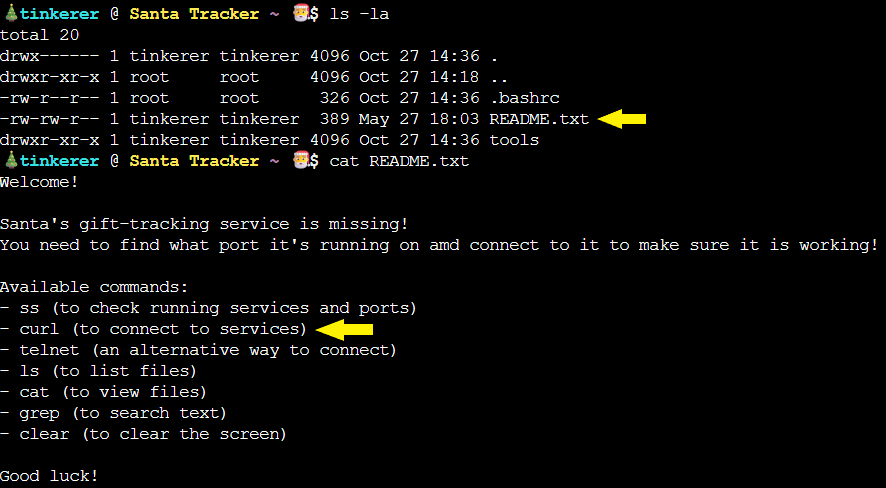

## Overview


Chat with **Yori** near the **apartment building** about Santa's mysterious gift tracker and unravel the holiday mystery.


!!! quote "Yori"
	Hi! I'm Yori.

	I was Ed's lost intern back in 2015, but I was found!
<div style="clear: both;"></div>

!!! quote "Yori"
	Think you can check out this terminal for me? I need to use cURL to access the gift tracker system, but it has me stumped.

	Please see what you can do!
	
## Hints
??? example "Who is Netstat?"
	Back in my day...we just used Netstat. I hear ss is the new kid on the block. A lot of the parameters are the same too...such as listing only the ports that are currently LISTENING on the system.

??? example "Web Requests Without a Browser?"
	Since we don't have a web browser to connect to this HTTP service...There is another common tool that you can use from the CLI.
	
## Solution	

### Tracking Down the Santa Tracker

Yori's [terminal](https://hhc25-wetty-prod.holidayhackchallenge.com/) opens up a prompt with some instructions on how to begin our challenge. Those pesky gnomes changed the port on the Santa Tracker, so let's start by finding out what they changed the port to:


```bash
ss -tlnp
```
Let's break down what we're asking for with `ss`:

- `ss`: Socket statistics (the modern replacement for netstat, as Yori hinted!)
- `-t`: Show TCP sockets only
- `-l`: Show only LISTENING sockets (not established connections)
- `-n`: Show numerical addresses instead of resolving hostnames (faster!)
- `-p`: Show the process using the socket


We found it! Looks like the gnomes chose port `12321`. How *clever*! They picked a palindrome port! Festive.

The output shows us the Local Address is `0.0.0.0:12321`. The `LISTEN` state tells us it's actively waiting for connections on all network interfaces!

Now we need to connect and verify that the tracker is still running. We should see if there is any information on what commands are available to use on this terminal:
```bash
ls -la
```
It's a README! Those are always helpful. Let's check it out:
```bash
cat README.txt
```


Look at that list! Our best option for connecting will be `curl` using `127.0.0.1 (localhost)` since we are on the same machine:
```bash
curl -v http://127.0.0.1:12321/
```
The `-v` flag stands for "verbose". It shows us the full HTTP conversation happening behind the scenes. This is *super* useful for debugging because we can see:

- The connection being established
- The HTTP request headers 
- The HTTP response headers
- Any redirects, errors, or other important details

Without `-v`, curl would just show us the page content. With it, we get to peek under the hood at the entire HTTP handshake.


Success! We're connected to our Santa Tracker again! Those gnomes thought they were being super sneaky with this one.

<div class="nav-buttons">
  <a href="/objectives/o3" class="nav-button nav-left">← Neighborhood Watch Bypass</a>
  <a href="/objectives/o5" class="nav-button nav-right">Next: Visual Networking Thinger →</a>
</div>
