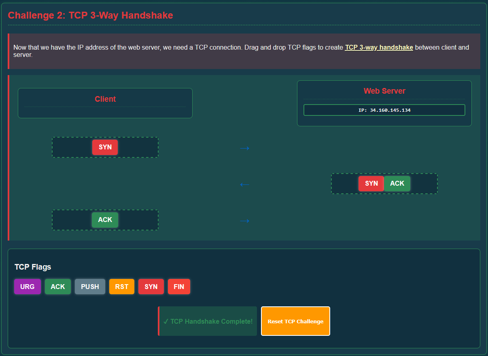
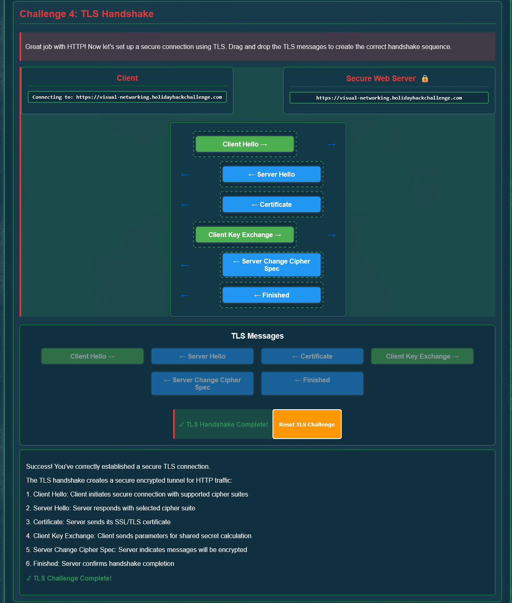
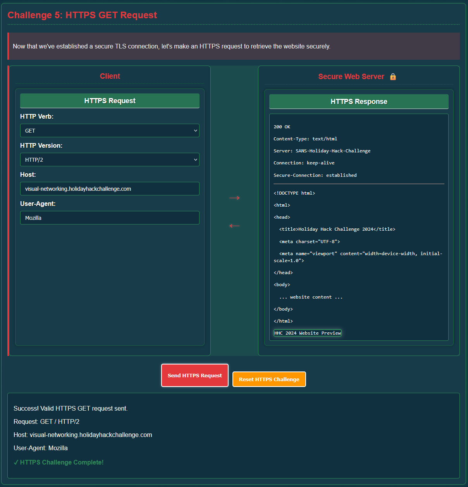

## Overview

Skate over to **Jared** at the **frozen pond** for some network magic and learn the ropes by the hockey rink.

!!! quote "Jared Folkins"
	Jared Folkins here! My favorite Christmas movie is White Christmas. You should find me on the socials and tell me what yours is. You know, I think Santa is right! It truly is better to give than to receive. I love singing Carols with my family! 🎵O holy night, the stars are brightly shining…🎵

!!! quote "Jared Folkins"
	Santa's got the right idea about giving, and I'm excited to give you a fantastic way to learn networking fundamentals!

	This interactive visualization I've created shows you exactly how packets travel, how protocols work, and why networks behave the way they do.

	It's way better than staring at boring textbooks - you can actually see what's happening!

	Want to dive into some hands-on network exploration?
	
*Absolutely*! Hands-on is definitely my style!
	
## Hints
??? example "Visual Networking Thinger"
	This terminal has built-in hints!

## Solution

Let's dive into Jared's [terminal](https://visual-networking.holidayhackchallenge.com/)! HEY! Those falling snowflakes look familiar...mine aren't that pretty though...

Looks like we have a mission: Help Santa deliver packets across the internet, one step at a time!

### Challenge 1: DNS Lookup

Our first task teaches us the fundamentals of how computers find each other on the internet. We need to perform a DNS lookup to discover the IP address of `visual-networking.holidayhackchallenge.com`.

!!! success "Client Request"
	- **Port:** `53` (DNS)
	- **Domain Name:** `visual-networking.holidayhackchallenge.com`
	- **Request Type:** `A`

!!! success "Server Response"
	- **Response Value:** `34.160.145.134`
	- **Response Type:** `A`

Success! We just translated a human-readable domain name into an IP address that computers can use!

### Challenge 2: TCP 3-Way Handshake

Now that we know where to send our packets, we need to establish a reliable connection using TCP. 

!!! success "Handshake Sequence"
	- **Client → Server:** `SYN` (synchronize)
	- **Server → Client:** `SYN, ACK` (synchronize-acknowledge)
	- **Client → Server:** `ACK` (acknowledge)
	
Each party confirms that they're listening before exchanging actual data, and ensures reliable delivery before the data flows.

### Challenge 3: HTTP GET Request

With our TCP connection established, we can now make an HTTP (Hypertext Transfer Protocol) request to retrieve the webpage.

!!! success "Request Parameters"
	- **HTTP Verb:** `GET`
	- **HTTP Version:** `HTTP/2`
	- **Host:** `visual-networking.holidayhackchallenge.com`
	- **User-Agent:** `Mozilla` (I use Firefox, but any User-Agent will do)

The server responds with a `302 Found` status that will redirect us to HTTPS. This response wants to be a little more safe, so the redirect sends us to a more secure area!

### Challenge 4: TLS Handshake

Now that we are redirected to HTTPS, we need to upgrade our connection to something more secure as well! To do this, we need to establish a TLS (Transport Layer Security) connection and create an encrypted tunnel for our data.

!!! success "TLS Handshake Sequence"
	1. `Client Hello`
	2. `Server Hello`
	3. `Certificate`
	4. `Client Key Exchange`
	5. `Server Change Cipher Spec`
	6. `Finished`
	
Phew, that was quite the process, but it's incredibly important to secure our messages from interception!	

### Challenge 5: HTTPS GET Request

Finally, now that our secure TLS tunnel is established, we can now make our HTTPS request. It's identical to the earlier HTTP request but now everything is encrypted!

!!! success "Request Parameters"
	- **HTTP Verb:** `GET`
	- **HTTP Version:** `HTTP/2`
	- **Host:** `visual-networking.holidayhackchallenge.com`
	- **User-Agent:** `Mozilla`

Now our server responds with a `200 OK` and delivers the HTML content, with confirmation that we have a secure connection!

Victory!! Our success has been reported to the North Pole! **I hope this means I'll be getting a pair of 24GB Nvidia RTX 3090 Founder's Editions for my future LLM project! (*fingers crossed*)**

  <a href="/objectives/o4" class="nav-button nav-left">← Santa's Gift-Tracking Service Port Mystery</a>
  <a href="/objectives/o6" class="nav-button nav-right">Next: Visual Firewall Thinger →</a>

