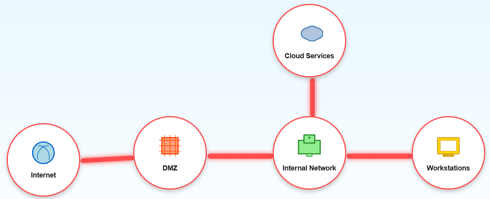
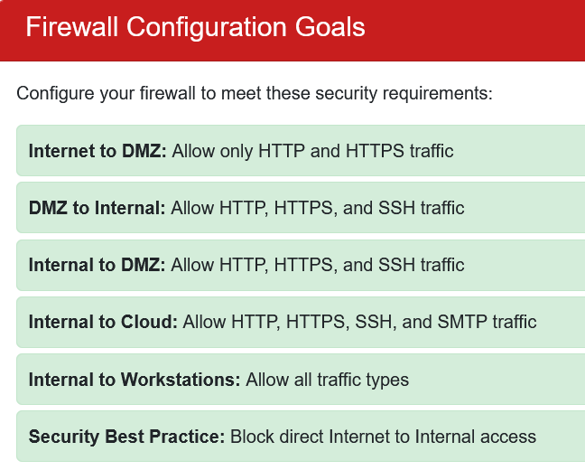

## Overview

Find **Elgee** in the **big hotel (NetWars room)** for a firewall frolic and some techy fun.

!!! quote "Elgee"
	Oh hi! Am I on the road again? I should buy souvenirs for the family.

	Loud shirts? Love them. Because - hey, if you aren't having fun, what are you even doing??

	And yes, finger guns are 100% appropriate for military portraits.

	... We should get dessert soon!

!!! quote "Elgee"
	Welcome to my little corner of network security! finger guns

	I've whipped up something sweeter than my favorite whoopie pie - an interactive firewall simulator that'll teach you more in ten minutes than most textbooks do in ten chapters.

	Don't worry about breaking anything; that's half the fun of learning! Ready to dig in?
	
## Hints

??? example "Visual Firewall Thinger"
	This terminal has built-in hints!

## Solution

### Building Santa's Network Defenses

This challenge presents an interactive firewall simulator where we configure security rules between different network zones. It's a practical introduction to network segmentation and the principle of least privilege - only allowing traffic that's actually needed.

---

### Understanding the Network

The simulator shows us a typical enterprise network topology with five zones:

- **Internet**: The wild, untrusted external world (where the Grinch lives)
- **DMZ (Demilitarized Zone)**: Public-facing services like web and email servers (the front desk of Santa's operation)
- **Internal Network**: Protected corporate network infrastructure (the actual workshop)
- **Workstations**: Employee computers (where elves do their spreadsheet magic)
- **Cloud Services**: External cloud resources (outsourced to the Cloud Elves)

The challenge is to configure firewall rules between these zones following security best practices. Each connection between zones needs specific rules about what traffic types (ports/protocols) are allowed.

---

### The Security Requirements

---

The simulator gives us clear instructions on how to configure our rules:

!!! info "Simulator Instructions"
	- **Internet → DMZ**: Only HTTP (80) and HTTPS (443) - public web traffic
	- **DMZ → Internal**: HTTP, HTTPS, and SSH (22) - web traffic plus secure administration
	- **Internal → DMZ**: HTTP, HTTPS, and SSH - same as above, bidirectional
	- **Internal → Cloud**: HTTP, HTTPS, SSH, and SMTP (25) - web, admin, and email
	- **Internal → Workstations**: All traffic types - internal network gets full access
	- **Security Best Practice**: Block direct Internet → Internal access (force traffic through DMZ)

---

### Configuring the Rules

The interface is straightforward - click any connection line between zones to configure rules for that path. Let's work through each one:

---

#### Internet to DMZ

For the Internet-facing DMZ, we allow only web traffic:

!!! success "Ports"
	- **HTTP (Port 80)**: Standard web traffic
	- **HTTPS (Port 443)**: Encrypted web traffic

The DMZ is where public-facing servers live - websites, email servers, stuff that needs to be reachable from the Internet. We want visitors to access those services, but that's it. No SSH from the Internet means attackers can't try to brute-force administrative access. 

---

#### DMZ to Internal Network

The DMZ needs to talk to internal systems for backend services:

!!! success "Ports"
	- **HTTP (Port 80)**
	- **HTTPS (Port 443)**
	- **SSH (Port 22)**: Secure administration access

SSH allows secure administrative connections from the DMZ to internal systems when needed. The web protocols let DMZ servers query internal APIs or databases.

---

#### Internal Network to Cloud Services

Internal systems need broader access to cloud resources:

!!! success "Ports"
	- **HTTP (Port 80)**
	- **HTTPS (Port 443)**
	- **SSH (Port 22)**
	- **SMTP (Port 25)**: Outbound email

SMTP appears here because internal mail servers need to send email to external cloud-based email services. Even Santa's workshop has embraced cloud computing for their massive "Dear Santa" email volume.

---

#### Internal Network to Workstations

For the internal trusted zones, we enable everything:

!!! success "Ports"
	- **DNS (Port 53)**: Name resolution
	- **HTTP (Port 80)**
	- **HTTPS (Port 443)**
	- **SMB (Port 445)**: File sharing
	- **SMTP (Port 25)**
	- **SSH (Port 22)**

We allow all traffic here because within the trusted internal environment, restricting protocols between servers and workstations creates more operational problems than security benefits. The real security boundary is between internal and external networks.

---

### The Secret Sauce: Implicit Deny

Notice what we're **not** doing - there's no rule for Internet to Internal Network. That connection stays blocked by default, which is the security best practice the challenge mentions.

This forces all Internet traffic through the DMZ first. Even if an attacker compromises a web server in the DMZ, they still can't directly reach internal systems - they'd need to break through another firewall. Defense in depth keeps the naughty listers at bay.

---

### Victory!

With all rules properly configured, the network is secure! We've implemented proper network segmentation, applied the principle of least privilege (only allowing necessary protocols), and blocked direct external access to internal systems.

Now we can rest easy knowing the workshop network is locked down tighter than Santa's vault of prototype toys.

  <a href="/objectives/o5" class="nav-button nav-left">← Visual Networking Thinger</a>
  <a href="/objectives/o7" class="nav-button nav-right">Next: Intro to Nmap →</a>

