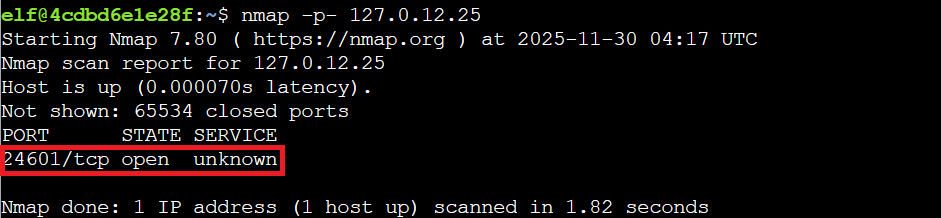

## Overview

Meet **Eric** in the **hotel parking lot** for Nmap know-how and scanning secrets. Help him connect to the wardriving rig on his motorcycle!

!!! quote "Eric"
	Hey, I'm Eric. As you can see, I'm an avid motorcyclist. And I love traveling the world with my wife.

	I enjoy being creative and making things. For example, a cybersecurity tool called Zero-E that I'm quite proud of, and the Baldur's Gate 3 mod called Manaflare. I'm even in the BG3 credits!

	I also make tools, ranges, and HHC worlds for Counter Hack. Yup, including the one you're in right now.

	But most of the time, I'm helping organizations in the real world be more secure. I do a bunch of different kinds of pentesting, but speciailize in network and physical.

	Some advice: stay laser-focused on your goals and don't let the distractions life throws at you lead you astray. That's how I ended up at Counter Hack!

!!! quote "Eric"
	Speaking of tools, let me introduce you to one of the most essential weapons in any pentester's arsenal: Nmap.

	It's like having X-ray vision for networks, and I've set up a perfect environment for you to learn the fundamentals.

	Help me find and connect to the wardriving rig's service on my motorcycle!

## Hints
??? example "Ncat Documentation"
	You may also want to check out the [Ncat Guide](https://nmap.org/ncat/guide/).
	
??? example "Nmap Documentation"
	Nmap is pretty straightforward to use for basic port scans. Check out its [documentation](https://nmap.org/book/man.html)!

## Solution

### Network Reconnaissance Boot Camp

The challenge drops us into an interactive Nmap tutorial terminal, where Eric guides us through five scanning tasks to locate his wardriving rig's service. Network reconnaissance boot camp, but with motorcycle accessories.

---

### Finding the Open Door

!!! question "Task 1"
	When run without any options, nmap performs a TCP port scan of the top 1000 ports. Run a default nmap scan of 127.0.12.25 and see which port is open.

The first task introduces us to Nmap's default behavior by scanning the top 1000 most common TCP ports. We're targeting `127.0.12.25`:

!!! success "Basic Port Scan"
	`nmap 127.0.12.25`
	

The scan reveals port `8080/tcp` running an `http-proxy` service. It's the classic starting point for any network enumeration!

---

### Scanning Every Single Port

!!! question "Task 2"
	Sometimes the top 1000 ports are not enough. Run an nmap scan of all TCP ports on 127.0.12.25 and see which port is open.

Sometimes the interesting stuff hides outside the top 1000. Using the -p- flag scans all `65,535` TCP ports:

!!! success "All Port Scan"
	`nmap -p- 127.0.12.25`
	

This uncovers port `24601/tcp` in an unknown state, much more intriguing than the standard web proxy. That port number might ring a bell for Les Misérables fans (Jean Valjean's prisoner number), but it's also clearly our wardriving rig trying to stay under the radar like a snowmobile in a blizzard.

---

### Mapping the Subnet

!!! question "Task 3"
	Nmap can also scan a range of IP addresses. Scan the range 127.0.12.20 - 127.0.12.28 and see which has a port open.

Nmap excels at scanning multiple targets simultaneously. Here we scan an IP range to map the network subnet:

!!! success "Range IP Scan"
	`nmap 127.0.12.20-28`
	

The scan confirms `127.0.12.25` has port `8080/tcp` open. This is useful when you're mapping an unfamiliar network segment and need to identify active hosts quickly, like figuring out which windows have lights on in a dark winter neighborhood.

---

### Identifying What's Running

!!! question "Task 4"
	Nmap has a version detection engine, to help determine what services are running on a given port. What service is running on 127.0.12.25 TCP port 8080?

Now we're getting tactical. The -sV flag triggers version detection, probing open ports to identify specific services and versions running behind them:

!!! success "Service Scan"
	`nmap -sV -p 8080 127.0.12.25`
	

This reveals the service running on port `8080`: `SimpleHTTPServer 0.6 (Python 3.10.12)`. Knowing exact versions is critical for vulnerability research and understanding potential attack surfaces. It's like reading the label on a present before deciding whether to shake it.

---

### Making First Contact

!!! question "Task 5"
	Sometimes you just want to interact with a port, which is a perfect job for Ncat! Use the ncat tool to connect to TCP port 24601 on 127.0.12.25 and view the banner returned.

With all reconnaissance complete, we use nc (netcat) to actually connect to the wardriving rig service on port `24601`:

!!! success "Connect to the WarDriver"
	`nc 127.0.12.25 24601`

The connection succeeds, displaying the banner: "Welcome to the WarDriver 9000!"

!!! success "Victory!"
	Congratulations! You've finished the Intro to Nmap and found the wardriving rig's service!
	
Mission accomplished! We've located Eric's motorcycle-mounted wardriving rig and established connection! 

  <a href="/objectives/o6" class="nav-button nav-left">← Visual Firewall Thinger</a>
  <a href="/objectives/o8" class="nav-button nav-right">Next: Blob Storage Challenge in the Neighborhood →</a>

