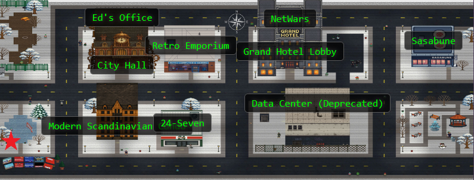
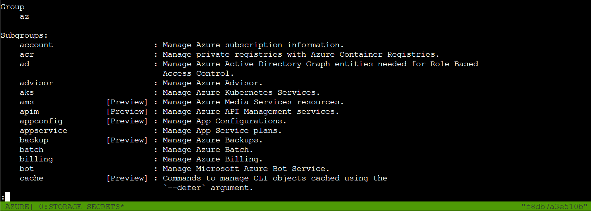
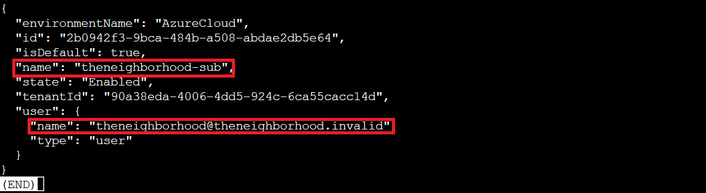
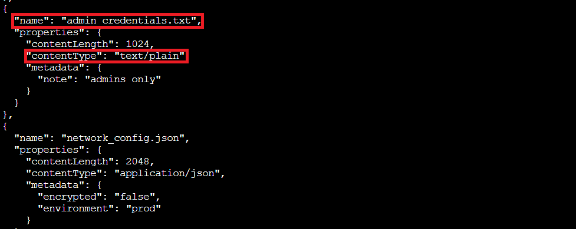

## Overview

Help the **Goose Grace near the pond** find which Azure Storage account has been misconfigured to allow public blob access by analyzing the export file.

Tracking some of these challenge locations is almost becoming a wild *goose* chase...oh, wait...

!!! quote "Grace"
	HONK!!! HONK!!!!

Ah understood, thankfully I am fluent in *Goosese*:

!!! quote "Grace (Translated)"
	The Neighborhood HOA uses Azure storage accounts for various IT operations.

	You've been asked to audit their storage security configuration to ensure no sensitive data is publicly accessible. Recent security reports suggest some storage accounts might have public blob access enabled, creating potential data exposure risks.

## Hints

??? example "Blob Storage Challenge in the Neighborhood"
	This terminal has built-in hints!

## Solution

This challenge is a cloud security audit, checking whether the Neighborhood HOA accidentally left any digital doors wide open. The terminal provides helpful hints at each step, walking us through Azure CLI basics while we hunt for misconfigurations.

### Azure CLI Crash Course

Before diving into the security audit, let's get familiar with the Azure command-line interface. The `az` command has extensive help documentation built right in:

!!! question "Azure CLI Help"
	You may not know this but the Azure cli help messages are very easy to access. First, try typing:
	`az help | less`
	

This shows all the available subgroups: managing subscriptions (`account`), working with storage, networking, and more. For our audit, we'll focus on the `storage` subgroup. Time to see what's hiding in the cloud!

### Who Are We Pretending to Be?

Before we start auditing storage accounts, let's verify what account we're authenticated as:

!!! question "Show Credentials"
	Next, you've already been configured with credentials. 🔑
	`az account show | less`
	
	- Pipe the output to `| less` so you can scroll.
	
	- Press `'q'` to exit less.

We're logged in as `theneighborhood@theneighborhood.invalid` in the `"theneighborhood-sub"` subscription. Perfect! We have the access we need to perform this security audit!

### The Storage Account Lineup

Now for the actual security audit. Let's see what storage accounts exist in this subscription:

!!! question "Storage Accounts"
	Now that you've run a few commands, Let's take a look at some Azure storage accounts.
	Try: `az storage account list | less`

Scrolling through the JSON output, one field immediately jumps out:

(*enlarged for effect, not... user error...*)

There it is: `"allowBlobPublicAccess": true`

This is the misconfiguration we're hunting for! In Azure security best practices, `allowBlobPublicAccess` should be disabled at the account level unless there's a specific, documented business need. When it's enabled, containers within that account can be configured for public access, turning private corporate storage into publicly readable buckets. One *careless* container configuration later, and you've got a data breach!

### Diving Into the Suspect Storage

We found that `neighborhood2` has `allowBlobPublicAccess` set to `true`. Let's dig deeper into this particular account:

!!! question "Misconfiguration?"
	hmm... one of these looks suspicious 🚨, i think there may be a misconfiguration here somewhere.
	Try showing the account that has a common misconfiguration: `az storage account show --name xxxxxxxxxx | less`
	
!!! success "Suspicious Account"
	`az storage account show --name neighborhood2 | less`

The full details confirm our suspicions. Looking at the account properties:

- `"allowBlobPublicAccess": true` at the account level

- Blob encryption is disabled (`"enabled": false`)

Publicly accessible *and* unencrypted? The HOA might as well have left their filing cabinet on the front lawn with a "free stuff!" sign taped to it.

### Cracking Open the Containers

Now let's see what containers exist within this misconfigured account:

!!! question "Container List"
	Now we need to list containers in `neighborhood2`. After running the command what's interesting in the list?

!!! success "Storage Containers"
	`az storage container list -n neighborhood2`
	

Two containers appear:

- **public:** Has `"publicAccess": "Blob"` (anyone can read the blobs without authentication)

- **private:** Has `"publicAccess": null` (properly secured)

The naming here is almost *chillingly* honest: one container is literally called "public" and configured for public access. The public container was last modified in January 2024, so whatever's in there has been sitting exposed for almost a year now. Someone really needs a security refresher course!

### What's Hiding in the Public Bucket?

Time to list the actual files (blobs) in the public container:

!!! question "Blob List"
	Let's take a look at the blob list in the public container for `neighborhood2`.
	
!!! success "Blob List"
	`az storage blob list --account-name neighborhood2 --container-name public`

*Oh noooo*

Two files are sitting here, publicly accessible to anyone who knows the account name:

- **admin_credentials.txt** (1024 bytes, with metadata note: "admins only")
- **network_config.json** (2048 bytes, marked as unencrypted production environment config)

That "admins only" note is pretty ironic considering anyone on the internet can download it without authentication.

### Downloading the Digital Evidence 

Let's download and examine that credentials file:

!!! success "Download Text File"
	`az storage blob download --account-name neighborhood2 --container-name public --name admin_credentials.txt --file /dev/stdout | less`

Oof!

The file contains plaintext credentials for multiple systems!

This is a complete security disaster! These credentials are sitting in a publicly accessible blob container that anyone with the account name could access without any authentication. The combination of `allowBlobPublicAccess: true` at the account level, `publicAccess: "Blob"` at the container level, and disabled encryption means these passwords have been sitting on the public internet just waiting to be discovered.

Even storing credentials in "private" cloud storage is asking for trouble. Azure Key Vault exists precisely to avoid situations like this. Secrets belong in dedicated secret management systems, not text files!

### Challenge Complete!

The `neighborhood2` storage account was indeed misconfigured with `allowBlobPublicAccess: true`, leaving admin credentials and network configurations exposed to the entire internet. A basic Azure CLI audit caught what should never have been misconfigured in the first place, but that's exactly what they pay us for...(we are getting paid, right??)

Just like Santa's naughty list, Azure security misconfigurations should be checked twice! 🎅🔒

!!! quote "Grace (Translated)"
	HONK HONK HONK! 'No sensitive data publicly accessible' they claimed. Meanwhile, literally everything was public! Good save, security expert!
	

  <a href="/objectives/o7" class="nav-button nav-left">← Intro to Nmap</a>
  <a href="/objectives/o9" class="nav-button nav-right">Next: Spare Key →</a>

