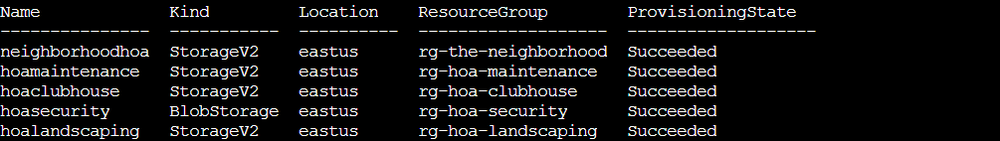
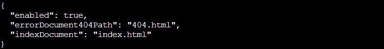
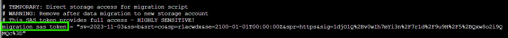

## Overview

Help **Goose Barry near the pond** discover the accidentally leaked SAS token in a public JavaScript file and determine what Azure Storage resource it exposes and what permissions it grants.

!!! quote "Barry"
	You want me to say what exactly? Do I really look like someone who says MOOO?

!!! quote "Barry"
	The Neighborhood HOA hosts a static website on Azure Storage.

	An admin accidentally uploaded an infrastructure config file that contains a long-lived SAS token. Use Azure CLI to find the leak and report exactly where it lives.

## Hints
??? example "Spare Key"
	This terminal has built-in hints!

## Solution

Barry is a grumpy goose. He wants us to find a leaked infrastructure config file in the HOA's Azure storage. Time to channel our inner security auditor (again)!

### Scouting the Territory

!!! question "List Resource Groups"
	Let's start by listing all resource groups: `az group list -o table`
	
	This will show all resource groups in a readable table format.

!!! success "Resource Group Reconnaissance"
	`az group list -o table`
	

Perfect! We can see several HOA-related resource groups: `rg-the-neighborhood`, `rg-hoa-maintenance`, `rg-hoa-clubhouse`, `rg-hoa-security`, and `rg-hoa-landscaping`. Since Barry mentioned the HOA hosts a static website, `rg-the-neighborhood` seems like our best bet to start investigating. The HOA is really committed to that organized suburban life.

### Finding the Storage Vaults

Now that we know which resource group to target, let's see what's inside. Time to open some presents! 🎁

!!! question "List Storage Accounts"
	Now let's find storage accounts in the neighborhood resource group 📦: `az storage account list --resource-group rg-the-neighborhood -o table`
	
	This shows what storage accounts exist and their types.

!!! success "Storage Account Discovery"
	`az storage account list --resource-group rg-the-neighborhood -o table`
	

We found five storage accounts, all HOA-themed: `neighborhoodhoa`, `hoamaintenance`, `hoaclubhouse`, `hoasecurity`, and `hoalandscaping`. The `neighborhoodhoa` account is our prime suspect since it's the main HOA storage!

### Verifying the Website Setup

The challenge mentioned a static website, so let's verify that's actually set up.

!!! question "Check Static Website Properties"
	Someone mentioned there was a website in here. Maybe a static website?
	
	`az storage blob service-properties show --account-name <insert_account_name> --auth-mode login`

!!! success "Website Configuration Check"
	`az storage blob service-properties show --account-name neighborhoodhoa --auth-mode login`

The output shows `"enabled": true` along with error and index document paths (`404.html` and `index.html`). This confirms we're dealing with a static website. Now we know where to look for publicly accessible files.

### Finding the Web Container

Static websites in Azure use a special container. Let's find it and check the access levels.

!!! question "List Containers"
	Let's see what 📦 containers exist in the storage account
	
	💡 Hint: You will need to use `az storage container list`
	
	We want to list the container and its public access levels.

!!! success "Container Inventory"
	`az storage container list --account-name neighborhoodhoa --auth-mode login`
	

Two containers appear: `$web` (the standard container for Azure static websites) and `public`. The `$web` container has `"publicAccess": null`, meaning its blobs might still be accessible via the website URL even though the container itself isn't browsable. This is our target!

### What's Lurking in the Static Website?

Time to peek inside that web container and see what files are sitting there. Hopefully just holiday party announcements and lawn care guidelines...

!!! question "List Blobs in Web Container"
	Examine what files are in the static website container
	
	💡 hint: when using `--container-name you might need '<name>'`
	
	Look 👀 for any files that shouldn't be publicly accessible!

!!! success "Blob Discovery"
	`az storage blob list --account-name neighborhoodhoa --container-name '$web' --auth-mode login --output table`
	

Well well well, what do we have here? Along with the expected `index.html` and `about.html` files, there's a suspicious `iac/terraform.tfvars` file sitting in the publicly accessible static website container. Infrastructure-as-Code configuration files definitely shouldn't be public! Someone left their secrets under the tree for everyone to unwrap. 🎄

### Unwrapping the Infrastructure Secrets

That terraform file looks very out of place. Let's download it and see what security nightmares await us inside.

!!! question "Examine Suspect File"
	Take a look at the files here, what stands out?
	
	Try examining a suspect file 🕵️:
	
	💡 hint: `--file /dev/stdout | less` will print to your terminal 💻.

!!! success "Download and Inspect"
	`az storage blob download --account-name neighborhoodhoa --container-name '$web' --name iac/terraform.tfvars --file /dev/stdout | less`

The file contains a `migration_sas_token` with full read-write-delete permissions, expiring in 2100. That's right, a *75-year token lifetime*! The comments even helpfully note it's "HIGHLY SENSITIVE" and warn to "Remove after data migration to new storage account."

**Spoiler alert:** they didn't remove it. And now it's publicly accessible on the internet.

This is exactly what you should never do with sensitive credentials. SAS tokens should be short-lived, tightly scoped, and never committed to version control or uploaded to public storage.

### Challenge Complete!

`/iac/terraform.tfvars` contains the leaked long-lived SAS token with excessive permissions. We found an infrastructure configuration file accidentally exposed in a public static website, containing a migration token that grants full storage access until the year 2100.

The HOA really needs to implement some secrets management best practices. Maybe add it to next month's meeting agenda, right after "Approval of Wreath Decorations" and before "Discussion of Acceptable Snowman Heights."

!!! quote "Barry"
	There it is. A SAS token with read-write-delete permissions, publicly accessible. At least someone around here knows how to do a proper security audit.
	
I'll take that as a compliment!
	

  <a href="/objectives/o8" class="nav-button nav-left">← Blob Storage Challenge in the Neighborhood</a>
  <a href="/objectives/o10" class="nav-button nav-right">Next: The Open Door →</a>

